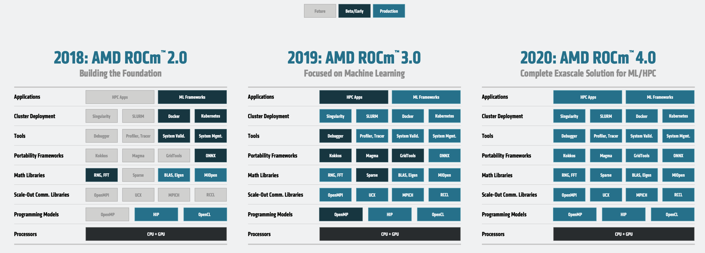

[NOTE]
====
AMD CDNA architecture and the AMD ROCm™ open ecosystem stack deliver high-performance, high-productivity, and portability to  meet the needs of the industry and fulfill the promise of heterogeneous computing. The AMD CDNA architecture is fully-programmable and designed for workloads with a mix of scalar, vector, and matrix computation motifs and can easily scale up with multiple GPUs using Infinity Fabric technology. The open ROCm ecosystem builds on AMD CDNA to deliver a full suite of development, optimization, and deployment tools for customers to run existing applications or develop brand new ones that scale from individual workstations to Exascale-class supercomputers.

AMD EPYC™ Processors
2nd and 3rd Gen AMD EPYC™ Processors have optimized multi-processor performance and scalability through the latest advancements in die-to-die connectivity with AMD Infinity Fabric™.

- High Speed Chiplet Interconnect
- Leadership Memory Bandwidth
- 8 Memory Channels Per Socket
- Peak 410 GB/s DRAM Bandwidth
- Leadership I/O Bandwidth
- All 8 x16 links PCIe® Gen4
- 128 PCIe© 4.0 Lanes in a Single Socket
- 64GB/s bi-dir bandwidth per link, 512GB/s per socket

Website: link:https://www.amd.com/en/technologies/infinity-architecture[]
====

[.text-center]

*Mobile*

AMD: Energy efficiency improvement dominates micro-architecture + processor architecture innovation to promote the overall performance of Renior

- 2014: In- crease the energy efficiency of mobile processors by 25 in 2020
- 2020: "Renior" completes 31x energy efficiency improvement, the processor is mainly used for ultra-thin notebooks; 5x performance improvement, 84% lower energy consumption

Zen2 CPU micro-architecture optimization:

- 15% IPC improvement compared to Zen; hierarchical cache optimization for Renior; each Renior Die has two Zen2 cores
- VEGA GPU maximizes the efficiency of each processing unit
- 25% increase in peak graphics clock + 77% increase in peak memory bandwidth; 2x data interface
- Two memory controllers
- Infinity fabric
- 75% better energy efficiency; 77% higher memory bandwidth

Intelligent low-power state selection

- Increase in power consumption status exposed to ACPI: 1 -> 3
- Optimize the duration and depth of each state

Optimize battery life

- SoC power consumption reduced by 20%
- Low power state management and efficiency improvement

Closed loop "thermal" management system

- Hot spot temperature sensing
- The temperature information is transmitted to the infinity fabric through the embedded controller
- The system dynamically adjusts the power consumption limit according to the external temperature information of the machine

[IMPORTANT]
.Note from Jaro
====
AMD proposition is actually something that you should see from Intel. On top of they own technologies CDNA/Zen/EPYC/RoC lastly they acquired Xilinx - so AMD will have "full ecosystem: CPUs,GPUs,FPGAs,SoCs". From competitiveness and business perspectives AMD moves makes a lot of sense.

link:https://www.amd.com/en/corporate/xilinx-acquisition[]
====

