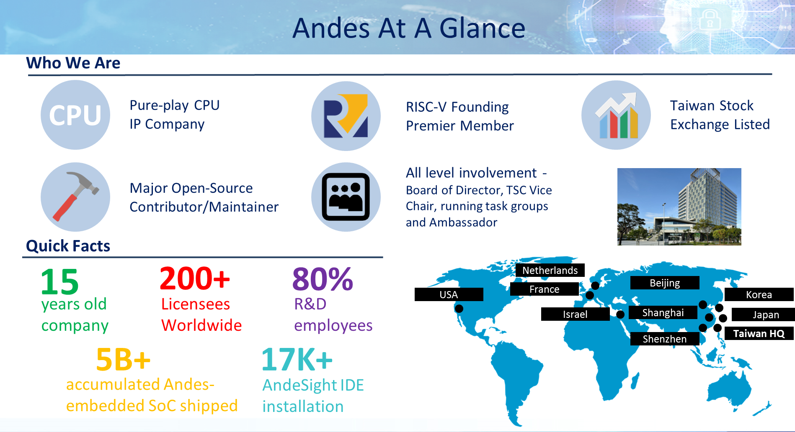

[NOTE]
====
Andes is a public listed company in Taiwan Stock Exchange (March 2017)

Andes was awarded with TSMC’s OIP “Partner of the Year” for New IP (2015)

Andes has track record of over 140 commercial licensees and over 2.5B Andes-Embedded SoCs shipped.

Andes sales and support channel covers Taiwan, China, Japan, Korea, United States, and Europe.

There are multiple world class companies evaluating Andes N25/NX25 now.

Website: link:http://www.andestech.com/en/risc-v-andes/[]
====

*RISC-V@Andes*

Andes’ Role in RISC-V Community

[.text-center]

RISC-V ISA is an innovation for industry because it is open, compact, modular and extensible; also 64-bit is natively defined. However, RISC-V is merely an instruction set architecture. It needs microarchitecture implementation and other associated products (such as compiler, development tools, and platform) to provide complete CPU IP solution. Andes sees the potential of RISC-V. Andes is joining forces with partners of RISC-V community to grow the ecosystem by bringing Andes’ CPU IP experiences together with RISC-V’s technology:

[.text-center]

- Andes becomes one of the Founding members of RISC-V Foundation (2016) and Premier member of RISC-V International(2020).
- Andes is a RISC-V major tool-chain contributor (and maintainer).
- Andes will provide a complete product portfolio with RISC-V CPU IP. Andes is your reliable RISC-V core IP business partner.
- Andes provides world’s leading customer-instruction extension capable RISC-V core IP (Andes 25-series cores) and tool.
- Andes provides RISC-V cores that runs Linux.
- Through years of interaction with customers, Andes is professional in designing details important to SoCs.

---

*Andes’ RISC-V Solutions*

1. AndeStar™ V5 Architecture:

V5 is the new family of AndeStar architecture which is fully compliant with RISC-V technology while bringing extended features unique to Andes and already proven in the V3 processors, such as

- Andes Performance Extension to speed up common program sequence such as those for memory accesses and branches
- Andes Custom Extension™ (ACE) to enable user-defined instructions for Domain-Specific Acceleration (DSA)
- CoDense™ for further code size compaction
- StackSafe™ stack overflow/underflow detection for program reliability
- PowerBrake frequency scaling for power saving.
- Supports both 32-bits (RV32) and 64-bits (RV64), and the latter is for applications demanding addressability greater than 4 GB or those benefiting from data wider than 32 bits.
- Processors based on V5 architecture are supported by the same rich and easy-to-use environment as in V3 processors.

[.text-center]

2. Facts of AndesCore™ N25F, NX25/NX25F, A25, AX25 and A27, AX27 processors:

Based on AndeStar™ V5 architecture:

- 32-bit N25, N25F, D25F, A25 and A27; 64-bit NX25, NX25F, AX25, and AX27
N25F, NX25F, A25 and AX25 supports single and double precision floating point for high-precision data computations
- D25F, A25 and AX25 supports DSP/SIMD instructions
- A25/AX25 and AX27/AX27 supports MMU (Memory Management Unit) for Linux applications

Pipeline features:

- Fast: Dynamic Branch Prediction, Local Memory (LM) and Caches 
- Operating above 1.1GHz with TSMC 28nm process
- Compact: 5-stage pipeline, many features are configurable as customer’s design requires
- Support Andes Custom Extension™ (ACE) for domain-specific acceleration

Other key features including: 

- ECC and parity for memory protection, configurable multiplier, well-balanced pipeline
- Platform-Level Interrupt Controller (PLIC): To meet the common requirements of microcontrollers and real-time applications, Andes enhanced RISC-V’s PLIC with vectored interrupt dispatch, and priority-based preemption for greatly reduced interrupt service latency and easier software programming
- Product package options: CPU subsystem pre-integrated with bus controller and AHB/AXI platforms to jump-start SoC design

[.text-center]
image:../img/andes_nd-e1595232148330.png[pdfwidth=60%,width=60%,align="center"]

3. Software development environment:

Offer the best RISC-V compiler and most comprehensive GUI-based development environment

- Brings the production-proven methodology for instruction customization, ACE, to RISC-V world with a complete and easy-to-use toolset and verification framework.
- Unified development environment through the tens of thousands of installation base AndeSight IDE, to integrate supports for both mass-produced V3 processors and emerging V5 processors into one tool framework and also to ease migration works to RISC-V based ISA V5.
- Support the popular open source FreeRTOS version 10 and also the industrial-strength ThreadX on both 32-bit and 64-bit RISC-V processors. That’s the first 64-bit RISC-V enabled ThreadX port running on AndesCore NX25.
- Continuous contributions on RISC-V architecture port to gcc, binutils, newlib, qemu, LLVM, U-BOOT and Linux framework.

[.text-center]

4. Hardware development environment:

- Full-featured FPGA development board
- Compact Arduino-compatible Corvette-F1 board
- ICE debugger

---

*AndesCore™ In The IoT Market*

With the superb performance-efficiency inherent in all Andes CPU products, their use has been part of the IoT market from its inception. Leveraging from early design wins in applications such as wireless radio and embedded control, Andes has now become used in a wide range of IoT products.

Different IoT applications demand different solutions. For example, the Andes N7 2-stage MCU can be an ideal solution for low-power process control in IoT devices. In applications where higher speeds are required, such as Bluetooth, Zigbee or WiFi, the 3-stage Andes N8 family may be a better choice. Within the Andes three stages CPU family, the Andes E8 allows customer to add specialized instructions to further increase performance-efficiency, boost performance and lower power even more.

Other SOC architectures for IoT may use a CPU in a “sensor fusion” approach, where diverse sensors data is gathered for localized processing and decision making. For many of these applications, the Andes N10 CPU can be an excellent choice both due to OS/MMU requirements and even optional FPU support. Finally, the high end of IoT devices may desire symmetric multicore support, along with full RTOS capability. For these, the Andes N13 can be used to serve the needs.

New industry-wide initiatives like the Thread Group (www.threadgroup.org) are striving to bring interoperability to IoT devices in the home. Andes participates with many of these groups, and is an active member of the Thread Group.

The diversity of IoT device types combined with the mandate for low power in SOCs have allowed AndesCore CPUs, peripherals and software tools be become an excellent solution in numerous IoT applications. If low-power is important, Andes is an excellent choice.

---

*AndesCore™ 32 & 64-Bit CPU Cores Provide Major Benefits For Wearable Devices*

The wearables market is expected to grow three-fold by 2019, according to research firm CCS Insight when it will ship $25 billion in smart watches, fitness trackers, and wearable cameras. Intel Corp. CFO Stacy Smith stated that battery life is critical in wearable devices and the one feature that’s lacking in wearables, GPS tracking, is a very power-hungry feature. The ultra-low power, very high performance, small silicon footprint AndesCore™ embedded processors are the ideal solution for solving these tough problems facing wearables. For example, AndesCore™ embedded processors have been designed into IoT devices, such as electronic shelf labels, which demand a battery life of more than 5 years.

AndesCore™ embedded processors are based on the AndeStar™ architecture. Designed within the past decade with the needs of emerging IoT devices in mind, the architecture enables enormous power savings while providing high performance. This is achieved through novel functionality such as frequency throttling, patented memory architecture, and custom instructions. Andes PowerBrake™ is a low-cost (few gates) means of achieving CPU frequency throttling without changing the PLL clock. PowerBrake™ allows 16 different performance scales from the highest performance to the lowest, so the processor can throttle up or down to accommodate these different computing requirements.

The major performance and power bottleneck in an IoT device is the flash memory containing its program. Andes FlashFetch™ breaks the bottleneck using a small amount of cache—tiny cache—and a prefetch SRAM buffer. Depending on the CPU frequency, running the Coremark and DMIPS benchmarks with FlashFetch™ can boost the score from 30 to over 100 percent. FlashFetch™ also allows the designer to achieve the same DMIPS performance with a lower clock or maintain the clock and boost the DMIPS performance.

The AndesCore™ capability to add custom instructions to accelerate compute intensive tasks, Andes Custom Extension™ (ACE), may be applied to the thorny problem of incorporating GPS capability in a battery operated device. Custom instructions to accelerate the basic GPS algorithm could provide the performance while reducing power consumption by as much as an order of magnitude. While custom instructions are not new to embedded processors, Andes’ contribution is a powerful tool that greatly eases the task of creating the instructions and incorporating them into the existing software development tools with quick turnaround time. In addition, the ACE logic of the instructions is written in the most popular HDL, Verilog, and is verified against its semantics automatically in the ACE flow.

Only the AndesCore series of high performance 32 & 64-bit CPU cores, designed in the past decade, can deliver the low cost, low power consumption and high performance demanded by today’s emerging high volume wearables applications.

---

*AndesCore™ 32-Bit CPU Cores Ideal In Rapidly Developing Networking Market*

With the advent of smart device, two networking technologies are poised for significant growth: WiFi and Bluetooth, thanks to the rapid development of proximity engagement solutions. These solutions are being driven by initiatives at Apple and Google: Apple iBeacon and Google Eddystone, both based around Bluetooth, but with WiFi attempting to participate. Proximity engagement solutions bring to life places and objects in the physical world by tagging them with digital content. Small inconspicuous devices—beacons—in places (shopping centers) and objects (retail goods) broadcast the same short message over and over to engage anyone with a smart device. Deployed anywhere, they run for years off a coin cell battery.

According to ComputerWorld, “the beacon market is just getting started. There are on the order of 100,000 beacons in use today. That number could grow rapidly to 50 million. Although many companies have invested money and resources in Bluetooth beacons, it’s not too late for a competing technology (like Wifi) to help drive and ultimately dominate the market.”

WiFi, Bluetooth, and Zigbee Networking all demand low-cost, high performance, and ultra low power consumption. However, they also demand high security. All these requirements are addressed in the AndesCore™ line of 32-bit embedded processors, based on the AndeStar™ Architecture. Developed in the past decade, AndeStar™ enables enormous power savings while providing high performance, and hacker resistant security.

Besides the performance-efficient baseline instruction set, AndeStar’s contribution to high performance is the capability to add custom instructions to accelerate compute intensive tasks in the framework of Andes Custom Extension (ACE). For example, a custom instruction to accelerate a FIR filter can boost performance and reduce power consumption by as much as an order of magnitude. While custom instructions are not new to embedded processors, Andes’ contribution is a powerful tool that greatly eases the task of creating the instruction and incorporating it into the existing software development tools with quick turnaround time. In addition, the ACE logic of the instruction is verified against its semantics automatically in the flow.

To prevent hacking and intrusion, AndeStar added a set of security features to protect against physical tampering and software attacks. These security features include secure interruption protected with hardware memory stacking, instruction/data/address scrambling, side channel attack protection, and fault-injection attack detection. Secure interruption protects the CPU states (including register file and program stack) of secure software from the potential attack via a malicious interrupt service routine (ISR) without compromising the real-time response of harmless cooperative ISRs. Scrambling defends against attacks that target all the interfaces of CPU and memory contents. Power analysis protection guards against hacking the program by observing the power use signature of the CPU. Fault injection attack detection constantly monitors the integrity of critical CPU states for presence of potential threats.

Only the AndesCore™ series of high performance 32-bit CPU cores, designed in the past decade, can deliver the low cost, low power consumption, high performance, and enhanced security demanded by today’s emerging high volume networking applications.

---

*AndesCore™ 32-Bit CPU Cores Ideal For 8-Bit CPU Replacement In Embedded Applications* 

From the original 8008 launched in the late 1970s to the 6502 that powered the early Apple II, to the 8088 that launched the IBM PC, and to the long-lived 8051 that powers many microcontrollers to this day, the 8-bit processor has had a long run. However, today’s embedded applications are demanding more powerful 32-bit processors to handle a multitude of new computing, communications, and security requirements over long periods of time without battery recharge or energy harvesting. Examples include electronic shelf labels, smoke and CO2 detectors, lab on a chip, intrusion detection, keyless entry, and many more.

Only one 32-bit CPU architecture, the AndesCore™ series of high performance 32-bit CPU cores, among many, offers the silicon footprint of an 8-bit CPU, computation power, and energy efficiency to meet the need of these embedded applications. Each AndesCore CPU implements the backward-compatible AndeStar™ instruction set architecture (ISA), which is in its third generation (V3). Power management features not available on the older 8-bit CPUs are common in the AndeStar architecture. The AndesCore N705, for example, comes with a feature called PowerBrake that allows the CPU clock rate to be dynamically throttled. The CPU can be running at full 100% with a high processing load and then scale down to 10% when the load is lessened. In addition to the CPU, there are power savings features incorporated into the peripherals surround the CPU in the form of pre-integrated and pre-verified Platform IP AE210, something not incorporated in the earlier 8-bit processors.

Most embedded microcontrollers stored their programs in on-chip flash or ROM. As a result, adopting a CPU with higher code density leads to a lower total chip cost. A misconception is that 8-bit CPUs have more compact code size than 32-bit CPUs. AndeStar ISA’s CoDense™ technology together with Andes highly optimized compiler offers the industry’s leading compact code size. Take an open-source Zigbee stack as example. It requires 50 KB for 8051, but only needs less than 22 KB, a 56% reduction, for AndesCore N705.

Another feature for the AndesCore N705 is flash acceleration since embedded applications rely on flash for program storage. An 8-bit CPU fetches its program an instruction at a time from flash. An extension feature for the AndesCore N705 called FlashFetch™ holds a small number of instructions to eliminate the need to access them from flash, a power consuming operation. Depending on the CPU frequencies, running the Coremark and DMIPS benchmarks with FlashFetch can boost the score from 30 to over 100 percent.

Another AndeStar architecture capability that makes it ideal for 8-bit replacement is its extension features for physical security such as secure interrupt with hardware memory stacking, data and address scrambling, and differential power analysis protection. Secure interrupt protects the CPU states (including register file and program stack) of secure software (such as a crypto function) from the potential attack via a malicious ISR (interrupt service routine) without compromising the real-time response of harmless cooperative ISR’s. Scrambling defends against attacks that target the interface between CPU and memory. Power analysis protection guards against hacking the program by observing the power use signature of the CPU. This is achieved by randomizing the execution cycles of the CPU to make it unintelligible to an attacker. The AndeStar architecture also blocks software/firmware attacks from hacking the JTAG interface.

Only the AndesCore series of high performance 32-bit CPU cores, designed in the past decade, can deliver low cost, low power consumption and high security demanded by today’s emerging high volume embedded applications.

[IMPORTANT]
.Note from Jaro
====
Andes is full stack producer of all kinds of CPUs /multiple levels of computing - and quite interesting is they commitment to own R&D and RISC-V community.

====
