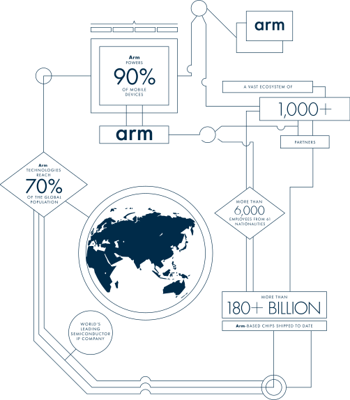

[NOTE]
====

Arm defines the pervasive computing that's shaping today’s connected world. Realized in 180 billion silicon chips, our device architectures orchestrate the performance of the technology that's transforming our lives — from smartphones to supercomputers, from medical instruments to agricultural sensors, and from base stations to servers.

GTC 21: Top 5 Arm Computing and Ecosystem Sessions
March 23, 2021

NVIDIA and Arm are working together to open new opportunities for partners, users, and developers, driving a new wave of computing around the world.

From powering the world’s largest supercomputers and cloud data centers, to edge devices on factory floors and city streets, the NVIDIA accelerated computing platform is used to help solve the world’s most challenging computational problems.

Website: link:http://yarenty.com[]
====

ARM:

- World’s leading semiconductor IP company
- Arm technologies reach 70% of the global population
- More than 6,000 employees from 85+ nationalities
- More than 180 billion Arm-based chips shipped to date
- An ecosystem of more than 1,000 partners

[.text-center]

The foundation of a global ecosystem of technology innovators, we empower the world’s most successful business and consumer brands. Every day thousands of partners embed 180 billion Arm-based chips in products that connect people, enhance the human experience, and make anything possible. Extensible, scalable, and ever evolving, it's a foundation that confirms how we lead by design — to serve today, anticipate tomorrow.

*Latest Versions of the Arm Architecture*

Arm is constantly working with lead partners to evolve its architecture to meet future needs. Armv9-A is a set of extensions to the Armv8-A architecture, and part of a rolling program of substantial enhancements to the architecture to be deployed over the next few years. The goal of these enhancements is to help increase the computing capability in areas such as digital signal processing (DSP) and machine learning (ML), and to continually improve the security and robustness of our systems.

The latest architectures for the R-profile and M-profile are Armv8-R and Armv8-M. Follow the Learn More links below to our developer site for more technical details and the latest architecture specifications.

* *Armv9-A Key Features*

* Advanced SIMD and Scalable Vector Extension 2 (SVE2)

Armv9-A supports the 128-bit wide fixed-length vector extensions first seen in Armv7 and Armv8. SVE2 builds on this to provide variable length vectors, enabling vector length agnostic programming.

* AArch32 and AArch64

32-bit and 64-bit execution environments. AArch64 provides access to larger address spaces and a modern programmers model. AArch32 provides backwards compatibility for legacy 32-bit applications.

* Realm Management Extension (RME)

Part of the Arm Confidential Computing Architecture (Arm CCA), RME extends confidential computing on Arm platforms to all developers.

* Branch Target Indicators (BTI) and Pointer Authentication

Together these provide an efficient way to combat return-orientated (ROP) and jump-orientated (JOP) attacks.

* Virtualization

Hardware support for virtualization, including secure virtualization and nested virtualization.

* TrustZone

A security feature that provides hardware isolation for the creation of Trusted Execution Environments (TEE).

* Memory Tagging Extension (MTE)

Enables developers to locate temporal spatial memory safety violations, which are a common source of software vulnerability.

* *Armv8-R Key Features*

* AArch32 and AArch64: 

AArch32 provides backwards compatibility with existing 32-bit software while AArch64 brings 64-bit execution capability and up to 48-bit physical addressing to the Arm real-time processor architecture.

* Protected Memory System Architecture (PMSA): 

Enables deterministic behaviour for timing-sensitive applications.

* Virtualization: 

Hardware support for virtualization, optimized for timing-sensitive workloads.

* *Armv8.1-M Key Features*

* M-profile Vector Extension (MVE):

An efficient vector processing capability that accelerates signal processing and machine learning algorithms.

* Additional data types supported in vector extension: 

Half-precision floating point (FP16) and 8-bit integer (INT8).

* Low overhead loops.
* Gather load, scatter store memory access.
* Additional debug features: 

including a performance monitoring unit, tailoring for DSP software development, and a debug extension to support multiple security domains in debug.

|===
| | *A-profile (Application)*  Cortex-A and Neoverse | *R-profile (Real-Time)*  Cortex-R | *M-profile (Microcontroller)* Cortex-M

| Features
| 
* Offers highest performance of all architecture profiles
* Highly energy efficient
* Optimized to run rich operating systems
|
* Optimized for systems with real-time requirements
|
* Designed for small, low power, highly energy-efficient devices

|Latest Versions	| Armv8 and Armv9	|Armv8	|Armv8

|Use Cases	
|PCs, laptops, smart TVs, servers, smartphones and automotive head units, cloud storage and supercomputers	
|Medical equipment, vehicle steering, braking and signalling, networking and storage equipment and embedded control systems	
|Security processors, IoT and embedded devices such as wearables, small sensors, communication modules and smart home products
|===

_Each profile means the architecture can be optimized for different environments and use cases. System on chips (SoCs) are often designed to power a specific class of product and include multiple processors that implement different architecture profiles to meet a product’s energy, performance and security needs._

---

*GTC 21: March 23, 2021*

Description of speaks.

* A Vision for the Next Decade of Computing

AI, 5G, and the internet of things are sparking the world’s potential. And for many hardware engineers and software developers, these technologies will also become the challenge of their careers. The question is how to invisibly integrate the new intelligence everywhere by creating more responsive infrastructure that links people, processes, devices, and data seamlessly. Getting there will require architectural leaps, new partnerships, and plenty of creativity. Arm President Rene Haas will discuss the forces pushing these advances and how Arm’s global developer ecosystem will react to drive the next wave of compute.

* Introducing Developer Tools for Arm and NVIDIA Systems

NVIDIA GPUs on Arm servers are here. In migrating to, or developing on, Arm servers with NVIDIA GPUs, developers using native code, CUDA, and OpenACC continue to need tools and toolchains to succeed and to get the most out of applications. We’ll explore the role of key tools and toolchains on Arm servers, from Arm, NVIDIA and elsewhere — and show how each tool fits in the end-to-end journey to production science and simulation.

* The Arm HPC User Group: An Open Community for Arm-Based Research and Engagement

We’ll introduce the newly created Arm HPC User Group, which provides a forum for application developers, system integrators, tool vendors, and implementers to share their experiences. Learn about the history of Arm for HPC and see what plans the Arm HPC User Group has to engage with users and researchers over the coming year. You don’t need an in-depth technical knowledge of either Arm systems or HPC to attend or appreciate this talk.

* HPC Applications on Arm and NVIDIA A100

By design, HPC applications have radically different performance characteristics across domains of expertise. Achieving a balanced computing platform that addresses a breadth of HPC applications is a fundamental advance in the HPC state of the art. We demonstrate that Arm-based CPUs (such as the Ampere Altra), paired with NVIDIA GPUs (such as the NVIDIA A100), comprise a balanced, performant, and scalable supercomputing platform for any HPC application, whether CPU-bound, GPU-accelerated, or GPU-bound. We present the runtime performance profiles of representative applications from genomics.

* Scalable, Efficient, Software-Defined 5G-Enabled Edge Based on NVIDIA GPUs and Arm Servers

We’ll demonstrate a scalable, performance-optimized 5G-enabled edge cloud that’s based on Arm servers with NVIDIA GPUs. We’ll focus on fully software-defined 5G Distributed Unit (DU) with an NVIDIA GPU/Aerial-based PHY layer with the upper layers based on Ampere Altra server based on Arm Neoverse N1 CPU. We’ll cover the performance, scale, and power benefits of this architecture for a centralized radio access network architecture.

[IMPORTANT]
.Note from Jaro
====
ARM is world’s leading semiconductor IP company. 70% of the global population use it. More than 180 billion Arm-based chips shipped (~2020), with extremely big ecosystem of more than 1,000 partners.

NVidia made amazing move by acquiring ARM. Everyone is anxious about future of ARM and is openness. On second hand that moves nVidia as full scope player to be compared at level with Intel and AMD.

The latest GTC speaks (23 March 2021) shows interesting plans - output of merging ARM and nVidia like :

- HPC servers with Arm-based CPUs (such as the Ampere Altra), paired with NVIDIA GPUs (such as the NVIDIA A100), comprise a balanced, performant, and scalable supercomputing platform for any HPC application, whether CPU-bound, GPU-accelerated, or GPU-bound
- Scalable, Efficient, Software-Defined 5G-Enabled Edge Based on NVIDIA GPUs and Arm Servers

====
