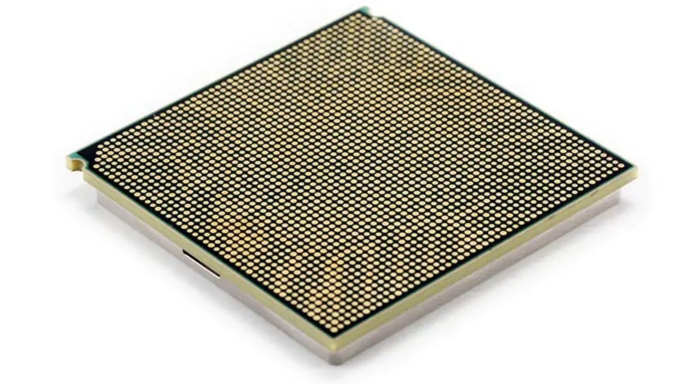

[NOTE]
====
IBM - no need to introduce, CPU part:

* First Commercialized 7nm Processor
* Multi-Petabyte Memory Clusters
* transparent memory encryption designed to support end-to-end security. T
* New Processor Core Architectures in the IBM POWER10 processor with an embedded Matrix Math Accelerator

Website: link:https://www.ibm.com/blogs/systems/ibm-power-systems-announces-power10-processor/[]
====

* IBM's First Commercialized 7nm Processor that is expected to deliver up to a 3x improvement in capacity and processor energy efficiency within the same power envelope as IBM POWER9, allowing for greater performance.
* Support for Multi-Petabyte Memory Clusters with a breakthrough new technology called Memory Inception, designed to improve cloud capacity and economics for memory-intensive workloads from ISVs like SAP, the SAS Institute, and others as well as large-model AI inference.
* New Hardware-Enabled Security Capabilities including transparent memory encryption designed to support end-to-end security. The IBM POWER10 processor is engineered to achieve significantly faster encryption performance with quadruple the number of AES encryption engines per core compared to IBM POWER9 for today's most demanding standards and anticipated future cryptographic standards like quantum-safe cryptography and fully homomorphic encryption. It also brings new enhancements to container security.
* New Processor Core Architectures in the IBM POWER10 processor with an embedded Matrix Math Accelerator which is extrapolated to provide 10x, 15x and 20x faster AI inference for FP32, BFloat16 and INT8 calculations per socket respectively than the IBM POWER9 processor to infuse AI into business applications and drive greater insights.

Designed over five years with hundreds of new and pending patents, the IBM POWER10 processor is an important evolution in IBM’s roadmap for POWER. Systems taking advantage of IBM POWER10 are expected to be available in the second half of 2021.

Samsung will manufacture the IBM POWER10 processor, combining Samsung’s industry-leading semiconductor manufacturing with IBM’s CPU designs.

[.text-center]

Need to mention technology that came with POWER 9:

* On-chip accelerators with new GZIP compression/decompression work much faster than software
* Ultra-high bandwidth CPU-GPU interconnect delivers ~ 4x faster training for AI models
* OpenCAPI™ interface offers high bandwidth and low latency communication to NICs, FPGA accelerators, and storage controllers

[IMPORTANT]
.Note from Jaro
====
Trend is ... obvious - not only smaller but also with AI part - embedded matrix math accelerator (FP32, BFloat16, INT8).
Do not forget technology that came with previous version - POWER 9: on-chip GZIP, CPU-GPU ultra-high bandwidth, OpenCAPI - bandwidth for communication with NICs, storage and FPGA accelerators.
====

