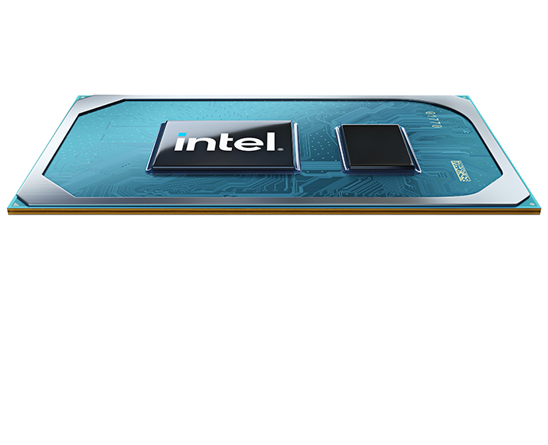

[NOTE]
====
CES 2021 (Jan. 11, 2021): Intel Announces Four New Processor Families.

* 11th Gen Intel® Core™ vPro® platform and Intel® Evo™ vPro® platform.
* ew N-series 10-nanometer Intel® Pentium® Silver and Intel® Celeron® processors.
* 11th Gen Intel® Core™ H-series mobile processors for gaming platforms .
* 11th Gen Intel® Core™ S-series desktop processors (code-named “Rocket Lake-S”) and its next-generation processors (code-named “Alder Lake”).

Website: link:https://newsroom.intel.com/news-releases/ces-2021-intel-announces-four-new-processor-families/[]
====

]

In a world where computing is pervasive and intelligence is distributed across every surface – from the cloud to the network to the intelligent edge – Intel today at CES 2021 highlighted how it is driving technology leadership to define the future of computing for people, business and society.

To help people navigate through this extraordinary time, Intel introduced new processors for business, education, mobile and gaming computing platforms – all designed to offer the premium PC experiences people deserve, with the most choices and no limits.

* Intel launched the 11th Gen Intel® Core™ vPro® platform and Intel® Evo™ vPro® platform, delivering the highest performance and most comprehensive hardware-based security1.
* Intel introduced the new N-series 10-nanometer Intel® Pentium® Silver and Intel® Celeron® processors that offer an unmatched balance of performance, media and collaboration for education systems.
* Intel announced a new line of 11th Gen Intel® Core™ H-series mobile processors for gaming platforms that deliver an industry-leading balance of mobility and enthusiast-level gaming.
* Intel also previewed products coming to market later in 2021, including 11th Gen Intel® Core™ S-series desktop processors (code-named “Rocket Lake-S”) and its next-generation processors (code-named “Alder Lake”).

*Introducing 11th Gen Intel® Core™ vPro®: The Best Platform for Business*

For business, Intel introduced the 11th Gen Intel vPro platform, an unrivaled business platform delivering the industry’s highest performance and world’s most comprehensive hardware-based security2. The new 11th Gen Intel Core vPro processors unveiled today are based on the world’s best business processor for thin-and-light laptops2 and, when combined with the new Intel Core vPro platform, offer:

Intel® Hardware Shield, providing the world’s most comprehensive security deep in hardware for business3 and the industry’s first silicon-enabled artificial intelligence (AI) threat detection to help stop ransomware and crypto-mining attacks. It is also equipped with Intel® Control Flow Enforcement Technology, ground-breaking technology to help shut down an entire class of attacks that long evaded software-only solutions4.
Intel 10-nanometer (nm) SuperFin technology, delivering industry-leading performance, Intel® Iris® Xe graphics and the world’s biggest Wi-Fi improvement in 20 years – with integrated Intel® Wi-Fi 6/6E (Gig+) that enables up to six times faster uploads and downloads in the office and nearly three times faster speeds at home versus standard Wi-Fi 55.
Eight times6 better AI performance, enabling businesses new compute power to keep pace with the fast-changing software ecosystem, and up to 2.3 times faster7 creation and video editing compared to the previous generation.
Up to 23% faster productivity8 than the competition when using apps like Office 365 and the best business collaboration experience, enabling more than 50% faster9 office productivity compared to the competition while on a video conference call.
Intel also launched the Intel® Evo™ vPro® platform, the best laptop experience for business users10. Laptop designs verified on the Intel Evo vPro platform are stylish, thin and light and provide an amazing immersive visual experience. They also offer remarkable responsiveness, instant wake and real-world battery life. More than 60 new laptops from top manufacturers will be available this year, combining the security and manageability of vPro and the amazing on-the-go experiences of Intel Evo. Additionally, Intel announced Intel Evo Chromebooks, enabling a new class of premium Chromebooks.

*New Processors and Partnerships for Best Education Platform*

Use of the PC as an essential education tool has accelerated greatly worldwide over the past year. To meet the growing needs of students, Intel introduced new N-series Intel® Pentium® Silver and Celeron® processors with an unmatched balance of performance, media and collaboration for education systems. The processors are designed on Intel’s 10nm architecture, delivering up to 35%11 better overall application performance and up to 78% better graphics performance gen on gen. This enables smooth application performance and browsing while multitasking, plus advanced camera and connectivity features for an enriched video conferencing and viewing experience.

As critical as advancing technology for meeting students’ evolving needs is putting laptops in their hands. Even with accelerated adoption, up to 30% of U.S. school children still lack internet or laptops for learning, and the pandemic has only exacerbated those requirements. During the last 15 years, Intel has invested more than $1 billion globally in education, including training for more than 15 million teachers. Last April, Intel launched the Online Learning Initiative and has provided hundreds of thousands of devices, as well as connectivity and resources, to students worldwide. Intel will continue these efforts in 2021 along with partners from inside and outside the technology industry.

*New Line of 11th Gen Intel® Core™ H-series Mobile Processors for the Best Gaming Platforms*

Intel launched a new line of 11th Gen Intel Core H-series mobile processors for gaming that extends the 11th Gen mobile family of products and pushes the limits of what’s possible for enthusiast-level gaming in laptops as thin as 16 millimeters. Led by the Intel® Core™ i7 Special Edition 4-core processor with up to 5 gigahertz (GHz) Turbo, these H35 processors are specifically targeted for ultraportable gaming. They feature new Gen 4 PCIE architecture for connecting to latest discrete graphics and deliver amazingly low latency and immersive game play on the go. At CES, Acer, ASUS, MSI and Vaio announced new systems powered by the 11th Gen Intel Core H35-series processor for ultraportable gaming, with more than 40 designs from top manufacturing partners launching in the first half of 2021.

For mobile enthusiasts who want desktop-caliber gaming and creation performance, Intel also announced an 8-core processor that will start shipping later this quarter. This platform is unique in the industry with features that would normally only be found in high-end desktop systems – including up to 5GHz, 20 lanes of PCIe Gen 4.0 architecture for fastest storage and discrete graphics, and Intel® Killer™ Wi-fi 6E (Gig+).

*Preview of Next-Generation “Rocket Lake” and “Alder Lake” Technologies for Leadership Desktop and Mobile Platforms*

Intel also demonstrated next-generation desktop technology for gamers and enthusiasts coming to market in 11th Gen Intel® Core™ S-series desktop processors (“Rocket Lake-S”). Featuring 19% gen-over-gen instructions per cycle (IPC) improvement12 for the highest frequency cores and headlined by the Intel Core i9-11900K, these processors will bring even more performance to gamers and PC enthusiasts at launch in the first quarter of 2021.

Additionally, Intel demonstrated “Alder Lake,” the next-generation processor that represents a significant breakthrough in x86 architecture and Intel’s most power-scalable system-on-chip. Due in second half of 2021, Alder Lake will combine high-performance cores and high-efficiency cores into a single product. Alder Lake will also be Intel’s first processor built on a new, enhanced version of 10nm SuperFin and will serve as the foundation for leadership desktop and mobile processors that deliver smarter, faster and more efficient real-world computing.

[IMPORTANT]
.Note from Jaro
====
Intel - doesn't look really progressive in CPU space, it is leader but question is: for how long?. Last year Apple resigned from using Intel CPUs, complaining about innovation - and Apple created it's own processor based on ARM architecture - M1 (see in SoC chapter). IBM on top of moving to 7nm added AI on-chip. Looks like Intel is missing signals from the rivals.

Intel was once one of most innovative companies from business perspective - they have innovative approach where every employee was equal - and every idea was worth testing, looks like that innovative spirit disappeared.
====

