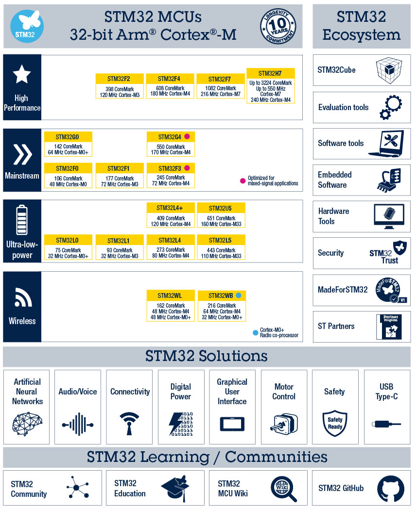
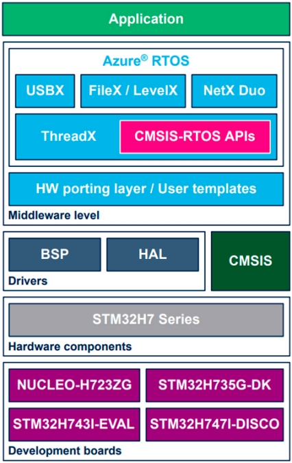

[NOTE]
====
ST Microelectronics is
creators and makers of semiconductor technologies, devices, and solutions. Together we design and build products, solutions and ecosystems that address the sustainability and resource management challenges our customers are facing, while helping them seize opportunities they are pursuing.

This is why we have 7,800 R&D employees, invest about 16% of our revenues in R&D every year, and engage in extensive collaboration with leading research labs and corporate partners throughout the world. Moreover, we are continuously investing in our footprint as an independent device manufacturer. Our 11 manufacturing sites master all aspects of the semiconductor supply chain and offer our customers the quality, flexibility, and supply security they need.

Website: link:https://www.st.com/en/microcontrollers-microprocessors/stm32-32-bit-arm-cortex-mcus.html[]
====

(Example STM32 MCU family)

The STM32 family of 32-bit microcontrollers based on the Arm ® Cortex ®-M processor is designed to offer new degrees of freedom to MCU users. It offers products combining very high performance, real-time capabilities, digital signal processing, low-power / low-voltage operation, and connectivity, while maintaining full integration and ease of development.

The unparalleled range of STM32 microcontrollers, based on an industry-standard core, comes with a vast choice of tools and software to support project development, making this family of products ideal for both small projects and end-to-end platforms.

---

Azure RTOS software expansion for STM32Cube for STM32H7 series

X-CUBE-AZRTOS-H7 (Azure® RTOS STM32Cube Expansion Package) provides a full integration of Microsoft® Azure® RTOS in the STM32Cube environment for the STM32H7 Series of microcontrollers. Ready-to-run applicative examples provided for the NUCLEO-H723ZG, STM32H735G-DK, STM32H747I-DISCO and STM32H743I-EVAL Evaluation boards, along with a full compatibility with STM32CubeMX and STM32CubeIDE, ensure that X-CUBE-AZRTOS-H7 drastically reduces the learning curve and provides a smooth application development experience with Azure® RTOS and STM32H7 Series microcontrollers. The scope of this Expansion Package covers the following Azure® RTOS middleware: RTOS (ThreadX), USB Device and Host (USBX), file system including the support for NOR and NAND Flash memories (FileX and LevelX), and networking including Ethernet and Wi-Fi® media (NetX Duo).

All features:

- Integrated and full featured operating system: Azure® RTOS ThreadX
- Industrial grade networking stack optimized for performance coming with many IoT protocols: Azure® RTOS NetX Duo
- Advanced Flash file system (FS) / Flash translation layer (FTL), fully featured to support NAND / NOR Flash memories: Azure® RTOS FileX and Azure® RTOS LevelX
- USB Host and Device stacks coming with multiple classes: Azure® RTOS USBX
- Safety pre-certifications (available from Microsoft): IEC 61508 SIL4, IEC 62304 Class C and ISO 26262 ASIL D
-  Security pre-certifications (available from Microsoft): EAL4+ for TLS/DTLS, FIPS 140-2 for software cryptographic library
- Many applicative examples available for STMicroelectronics NUCLEO-H723ZG, STM32H735G-DK, STM32H747I-DISCO and STM32H743I-EVAL boards
- Free user-friendly license terms
- Enhanced for STMicroelectronics toolset: graphical configuration of Azure® RTOS middleware  with STM32CubeMX and STM32CubeIDE
- Update mechanism, which can be enabled by the user to be notified of new releases

[IMPORTANT]
.Note from Jaro
====
STMicroelectronics on top of all semiconductor they produce CPUs, here some ARM based however they also create full ecosystem from evaluation through software and hardware tools 

====
