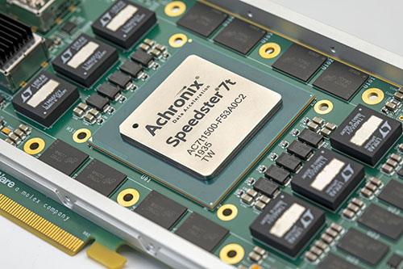
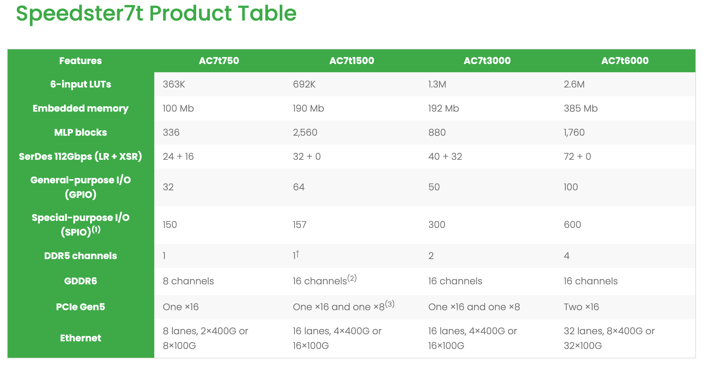

[NOTE]
====
Achronix is a fabless semiconductor corporation based in Santa Clara, California, offering high-performance FPGA solutions.

Website: link:http://yarenty.com[]
====

*Speedster7t FPGAs*

Speedster®7t FPGAs are optimized for high-bandwidth workloads and eliminate the performance bottlenecks associated with traditional FPGAs.

The Speedster7t FPGA family is optimized for high-bandwidth workloads and eliminates the performance bottlenecks associated with traditional FPGAs. Built on TSMC’s 7nm FinFET process, Speedster7t FPGAs feature a revolutionary new 2D network-on-chip (NoC), an array of new machine learning processors (MLPs) optimized for high-bandwidth and artificial intelligence/machine learning (AI/ML) workloads, high-bandwidth GDDR6 interfaces, 400G Ethernet and PCI Express Gen5 ports — all interconnected to deliver ASIC-level performance while retaining the full programmability of FPGAs.  Get started today with the VectorPath accelerator card, featuring the Speedster7t FPGA.

[.text-center]

2D Network on Chip (NoC)

- >20 Tbps bandwidth
- Reduce routing congestion vs. traditional FPGAs
- Simplify FPGA design

High-Speed Interfaces

- PCIe Gen5
- Up to 72 – 112 Gbps SerDes
- 400G Ethernet Interfaces
- Eight hard GDDR6 memory interfaces with 4 Tbps bandwidth

Machine Learning Processors

- Native support for integer, floating point, bfloat16 and block floating point
- Speeds up to 750 MHz with integrated memory
- Fully fracturable integer multiplier/accumulator

The core of many AI/ML algorithms is pattern recognition, often implemented as a neural network. AI/ML algorithm developers are widely adopting deep convolutional neural networks (DNNs) because these deep networks offer state-of-the-art accuracy for important image classification tasks. AI/ML algorithms generally employ matrix vector math, which requires trillions of multiply/accumulate (MAC) operations per second. Executing these core AI/ML math operations requires many fast multipliers and adders — generally called MAC units.

*FPGA as an AI/ML Engine*

Achronix's new Speedster7t FPGA family has been designed specifically to meet these challenges. Every aspect of the Speedster7t FPGAs' architecture has been tuned to create an optimized, balanced, massively parallel compute engine for AI/ML applications. Each Speedster7t FPGA feature a massively parallel array of programmable compute elements, organized into new machine learning processors (MLP) blocks. Each MLP is a highly configurable, compute-intensive block, with up to 32 multipliers, that support integer formats from 4 to 24 bits and various floating-point modes including direct support for Tensorflow’s bfloat16 format and block floating-point (BFP) format.

The MLP's programmable MAC incorporates both a fracturable, integer MAC and a hard floating-point MAC. Each MLP block in the Speedster7t fabric also incorporates two memories that are closely coupled to the MAC blocks. One memory is a large, dual-port, 72-kb embedded SRAM (BRAM72k), and the other is a 2-kb (LRAM2k) cyclic buffer. The number of available MLP blocks varies by device, but can number into the thousands.

The MAC's fracturable nature allows it to optimally handle the reduced-precision calculations increasingly used by AI/ML inference algorithms to minimize memory requirements. Due to its fracturable nature, the MLP can perform an increasing number of computations as the precision of the number formats are reduced.

*Feature-Rich and Highest Performance Operation*

The MLP offers a range of features including integer multiply with optional accumulate, bfloat16 operations, floating point 16, floating point 24, and block floating point 16. Below is a list of features available with the MLP block:

- Fully fracturable integer multiplier/accumulator to efficiently support machine learning inferencing and more traditional applications such as complex adaptive signal processing. Each MLP supports 4x int16, 16x int8 or 32x int4 multiplications. The Speedster7t family supports up to 40,960 int8 MACs resulting in theoretical maximum performance of 61.4 tera-operations per second when running at 750 MHz.
- Flexible floating point is provided to greatly enable numerical precision in calculations. The MLP can be reconfigured to support fp15, fp24 and bf16 number formats for both input and output variables.
- Native support for block floating point is enabled in the MLP. In block floating point, a single exponent is shared across a block of mantissa values. This scheme provides improved dynamic range over fixed-point arithmetic with performance approaching that of traditional floating point, but significantly more efficient. The MLP has dedicated circuitry to enable block floating point numbers to be multiplied, summed and accumulated.
- Highest performance matrix multiplication, exploiting data locality and flow, the MLP includes integrated block RAMs to ensure maximum performance. These memories can be utilized independently, but for MLP multiplication functions, they ensure the highest performance and most power efficient operation by not utilizing the FPGA routing resources. MLPs also include cascade paths between adjacent MLPs to share memories and data for weights or activation data and implementation of efficient data structures such as systolic array architectures.

---

*VectorPath Accelerator Card*

- PCIe Gen3 ×16 with qualification path to Gen4 and Gen5
- 400G and 200G Ethernet connectivity
- GDDR6 delivering 4 Tbps memory bandwidth
- Includes one-year license to ACE design software, BittWare BittWorks II toolkit, PCIe drivers

[.text-center]

[IMPORTANT]
.Note from Jaro
====
Achronix to List on NASDAQ Through Merger with ACE Convergence

January 7, 2021:
Achronix Semiconductor Corporation, a leader in high-performance field-programmable gate arrays (FPGAs) and embedded FPGA (eFPGA) IP, and ACE Convergence Acquisition Corp. (ACE) (Nasdaq: ACEV), a special-purpose acquisition company, today announced that they have entered into a definitive agreement for a business combination that would result in the combined entity continuing as a publicly listed company. Upon closing of the transaction, the combined operating entity will be named Achronix Semiconductor Corporation and will be listed under the ticker symbol ACHX.

As the only independent, high-end FPGA semiconductor company that offers both high-end standalone FPGAs along with eFPGA IP technology, Achronix is uniquely positioned to address the needs of high-performance applications that require programmable hardware accelerators. Demand for FPGA-based data accelerators is driven by the rapid expansion of high-growth markets, including AI, Cloud, 5G, and ADAS. Achronix’s semiconductor portfolio targets the nearly $10 billion data acceleration market, which is expected to have double-digit CAGR through 2025. (Data according to Semico Research.)

Announcement Highlights

- Achronix is the only independent supplier of high-performance FPGAs and eFPGA IP based data acceleration solutions used in high-growth applications including AI, cloud computing, 5G, networking and automotive driver assistance
- Highly differentiated financial profile with estimated 2020 revenues of approximately $105 million, 79% gross margins and 35% operating margins with migration to next-generation products driving an estimated revenue CAGR of 20% to 25% from 2020 to 2025
- Business combination with ACE Convergence Acquisition Corp. (Nasdaq: ACEV) positions Achronix to capitalize on non-cancellable backlog in excess of $160 million and over $1.1 billion in identified pipeline opportunities driven by Speedster® and Speedcore™ products
- Approximately $2.1 billion estimated post-transaction equity value based on current assumptions with up to $330 million in gross cash proceeds to the company, assuming minimal redemptions
- Oversubscribed $150 million fully committed common stock concurrent PIPE financing at $10.00 per share anchored by ACE Equity Partners LLC, funds and accounts managed by BlackRock and Hedosophia; and with participation from other institutional investors
- Achronix expected to be listed on Nasdaq under the ticker symbol “ACHX” following an anticipated transaction close by the end of the first half of 2021

====