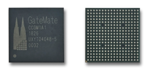
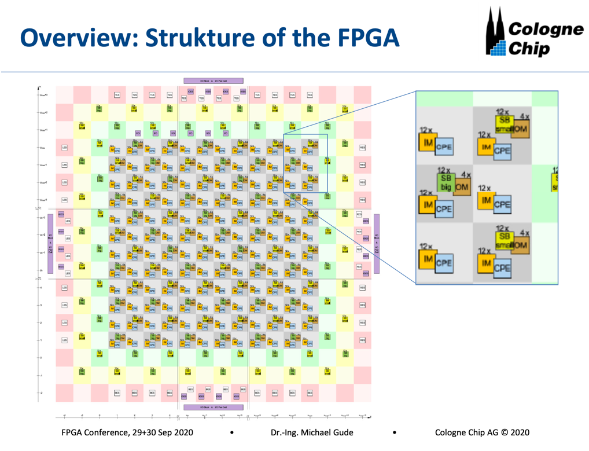

[NOTE]
====
Cologne Chip - The smart semiconductor company

Specialized in Telecoms -  ISDN Transceiver ICs, ASSIC IP Cores in the fiels of telecommunication interfaces - C^3IP - fullyu digital implementation instead of analog functional blocks (they claim it works).

The programmable silicon of GateMateTM FGPA can be used in low-power and speed applications and thus in a wide range of areas: Industry, automation, communication, AI, automotive, IoT and much more.

GateMate is their latest development, FPOA architecture with the most cost-effective FPGAs against the Big player link:https://www.elektroniknet.de/international/with-the-most-cost-effective-fpgas-against-the-big-player.176029.html[]

Website: link:https://www.colognechip.com/[]
====

*GateMateTM FPGA*

Suitable from university projects up to high volume applications.

The GateMateTM FPGA family of Cologne Chip AG addresses all application requirements of small to medium size FPGAs. Very low power and speed applications are feasible. Logic capacity, power consumption, package size and PCB compatibility are best in class. GateMateTM FPGAs combine these features with lowest cost in industry making the devices well suited from University projects to high volume applications. Because of the outstanding Circuit size/Cost ratio, even new applications now can use the benefits of FPGAs.

All this is based on a novel FPGA architecture combining a special Central Programmable Element (CPE) with a smart routing engine. Furthermore, arbitrary size Multipliers are usable. Memory aware applications can use block RAMs with bit widths of 1 to 80 bits. Even bit-wise enable is possible.

[.text-center]

General Purpose IOs (GPIOs) can use different voltage levels from 1.2 to 2.5 Volt. GPIOs can be configured as single-ended or LVDS differential type. Furthermore a high speed SerDes interface is available.

GateMateTM FPGAs are supported by EasyConvertTM, that enables the transfer of existing FPGA designs without new synthesis. Worldclass P&R-software maps and implements the design into GateMateTM FPGA.

A Static Timing Analysis (STA) is also performed and gives evidence about critical pathes and the overall performance of a design. The design can be easily simulated using Verilog netlist and SDF timing extraction.

The devices are manufactured using GlobalfoundriesTM 28 nm SLP (Super Low Power) process. Due to manufacturing in Europe, there is no danger of trade restrictions or high taxation.

[.text-center]

*GateMateTM FPGA Features*

Novel CPE Architecture

* 20,480 programmable elements for combinatorial and sequential logic
* 40,960 Latches / Flip-Fops within programmable elements
* CPE consists of LUT tree with 8 inputs
* Each CPE configurable as 2-bit full-adder or 2x2 multiplier

Low Power Consumption

* GlobalfoundriesTM 28 nm SLP (Super Low Power) process
* 3 operation modes: low power, economy, speed
* No excessive start-up currents
* Only two supply voltages needed, can be applied in any order

Features

* 4 programmable PLLs
* Fast configuration with quad SPI interface up to 100 MHz
* Multi-Chip configuration
* 1,280 Kbit dual-port SRAM with variable data width divided in 32 SRAM blocks
* Dual ported Block RAMs with 20-80 bit data width, also configurable as FIFO
* Multipliers with arbitrary factor width implementable
* Multiple clocking schemas
* All GPIOs configurable as single-ended or LVDS differential type and support double data rate (DDR)

Package

* FPGA in ball grid package for low size and high pin count
* Only 2 signal layers required on PCB

[IMPORTANT]
.Note from Jaro
====
Colognechip company are proud of title: "Made in Germany", and looks like stable German company.

GateMate - is quite innovative and on the level with Xilinx.
Currently, they work on evaluation board and  software part - creating primitive libraries.

Recently they have delay in delivery of chips due to Corona.

They start thinking about OTP version of the chip (one time programmable) as many customers only want to program the chip once.

In long run they could be interesting player on the market.
====
