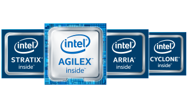
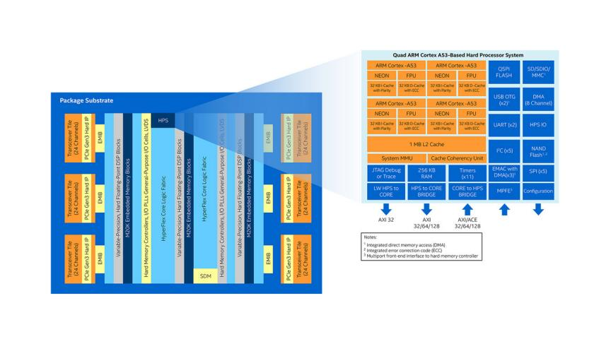
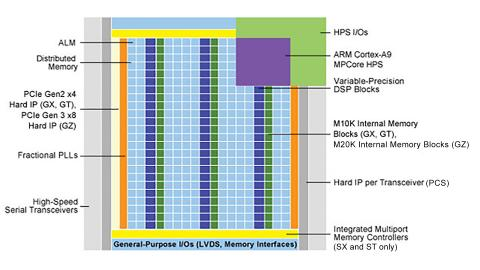
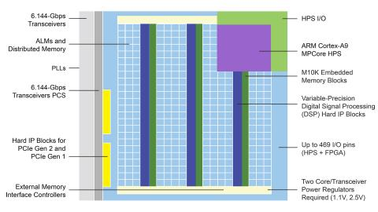

[NOTE]
====

Intel® FPGAs offer a wide variety of configurable embedded SRAM, high-speed transceivers, high-speed I/Os, logic blocks, and routing. Built-in intellectual property (IP) combined with outstanding software tools lower FPGA development time, power, and cost:

* *Intel® Agilex™ FPGAs*
Intel® Agilex™ FPGA family, built on 10nm technology, enables customized acceleration and connectivity for a wide range of compute and bandwidth intensive applications while providing an improvement in performance and reduction in power.

* *Intel® Stratix® Series*
The Intel® Stratix® FPGA and SoC family enables you to deliver high-performance, state-of-the-art products to market faster with lower risk and higher productivity.

* *Intel® Arria® Series*
The Intel® Arria® device family delivers Intel® performance and power efficiency in the midrange.

* *Intel® Cyclone® Series*
The Intel® Cyclone® FPGA series is built to meet your low-power, cost-sensitive design needs, enabling you to get to market faster.

* *Intel® MAX® Series*
The Intel® MAX® 10 FPGAs revolutionize non-volatile integration by delivering advance processing capabilities in a low-cost, single chip small form.

Website: link:https://www.intel.com/content/www/us/en/products/programmable.html[]
====

Intel® Agilex™ SoC FPGAs provide the agility and flexibility to address a broad range of markets with tailored solutions.

To meet the needs of high-end applications with the most demanding performance requirements, Intel offers the Intel® Stratix® series. The Intel® Arria® series balances cost and power with performance for midrange applications. The Intel® Cyclone® series provides low system cost and power coupled with performance levels that make the device family ideal for differentiating high-volume applications.

Intel® Agilex™ SoC FPGAs
The Intel® Agilex™ SoC FPGA family manufactured on Intel’s 10nm technology, integrates the quad-core Arm* Cortex*-A53 processor, features a hardened variable precision DSP, and delivers significant improvements in power and performance1 for a wide array of applications which require high system integration.

Family Variants:

* Intel® Agilex™ F-Series FPGAs and SoCs

Intel® Agilex™ F-Series FPGAs and SoC FPGAs bring together transceiver support up to 58 Gbps, increased DSP capabilities, high system integration, and 2nd Gen Intel® Hyperflex™ architecture for a wide range of applications in Data Center, Networking, and Edge. Intel® Agilex™ F-Series FPGA and SoC family also provides the option to integrate the quad-core Arm* Cortex-A53 processor to provide high system integration.

* Intel® Agilex™ I-Series SoC FPGAs

Intel® Agilex™ I-Series SoC FPGAs are optimized for high performance processor interface and bandwidth intensive applications. Coherent attach to Intel® Xeon® processors with Compute Express Link, hardened PCIe* Gen 5 support and transceiver support up to 112 Gbps make the Intel® Agilex™ I-Series SoC FPGAs a compelling choice for applications which demand massive interface bandwidth and high performance.

* Intel® Agilex™ M-Series SoC FPGAs

Intel® Agilex™ M-Series SoC FPGAs are optimized for compute and memory intensive applications. With Coherent attach to Intel® Xeon® processors, HBM integration, hardened DDR5 controller, and Intel® Optane™ DC persistent memory support the Intel® Agilex™ M-Series SoC FPGAs are optimized for data-intensive applications which need massive memory in addition to high bandwidth. Coming soon.

*FEATURES*

* *Compute Express Link*
With the Compute Express Link, Intel® Agilex™ FPGA, and SoC family offers the industry’s first Cache and Memory coherent interconnect to Intel® Xeon® processors. This revolutionary FPGA interconnect will provide low latency and performance gains for memory intensive applications with massive data processing needs.

* *Transceiver Leadership* 
Intel® Agilex™ FPGA and SoC family delivers accelerated transceiver innovation with data rates up to 112Gbps and support for PCI Express* up to Gen 5. Intel® Agilex™ FPGA and SoC family will allow customers to choose from a comprehensive transceiver portfolio of 28.3Gbps, 58Gbps, and 112Gbps transceiver tiles. Decoupling the transceiver development accelerates product innovation.

* *DSP Innovation* 
Intel® Agilex™ FPGA and SoC family offers a configurable DSP engine which features hardened support for single-precision FP32, half-precision FP16, BFLOAT16, and INT8 calculations. Intel® Agilex™ FPGA and SoC family also supports low- precision configurations from INT7 to INT2 for maximum flexibility. Intel® Agilex™ FPGA programmability, coupled with the innovations in the DSP blocks is ideal for evolving AI workloads.

* *Heterogeneous 3D SiP Technology*
With the proven Embedded multi-die Interconnect Bridge (EMIB) technology, Intel® Agilex™ FPGA, and SoC family offers high density die-to-die interconnect for heterogeneous chips and delivers high performance at low cost. A large library of tiles including transceivers, custom IO, custom compute, and Intel® eASIC™ device tiles provide the agility, flexibility, and customization needed for a variety of applications.

* *Hardened Protocol Support*
Intel® Agilex™ FPGA and SoC family delivers optimal power, performance, and logic utilization efficiency by integrating hardened protocols for many popular functions including 100/200/400G Ethernet, PCIe* Gen 4/5 interface, Interlaken, CPRI, JESD204B/C, and many more.

* *Memory Integration*
Intel® Agilex™ FPGA and SoC family features the industry’s first FPGA support for Intel® Optane™ DC persistent memory. In addition to this, HBM integration allows up to 16GB of external memory to be offered in-package affording up to 512 GB/s of peak memory bandwidth. Dedicated DDR5/4 hard memory controllers will support further on-board DRAM memory expansion.

* *2nd Gen Intel® Hyperflex™ Architecture*
Continuous improvements to the acclaimed Intel® Hyperflex™ architecture deliver improved performance compared to Intel® Stratix® 10 device designs. The 2nd Gen Intel® Hyperflex™ architecture will be extended to all densities and variants of Intel® Agilex™ FPGA and SoC family and thus greatly improve the productivity of customers and reduce time-to-market.

* *Secure Device Manager*
A Secure Device Manager will serve as the central command center for the entire FPGA, controlling key operations, such as configuration, device security, single event upset (SEU) responses, and power management. The Secure Device Manager creates an unified, secure management system for the FPGA fabric, hard processor system (HPS) in SoCs, embedded hard IP blocks, and I/O blocks.

---

Intel® Stratix® 10 SoC FPGAs
Intel® Stratix® 10 SoC FPGAs offer breakthrough advantages in bandwidth and system integration, including a next-generation hard processor system (HPS). Intel® Stratix® 10 SoC FPGAs feature the revolutionary Intel® Hyperflex™ FPGA Architecture and are manufactured on the Intel 14 nm Tri-Gate process, delivering breakthrough levels of performance and power efficiencies that were previously unimaginable. When coupled with 64 bit quad-core ARM* Cortex*-A53 processor and advanced heterogeneous development and debug tools such as the Intel® SDK for OpenCL™ 2 and SoC Embedded Design Suite (EDS), Intel® Stratix® 10 SoC FPGAs offer the industry’s most versatile heterogeneous computing platform.

Achieve High Levels of System Integration
Intel® Stratix® 10 SoCs empowers the USR in the ARM* ecosystem. ARM's next-generation 64-bit architecture (ARMv8) enabling enable hardware virtualization, system management and monitoring capabilities, and acceleration pre-processing. The ARM* Cortex-A53* processor supports 32-bit execution mode and board support packages for popular operating system including Linux*, Wind River’s VxWorks*, Micrium’s uC/OS-II* and uC/OS-III*, and more.

Achieve High Designer Productivity with Optimized FPGA and SoC Design Software
New engine optimized for multi-million logic elements (LE) FPGA designs providing significant reduction in design iterations, Intel® Stratix® 10 SoC Virtual Platform to enable early software development and verification, and C-based design entry using the Intel® FPGA SDK for OpenCL™, offering a design environment that is easy to implement on SoC FPGAs. Heterogeneous debug, profiling, and whole chip visualization with Intel® FPGA SoC FPGA Embedded Development Suite (EDS) featuring the ARM* Development Studio 5* (DS-5*) Intel® SoC FPGA Edition Toolkit.

---

Intel® Arria® 10 SoC FPGAs
The 20 nm ARM-based Intel® Arria® 10 SoC FPGAs deliver optimal performance, power efficiency, small form factor, and low cost for midrange applications. The Intel® Arria® 10 SoC FPGAs, based on TSMC’s 20 nm process technology, combine a dual-core ARM* Cortex*-A9 MPCore* HPS with industry-leading programmable logic technology that includes hardened floating-point digital signal processing (DSP) blocks. By utilizing the same dual-core ARM* Cortex*-A9 processor as the Arria® V SoC FPGA, the Intel® Arria® 10 SoC FPGA offers an easy performance upgrade and software migration path for Arria® V SoC FPGA designs.

The 20 nm ARM*-based Intel® Arria® 10 SoC delivers optimal performance, power efficiency, small form factor, and low cost for midrange applications. The Intel Arria 10 SoC, based on TSMC’s 20 nm process technology, combines a dual-core ARM Cortex*-A9 MPCore* Hard Processor System (HPS) with industry-leading programmable logic technology that includes hardened floating-point digital signal processing (DSP) blocks. The Intel Arria 10 SoC offers a processor with a rich feature set of embedded peripherals, hardened floating-point variable-precision DSP blocks, embedded high-speed transceivers, hard memory controllers, and protocol intellectual property (IP) controllers - all in a single highly integrated package.

---

Arria® V SoC FPGAs
Arria® V SoC FPGAs provide the highest bandwidth with the lowest total power for midrange applications such as remote radio units, 10G/40G line cards, medical imaging, and broadcast studio equipment. The combination of a HPS consisting of a dual-core ARM* Cortex*-A9 processor, peripherals, and memory interfaces with our flexible 28 nm FPGA fabric lets you reduce system power, cost, and board space.

SoC FPGAs are more than the sum or their parts. It is critically important to understand how the processor and FPGA systems work together to accomplish each task. When you choose an SoC FPGA for your next design, architecture matters. Intel® SoC FPGAs are designed to:

Preserve the flexibility of processor boot / FPGA configuration sequence, system response to processor reset, and independent memory interfaces of a two-chip solution
Maintain data integrity and reliability with integrated ECC
Protect DRAM memory shared by the processor and FPGA with an integrated memory protection unit
Enable system-level debug with Intel's FPGA-adaptive debugging for unmatched visibility and control of the whole device

---

Cyclone® V SoC FPGAs
Cyclone® V SoC FPGAs provide the industry's lowest system cost and power. The SoC FPGA high performance levels are ideal for differentiating high-volume applications such as industrial motor control drives, protocol bridging, video converter and capture cards, and handheld devices. SoC FPGAs come in a wide range of programmable logic densities with many system-level functions hardened in silicon-a dual-core ARM* Cortex*-A9 HPS, embedded peripherals, multiport memory controllers, serial transceivers, and PCI Express* (PCIe*) ports.

ARM*-Based HPS
The Cyclone® V SoC FPGA HPS consists of a dual-core ARM* Cortex*-A9 MPCore* processor, a rich set of peripherals, and a multiport memory controller shared with logic in the FPGA, giving you the flexibility of programmable logic and the cost savings of hard intellectual property (IP) due to:
Single- or dual-core processor with up to 925 MHz maximum frequency.
Hardened embedded peripherals eliminate the need to implement these functions in programmable logic, leaving more FPGA resources for application-specific custom logic and reducing power consumption.
Hardened multiport memory controller, shared by the processor and FPGA logic, supports DDR2, DDR3, and LPDDR2 devices with integrated error correction code (ECC) support for high-reliability and safety-critical applications.
High-Bandwidth Interconnect
High-throughput datapaths between the HPS and FPGA fabric provide interconnect performance not possible in two-chip solutions. This tight integration provides:

Over 100 Gbps peak bandwidth.
Integrated data coherency.
Significant system power savings by eliminating the external I/O paths between the processor and the FPGA.
Flexible FPGA Fabric
The FPGA logic fabric lets you differentiate your system by implementing custom IP or off-the-shelf preconfigured IP from Intel or its partners into your designs. This allows you to:

Adapt quickly to varying or changing interface and protocol standards.
Add custom hardware in the FPGA to accelerate time-critical algorithms and create a compelling competitive edge.
Quickly deploy a custom ARM* processor without the extensive design, verification, and non-recurring engineering (NRE) costs required in ASICs.
Architecture Matters
Because Cyclone® V SoC FPGAs integrate many hard IP blocks, you can lower your overall system cost, power, and design time. SoC FPGAs are more than the sum or their parts. How the processor and FPGA systems work together matters greatly to your system’s performance, reliability, and flexibility. Intel® SoC FPGAs are designed to:

Preserve the flexibility of processor boot or FPGA configuration sequence, system response to processor reset, and independent memory interfaces of a two-chip solution.
Maintain data integrity and reliability with integrated ECC.
Protect DRAM memory shared by the processor and FPGA with an integrated memory protection unit.
Enable system-level debug with Intel’s FPGA-adaptive debugging for unmatched visibility and control of the whole device.
Not All SoC FPGAs Are Created Equal. Architecture Matters.
Learn how to choose the right SoC FPGA for your application from our extensive set of resources, including a short series of videos from processor expert Jim Turley.

---

Intel® eASIC™ devices are structured ASICs, an intermediary technology between FPGAs and standard-cell ASICs. These devices provide lower unit-cost and lower power compared to FPGAs and faster time to market and lower non-recurring engineering cost compared to standard-cell ASICs. The new Intel® eASIC™ N5X devices, formerly codenamed Diamond Mesa, add a hard processor system and secure device managers compatible with Intel® FPGAs to extend Intel's logic portfolio offerings.

Benefits:

* Lower Power and Unit Cost

Provides unit-cost and power reductions compared to FPGA by replacing SRAM configuration logic with patented single-via customization technology and disconnecting power from unused device structures.

* Time Advantage

Faster time to market and turnaround time than traditional ASICs due to simplified design flow, customization of only a few mask layers, and when feasible no PCB change from base FPGA designs.

* High Performance

The structured ASIC combines logic, memory, DSP functionality, high-speed memory interfaces, and high-speed transceivers for high-performance data plane or control plane applications.

* Broad IP Support

A wealth of fully verified eASIC-ready IP cores from Intel and third-party alliance partners.

* Simplified Design Flow

Intel® eASIC™ device eTools offer a framework for design conversion and validation using a combination of internally developed and industry standard third-party tools.

* Market Applicability

Intel® eASIC™ devices offer custom low power solutions for a broad range of end markets such as 5G wireless, networking, military, cloud and storage, machine learning inference, consumer, video and broadcast and automotive applications.

[IMPORTANT]
.Note from Jaro
====

Intel® FPGAs offer a wide variety of configurable embedded SRAM, high-speed transceivers, high-speed I/Os, logic blocks, and routing. Built-in intellectual property (IP) combined with outstanding software tools lower FPGA development time, power, and cost:

- Agilex
- Stratix
- Arria 
- Cyclone

Intel FPGAs are impressive - that's why if you look for volume FPGA world is divided by Intel ans Xilinx - they both get 90% FPGA solutions, and they both are most advanced.

There is separate eASC family of devices with ready IP cores from Intel and third-party alliance partners.
====
