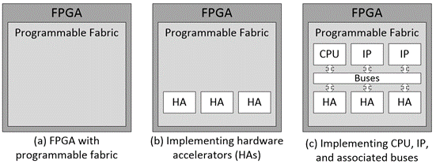
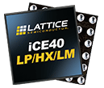
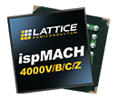

[NOTE]
====
The full-featured Lattice sensAI stack includes everything you need to evaluate, develop and deploy FPGA-based Machine Learning / Artificial Intelligence solutions - modular hardware platforms, example demonstrations, reference designs, neural network IP cores, software tools for development, and custom design services.
The Lattice’s FPGA-based machine learning solutions are highly flexible, easy to implement, low power (from under 1 mW-1 W), small (package sizes starting at 5.5 mm2) and priced for high volume production.
Lattice can help you accelerate deployment of always-on, on-device AI into a wide range of Edge applications including mobile, smart home, smart city, smart factory, and smart car products.

Website: link:https://www.latticesemi.com/[]
====

Things are evolving dramatically in embedded design space. Until relatively recently, computation-intensive tasks like security, analysis, artificial intelligence (AI), and machine learning (ML) were predominantly to be found in the Cloud. Now, such tasks are increasingly being deployed in devices at the Edge; that is, the boundary where the internet meets, and interfaces with, the real world.

Another trend is the rapidly increasing use of RISC-V processors, where RISC-V is an open standard instruction set architecture (ISA) based on established reduced instruction set computer (RISC) principles that is made available under open-source licenses. As reported by Jeff Shepard in his RISC-V is Growing and Offers Stability, Scalability, and Security article on MicrocontrollerTips.com, “Semico Research has projected that 62.4 billion RISC-V CPU cores will be sold by 2025. While that’s only about six percent of the overall CPU core market, RISC-V is an emerging technology that most designers should follow and become increasingly familiar with.”

Also of interest is the increasing use of field-programmable gate arrays (FPGAs) in embedded systems. Certain data processing tasks, including many AI/ML algorithms, can benefit from parallel processing. Traditional microprocessors (MPUs) and microcontrollers (MCUs) are great when it comes to decision-making tasks, but they can be inefficient in terms of time and power consumption when it comes to implementing raw data processing algorithms. By comparison, the programmable fabric in FPGAs (a) can be configured to implement hardware accelerator (HA) functions that perform data processing algorithms in a massively parallel fashion (b), thereby providing fast performance with low latency while consuming relatively little power.

In many cases, it is required to augment these hardware accelerators with a central processing unit (CPU) that can perform high-level decision-making and control functions. As opposed to a hard-core CPU that is implemented directly in the silicon, some of the FPGA’s programmable fabric can be used to implement a soft-core CPU along with an associated bus structure (address, data, control) and any required peripheral intellectual property (IP) functions (c).

---

Another interesting advantage of FPGA/SoC is startup time - something that benefit most of Apple laptops, and perfectly visualized on Lattice MachXO3D chip - designed for automotive world:

Lattice’s flash-based MachXO3™ FPGAs provide “instant-on” capabilities that allow them to be the platform’s first-on, last-off devices. As a result, these devices dominate the market for system control and power management functionality.

---

*Stacks/Applications*

---

* Lattice sensAI Stack

New release of sensAI provides 10X performance boost and expands on Neural Network support, design partner and solution ecosystem, reference designs, and demos, helping customers bring Edge AI solutions to market quickly and easily.

* Lattice mVision Stack

Lattice mVision Solutions Stack accelerates low power embedded vision development and includes the modular hardware development boards, design software, embedded vision IP portfolio, and reference designs and demos needed to implement sensor bridging, sensor aggregation, and image processing applications.

* Single Wire Aggregation

iCE40 UltraPlus FPGA can aggregate multiple interfaces over a single high speed 7.5Mbps wire, providing a flexible and robust method for solving PCB boards routing issues.

---

*CHIPS*

---

* *General Purpose*
Broad Range of Applications

* Certus-NX 

Low-power general purpose FPGA family with up to 40K Logic Cells, industry-leading I/O count in small packages, with support for PCIe and GigE (SGMII). Built on Lattice Nexus platform using low-power and highly reliable 28 nm FD-SOI technology.

* ECP5 / ECP5-5G
 

With a focus on compact, high volume applications, Lattice optimized ECP5 for low cost, small form factor and low power consumption. These characteristics make ECP5 ideal for delivering programmable connectivity to complement ASICs and ASSPs.

* LatticeECP3

LatticeECP3 was designed to offer an efficient FPGA with the benefits of SERDES. Need PCIe, HDMI, CPRI, JESD204, GbE or XAUI? No problem. When performance requirements are high, and size, weight or power is constrained, LatticeECP3 is perfect.

* LatticeECP2/M

With up to 95K LUTS, up to 5.3 Mbit block and distributed RAM, the LatticeECP2/M families integrate capabilities previously only found on higher cost FPGAs.

* LatticeXP2

LatticeXP2 devices combine up to 40K LUTs with non-volatile Flash cells to enable instant-on performance across a feature-set optimized for high-volume, low cost applications.

---

*Video Connection*
Video Bridging & Processing

* CrossLink-NX

Built on the Lattice Nexus platform, CrossLink-NX FPGA, featuring 10 Gbps MIPI D-PHY bandwidth, provides best-in-class power and performance for Embedded Vision and Edge AI applications.

* CrossLinkPlus

CrossLinkPlus FPGA features integrated flash memory, a hardened MIPI D-PHY and high-speed I/O for instant-on and flexible on-device programming capabilities. It provides world-class MIPI bridging solution for low power Embedded Vision applications.

* CrossLink

CrossLink combines hardened high-speed video interfaces, flexible high-speed IO, and IP for low power video bridgingapplications supporting LVDS, SLVS, SubLVDS, OpenLDI and RGB interfaces.

---

*Ultra Low Power* 
World's Smallest Form Factor FPGAs

* iCE40 UltraPlus – ML/AI Low Power FPGA

Programmable solution that combines flexible I/O, a configurable architecture, and low power operation in a small form factor. Offering high performance “best-in-class” co-processor capable of highly parallel computing while simultaneously adding high levels of connectivity and support for a wide range of I/O standards and protocols.

* iCE40 Ultra / UltraLite - Smallest, Lowest Power FPGA

The iCE40 Ultra / UltraLite, the world’s most integrated mobility focused FPGA, brings you unsurpassed integration at breakneck development speed. It allows customers to upgrade current products or create completely new capabilities, while reducing power, cost, BOM, and size.

* iCE40 LP/HX/LM - Low-power, high-performance FPGA

With iCE40 LP/HX/LM FPGAs you can create ingenious mobile products while staying within your cost, power, size and schedule targets. These devices allow you to rapidly customize solutions with off-the-shelf chips. This means maximum product differentiation with minimum cost and effort.

---

*Control & Security*
Platform Mgmt & Security

* Mach-NX – Hardware Security for Programmable System Control

The Mach-NX FPGA provides NIST compliant Control PLD functionality with hardware Root-of-Trust & Dual Boot capability to implement robust hardware security.

* MachXO3D – Secure FPGA Enabling Hardware Root-of-Trust

MachXO3D provides NIST SP 800 193 compliant Secure Control PLD functionality with Hardware Root-of-Trust and Dual Boot capabilities to simplify implementation of comprehensive, flexible and robust hardware security throughout the product lifecycle.

* MachXO3 – Control and Bridging FPGA

MachXO3 FPGA family provides secure and reliable small-footprint FPGAs for control PLD and bridging design for applications such as MIPI DSI/CSI-2 interfaces.

* MachXO2 – Flexible Interface Bridging FPGA

MachXO2 FPGA device for quickly implementing system control functions for routers, base stations, servers, storage, industrial and medical applications.

* MachXO – Interface Bridging

MachXO family of non-volatile, infinitely reconfigurable PLDs designed for applications traditionally implemented using CPLDs or low-capacity FPGAs.

* Platform Manager 2 & L-ASC10

Platform Manager 2 simplifies hardware management design, reduce design time, boost reliability and reduce BOM and cost by integrating power, thermal and control plane management into a single design. The entire design is implemented in software.

* ispMACH 4000ZE

The ispMACH 4000ZE CPLD family is ideal for ultra-low power, high-volume portable applications. The cost-optimized ispMACH 4000ZE family offers standby current as low as 10µA typical and ultra-small space-saving packages.

* ispMACH 4000V/Z

The ispMACH 4000V/Z family integrates up to 512 macrocells that support individual clock reset, preset and clock enable controls that operate at SuperFAST™ frequencies of up to 400 MHz.

---

* *IP, Reference Designs, Demos, Dev Kits, & Boards*

* Intellectual Property, Reference Designs & Demos

Simplify your design efforts by using pre-tested, reusable functions. These proven blocks are optimized for Lattice device architectures, resulting in fast, small cores that utilize the latest Lattice architectures to their fullest.

* Development Kits and Boards

FPGA, CPLD, and Mixed Signal based development boards and kits help streamline your design process. With ready-to-use demos and easy-to-use kits, you can go swiftly from prototype to production.

[IMPORTANT]
.Note from Jaro
====
After Xilinx and Intel - Lattice is number 3 player in FPGA world. It has big catalog of FPGA producs and living ecosystem with full solutions and accompanied software stack. They are very active in delivering low power solution for multiple domain.
====

