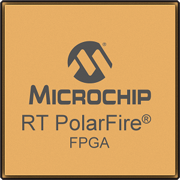

[NOTE]
====

Microsemi Corporation, a wholly owned subsidiary of Microchip Technology Inc. (Nasdaq: MCHP), offers a comprehensive portfolio of semiconductor and system solutions for communications, defense & security, aerospace and industrial markets. Products include high-performance and radiation-hardened analog mixed-signal integrated circuits, FPGAs, SoCs and ASICs; power management products; timing and synchronization devices and precise time solutions, setting the world's standard for time; voice processing devices; RF solutions; discrete components; enterprise storage and communication solutions, security technologies and scalable anti-tamper products; Ethernet solutions; Power-over-Ethernet ICs and midspans; as well as custom design capabilities and services. Microsemi is headquartered in Aliso Viejo, California.

Website: link:https://www.microsemi.com/[]
====

Microchip offer a broad portfolio of low and mid-range density FPGAs that lead the industry in their low power consumption, reliability, and security capabilities. Our devices are unique in their use of non-volatile, instant-on technology that enables our FPGAs to deliver 30 to 50 percent lower power than competing FPGAs, immunity to radiation, and unique security features. Use our FPGAs, SoC FPGAs, and Radiation Tolerant FPGAs to meet high-bandwidth connectivity and high-data throughput needs in applications such as Hybrid and Electric Vehicles, Communications IoT Infrastructure, Industrial Controls and Automation, Spacecraft, Commercial Aircraft, and Defense Equipment.

*PolarFire Mid-Range FPGAs*

[.text-center]

- Cost-optimized, lowest power in their class
- 250 Mbps to 12.7 Gbps transceivers
- 100K to 500K LE, up to 33 Mbits of RAM
- Best-in-class security and exceptional reliability

- NEW - PolarFire FPGA Smart Embedded Vision

*RT PolarFire Radiation Tolerant FPGAs*

[.text-center]

- Immune to configuration upsets
- 50% lower power than SRAM FPGAs
- 250 Mbps to 10 Gbps  transceivers

*PolarFire SoC FPGAs*

[.text-center]

- Early access program for PolarFire SoC is now open.
- Deterministic, coherent 64-bit multi-core RISC-V CPU
- 25k to 460k logic elements (LEs)
- Up to 50% lower power than alternatives
- Integrated DDR3/4, LPDDR3/4 controller and PHY

*IGLOO2 Low-Density FPGAs*

[.text-center]

- Up to 50% Lower Power
- PCIe Gen2 in devices as low as 10K LE
- Hardened memory subsystem
- Nonvolatile and instant-on

---

*Microsemi Mi-V RISC-V Ecosystem*

[.text-center]

- World's First RISC-V SoC FPGA Architecture
- Lowest power, Programmable RISC-V solutions
- RISC-V CPUs
- Design tools, Operating Systems, Firmware
- Development boards, Design support

[IMPORTANT]
.Note from Jaro
====

Microchip offers a comprehensive portfolio of semiconductor and system solutions for communications, defense & security, aerospace and industrial markets. Products include high-performance and radiation-hardened analog mixed-signal integrated circuits, FPGAs, SoCs and ASICs; power management products; timing and synchronization devices and precise time solutions, setting the world's standard for time; voice processing devices; RF solutions; discrete components; enterprise storage and communication solutions, security technologies and scalable anti-tamper products; Ethernet solutions; Power-over-Ethernet ICs and midspans; as well as custom design capabilities and services.

- FPGA & SoC Design Tools
- FPGAs
- Boards and Kits
- Rad-Tolerant FPGAs
- SoC FPGAs
- Antifuse FPGAs
- FPGA Applications
- Mi-V RISC-V

====
