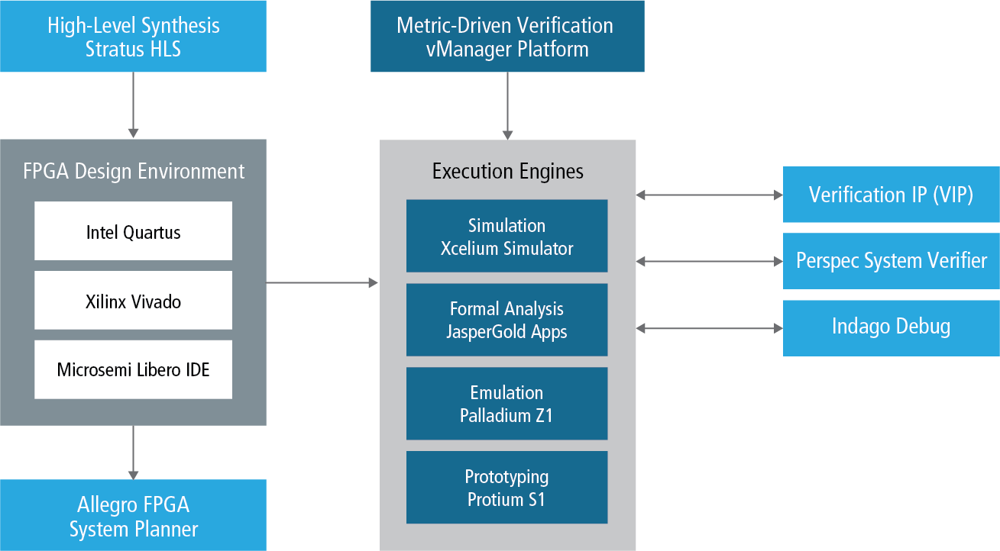

* *CADENCE*

Cadence is a pivotal leader in electronic design, building upon more than 30 years of computational software expertise. The company applies its underlying Intelligent System Design strategy to deliver software, hardware and IP that turn design concepts into reality.

[.text-center]

Cadence customers are the world’s most innovative companies, delivering extraordinary electronic products from chips to boards to systems for the most dynamic market applications including consumer, hyperscale computing, 5G communications, automotive, aerospace, industrial and health.

website: link:https://www.cadence.com/[]
FPGA development: link:https://www.cadence.com/ko_KR/home/solutions/fpga-development.html[]

---

