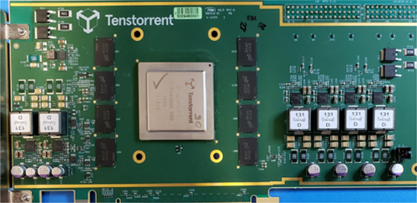
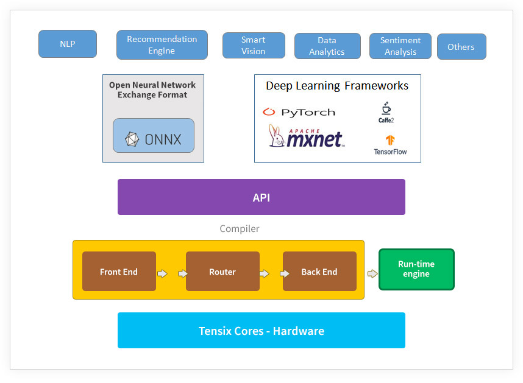

Tenstorrent: full-stack software + general architecture, software includes compiler and runtime dynamic optimization

Tenstorrent has anticipated this growth and has designed an architecture inherently built to handle these massive workloads effectively and efficiently.

* Fully programmable architecture that supports fine-grain
conditional execution, dynamic sparsity handling, and an
unprecedented ability to scale via tight integration of
computation and networking
* Difficult communication and synchronization bottlenecks
addressed
* Compiler based flexible parallelization
* Fine grain adaptation of compute graph at runtime
* Consistently high performance / utilization, regardless of
model type, batching
* Facilitating machines to go beyond pattern recognition and into cause-and-effect learning

*Grayskull – High Performance AI Processor*

HIGH PERFORMANCE AI PROCESSOR FOR WORKLOADS OF TODAY AND TOMORROW
ARRAY OF POWERFUL TENSIX(TM) PROCESSING CORES PROVIDING TOTAL OF 368 TOPS; EACH TENSIX CORE CONTAINS:

- Fully C++ programmable, multi-threaded, front-end
- Highly area and power efficient matrix compute engine
- Powerful and flexible SIMD engine

CUSTOM NOC WITH UNPRECEDENTED MULTI-CAST FLEXIBILITY AND LOW SOFTWARE OVERHEAD DATA TRANSFER
SUPPORT FOR THE LARGEST MODELS OF TODAY, AND FOR UPCOMING LARGER MODELS

- A large 120MB on-chip SRAM,
- 8 channels of LPDDR4 DRAM,
- 16 lanes of PCI-e Gen 4 host interface,

FLEXIBLE DATA FORMAT SUPPORT, INCLUDING INT8, AND MANY FLAVOURS OF FP
DYNAMIC DATA COMPRESSION FOR OVER 8X IMPROVEMENT IN BANDWIDTH EFFICIENCY FOR SPARSE WORKLOADS
FULL SUPPORT FOR TENSTORRENT'S CONDITIONAL EXECUTION AND DYNAMIC GRAPH OPTIMIZATION TECHNOLOGIES FOR OVER 10X IMPROVEMENT IN THROUGHPUT ON OPTIMIZED GRAPHS

*Grayskull performance (65W)*

[cols="1,1"]
|===
|Performance BenchMark
|Tenstorrent Grayskull

|Raw TOPS
|368 TOPS

|Resnet 50, 224x224
|22,431

|BERT base, SQUAD
|2,830 sentences/sec

|BERT base, SQUAD + conditional features
|10,150 sentences/sec

|BERT base, SQUAD + conditional features + low prec FP
|23,345 sentences/sec
|===

Grayskull Software Platform

]

[IMPORTANT]
.Note from Jaro
====
Generally this is startup - quite early stage, and until Jan/2021 I was not sure if it will stay for another year, however there is some light at the end of the tunnel:

TORONTO – January 6, 2021 - Jim Keller joins Tenstorrent as President and CTO.

Tenstorrent, a hardware start-up developing next generation computers, announces the addition of industry veteran Jim Keller as President, CTO, and board member.
During his long and impactful career he has helped create some of today’s most iconic technology including the AMD Zen, K7 (Athlon) and K8 micro-architectures, Apple A4-A7 processors, the x86-64 instruction set and HyperTransport interconnect.
====