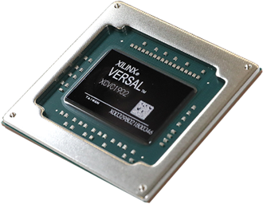
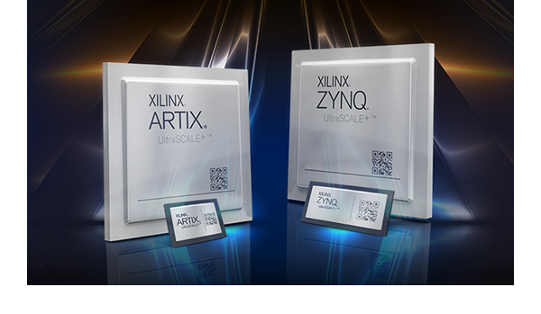
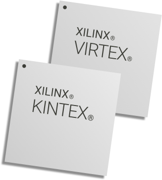
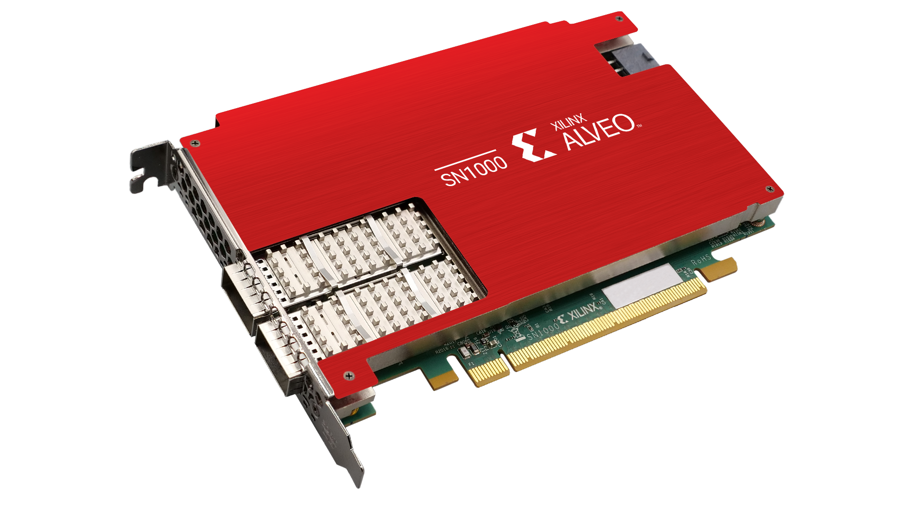

[NOTE]
====
Xilinx is the inventor of the FPGA, programmable SoCs, and now, the ACAP. Xilinx delivers the most dynamic processing technology in the industry.

This year Xilinx created and launched its own AppStore link:https://www.xilinx.com/products/app-store.html[] where all developers can create and sell apps.

The Xilinx App Store makes it easy to evaluate, purchase, and deploy accelerated applications.

Website: link:https://www.xilinx.com/[]
====

*Xilinx Solutions*

Xilinx develops highly flexible and adaptive processing platforms that enable rapid innovation across a variety of technologies—from the endpoint to the edge to the cloud. Xilinx is the inventor of the FPGA, hardware programmable SoCs, and the ACAP, designed to deliver the most dynamic processor technology in the industry.

The adaptive compute acceleration platform (ACAP) Versal architecture was designed to enable all types of developers to accelerate their whole application with disruptive performance through optimized hardware and software, providing a solution that adaptable faster than the pace of silicon design cycles.

The Xilinx UltraScale™ architecture delivers unprecedented levels of integration and capability while delivering ASIC-class system level performance for the most demanding applications requiring massive I/O & memory bandwidth, massive data flow, DSP, and packet processing performance. Our break-out portfolio also includes the industry's only hardware programmable homogeneous and heterogeneous 3D ICs with the highest bandwidth and system integration. In addition, our hardware, software, and I/O programmable SoC platform offers the flexibility and scalability of an FPGA combined with ASIC-like performance and power and the ease of use of an ASSP.

*Xilinx VERSAL*

Industry’s First ACAP

[.text-center]

Adaptive compute acceleration platform (ACAP) is a fully software-programmable, heterogeneous compute platform that combines Scalar Engines, Adaptable Engines, and intelligent AI and DSP Engines to enable a disruptive increase in compute for applications in data center, wireless networking, automotive driver assist, and wired communications. This high-performance architecture is designed to enable all types of developers - software engineers, hardware engineers, and data scientists — to accelerate their entire application with optimized hardware and software.

*Industry Leading FPGAs*

Xilinx offers a comprehensive multi-node portfolio to address requirements across a wide set of applications. Whether you are designing a state-of-the art, high-performance networking application requiring the highest capacity, bandwidth, and performance, or looking for a low-cost, small footprint FPGA to take your software-defined technology to the next level, Xilinx FPGAs and 3D ICs provide you with system integration while optimizing for performance/watt.

[.text-center]

*Programmable SoCs, MPSoCs, and RFSoCs*

Xilinx’s SoC portfolio integrates the software programmability of a processor with the hardware programmability of an FPGA, providing you with unrivaled levels of system performance, flexibility, and scalability. The portfolio gives your designs overall system benefits of power reduction and lower cost with fast time to market.

*Programmable 3D ICs*

Highest Bandwidth and Integration
Xilinx homogeneous and heterogeneous 3D ICs deliver the highest logic density, bandwidth, and on-chip resources in the industry, breaking new ground in system-level integration. Xilinx UltraScale 3D ICs provide unprecedented levels of system integration, performance, bandwidth, and capability

[.text-center]

*Cost-Optimized Portfolio*

The Xilinx cost-optimized portfolio is the broadest in the industry, comprising four families that are optimized for specific capabilities:

[.text-center]

- Spartan®-6 FPGAs for I/O optimization
- Spartan-7 FPGAs for I/O optimization with the highest performance-per-watt
- Artix®-7 FPGAs for transceiver optimization and highest DSP bandwidth
- Zynq®-7000 programmable SoCs for system optimization with scalable processor integration
- Artix UltraScale+™ FPGAs for high I/O bandwidth and DSP compute

---

*Accelerator Cards*

[.text-center]

* Alveo SN1000

Industry’s first fully software defined, fully hardware accelerated SmartNIC.

* Alveo U25

Ultra-high throughput, small packet performance and low-latency offload SmartNIC.

* Alveo U50

Delivers compute, networking, and storage acceleration in an efficient 75-watt, small form factor, and armed with 100 GbE networking, PCIe Gen4, and HBM2. Designed to deploy in any server.

* Alveo U200

Incredible compute, networking, and storage acceleration thanks to 890k LUTs, 5.9k DSP slices, 64GB of DDR4 memory, and dual 100Gbps network interfaces.

* Alveo U250

Offers 1.3M LUTs, 11.5k DSP slices, 64GB of DDR4 memory, dual 100Gbps network interfaces, and delivers 90x higher performance than CPUs on key workloads at a fraction of the costs.

* Alveo U280

Built for compute and memory bound workloads and is armed with 8GB of HBM2 + 32GB of DDR4 memory, 1.1M LUTs , 8.5k DSP slices, dual 100Gbps network interfaces, PCIe Gen4, and support for CCIX.

[IMPORTANT]
.Note from Jaro
====
Xilinx is the inventor of the FPGA, programmable SoCs, and now, the ACAP. Xilinx is de facto leader in FPGA technology both hardware wise and software - where you can create lots of advanced algorithms using C/C++.
Xilinx is _"a must watch"_ in the FPGA connected world, last 2 big innovations are: 

- Adaptive compute acceleration platform (ACAP) is a fully software-programmable, heterogeneous compute platform that combines Scalar Engines, Adaptable Engines, and intelligent AI and DSP Engines
- AppStore - that is from monetization perspective - The Xilinx App Store makes it easy to evaluate, purchase, and deploy accelerated applications.

Xilinx is organizing and taking part in multiple events during each year - and most of them are worth attending. At time of polishing this report 24-25 March 2021 there is Xilinx Adapt: Data Center conference: "composable data centers", SmartNIC, real world HPC workloads, AI/Video application acceleration, DB performance, algorithmic trading, and all about acceleration for software & AI developers.

Do not forget that Xilinx ... soon will be AMD:
link:https://www.amd.com/en/press-releases/2020-10-27-amd-to-acquire-xilinx-creating-the-industry-s-high-performance-computing[]

====

