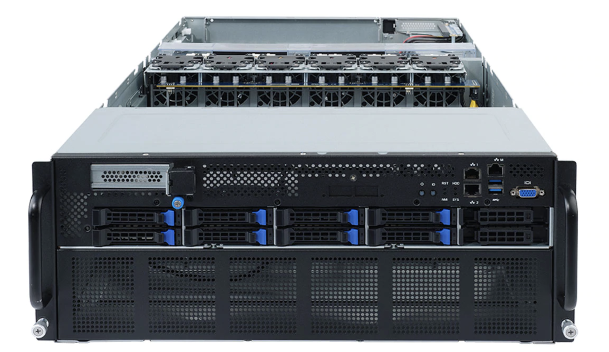

[NOTE]
====

AMD has 2 significant GPUs products:

* *AMD Radeon™ RX Graphics Cards*  - gaming

Website: link:https://www.amd.com/en/graphics/radeon-rx-graphics[]

* *AMD Instinct™ Accelerators*  - AI/HPC

The AMD Instinct™ MI100 accelerators designed with the AMD CDNA™ Architecture encompass AMD Infinity Architecture, offering an advanced platform for tightly connected GPU systems so workloads can share data fast and efficiently.

- Advanced platform connectivity and scalability
- 2x greater P2P bandwidth then PCIe® Gen4
- Up to 552 GB/s P2P bandwidth in quad GPU Hives4

Website: link:https://www.amd.com/en/products/server-accelerators/instinct-mi100[]
====

AMD Radeon™ RX Graphics Cards

[.text-center]

AMD RDNA2 

AMD RDNA™ 2 architecture is the foundation for next-generation PC gaming graphics, the PlayStation 5 and Xbox Series S and X consoles. The groundbreaking RDNA architecture was first introduced at E3 2019, and since then has continuously evolved to spearhead the next generation of high performance gaming. It’s the DNA that powers your games, the DNA that brings your games to life, the DNA that keeps evolving.

Example stats:

[.text-center]

*AI*

Accelerated Solution to Power Your AI Workloads

Accelerate your data-driven insights with Deep Learning optimized systems powered by AMD Instinct™ MI100 accelerators.

AMD, in collaboration with top HPC industry solution providers, enables enterprise-class system designs for the data center. AMD EPYC™ and AMD Instinct™ processors, combined with our revolutionary Infinity architecture, virtually eliminate traditional server bottlenecks delivering optimized solutions for real-world application deployments.

[.text-center]

---

*HPC*

Heterogenous Solution Designs for HPC

Accelerate your discovery with fast, accurate performance driven system designs. AMD, in collaboration with top HPC industry solution providers, enables enterprise-class system designs for the data center.

AMD EPYC™ and AMD Instinct™ processors, combined with our revolutionary Infinity architecture, virtually eliminate traditional server bottlenecks delivering optimized solutions for real-world application deployments.

[.text-center]

---

*Accelerators*

The era of exascale is here. Immense computational power coupled with the fusion of HPC and AI is enabling researchers to tackle grand challenges once thought beyond reach.

AMD Instinct™ accelerators are engineered from the ground up for this new era of computing, supercharging HPC and AI workloads to propel new discoveries. Powered by the AMD CDNA architecture, AMD Instinct™ MI100 accelerators deliver a giant leap in compute and connectivity, offering a nearly 3.5x performance boost for HPC (FP32 matrix) and a nearly 7x boost for AI workloads (FP16) compared to AMD’s prior generation accelerators.1

[.text-center]

The 7nm AMD Instinct MI100 accelerator is the first implementation of the AMD CDNA architecture and brings the open ROCm ecosystem  to life, offering the next level of performance, productivity, and portability for the industry. The MI100 is the first x86 server GPU to break  the 10TFLOP/s (FP64) barrier for HPC and delivers up to a nearly 7X boost in computational (FP16) throughput for machine learning over the  prior generation. Moreover, it brings improved connectivity and scaling with AMD’s 2nd Gen Infinity architecture providing the building blocks for designing systems with dual, fully-connected, quad GPU hives, each with up to 552 GB/s of peak peer-to-peer I/O bandwidth in a computing node. 

The robust ROCm ecosystem builds on this foundation and enables a comprehensive set of high-productivity tools that  empower customers to easily migrate, develop, and deploy applications at any scale. The open nature of the ROCm ecosystem guarantees portability, improves customer and developer productivity, and helps assure security as well. Most importantly, some the world’s largest

Exascale supercomputers are already deploying ROCm and the MI100 and demonstrating the benefits for leading scientific computing and  machine learning applications.

World’s Fastest HPC GPU

Delivering up to 11.5 TFLOPs of double precision (FP64) theoretical peak performance, the AMD Instinct™ MI100 accelerator delivers leadership performance for HPC applications and a substantial up-lift in performance over previous gen AMD accelerators. The MI100 delivers up to a 74% generational double precision performance boost for HPC applications.

[.text-center]

Unleash Intelligence Everywhere

Powered by the all-new Matrix Cores technology, the AMD Instinct™ MI100 accelerator delivers nearly a 7x up-lift in FP16 performance compared to prior generation AMD accelerators for AI applications.2 MI100 also greatly expands mixed precision capabilities and P2P GPU connectivity for AI and machine learning workloads.

[.text-center]

[IMPORTANT]
.Note from Jaro
====
AMD has both Gaming and servers GPU solutions. 

16 November 2020 they launched ML/HPC accelerator: AMD Instinct MI100, which obviously they claim is faster and better than nVidia A100.

What is interesting that even AMD doesn't create language like CUDA, but provide HIP:

HIP is a C++ Runtime API and Kernel Language that allows developers to create portable applications for AMD and NVIDIA GPUs from single source code.

Key features include:

- HIP is very thin and has little or no performance impact over coding directly in CUDA mode.
- HIP allows coding in a single-source C++ programming language including features such as templates, C++11 lambdas, classes, namespaces, and more.
- HIP allows developers to use the "best" development environment and tools on each target platform.
- The HIPIFY tools automatically convert source from CUDA to HIP.
- Developers can specialize for the platform (CUDA or AMD) to tune for performance or handle tricky cases.

New projects can be developed directly in the portable HIP C++ language and can run on either NVIDIA or AMD platforms. Additionally, HIP provides porting tools which make it easy to port existing CUDA codes to the HIP layer, with no loss of performance as compared to the original CUDA application. HIP is not intended to be a drop-in replacement for CUDA, and developers should expect to do some manual coding and performance tuning work to complete the port.

more:
link:https://github.com/ROCm-Developer-Tools/HIP[]

====
