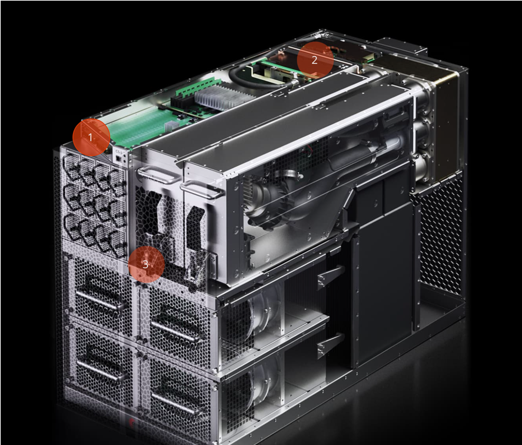

CS-1 is powered by the Cerebras Wafer Scale Engine - the largest chip ever built

* 56x the size of the largest Graphics Processing Unit
* The Cerebras Wafer Scale Engine is 46,225 mm2 with 1.2 Trillion transistors and 400,000 AI-optimized cores.
* By comparison, the largest Graphics Processing Unit is 815 mm2 and has 21.1 Billion transistors.

Purpose-built for Deep Learning: enormous compute, fast memory and communication bandwidth

* 46,225 mm2 chip56x larger than the biggest GPU ever made
* 400,000 core78x more cores
* 18 GB on-chip SRAM3000x more on-chip memory
* 100 Pb/s interconnect33,000x more bandwidth

Cerebras Graph Compiler drives full hardware utilization
The Cerebras Graph Compiler (CGC) automatically translates your neural network to an optimized WSE executable.Every stage of CGC is designed to maximize WSE utilization. Kernels are intelligently sized so that more compute resources are allocated to more complex work. CGC then generates a placement and routing, unique for each neural network, to minimize communication latency between the layers.

Designed for flexibility and extensibility
The Cerebras software platform includes an extensive library of primitives for standard deep learning computations, as well as a familiar C++ interface for developing custom software kernels.A comprehensive suite of debug and profiling tools allows researchers to optimize the platform for their work.

]

Software that integrates seamlessly with your workflows
The Cerebras software platform integrates with popular machine learning frameworks like TensorFlow and PyTorch, allowing researchers to use familiar tools and effortlessly bring their models to the WSE.A programmable C++ interface allows researchers to extend the platform and develop custom kernels - empowering them to push the limits of ML innovation.

1. Input/Output
The CS-1 requires high bandwidth communication with surrounding infrastructure to feed the 400,000 cores on the Wafer-Scale Engine. Our I/O system handles this task and delivers 1.2 Terabits per second bandwidth to the system edge through 12x standard 100 Gigabit Ethernet links to the datacenter. The I/O system also includes several optimized FPGAs to convert standard TCP-IP traffic into WSE protocol. This allows the CS-1 to be easily connected to a standard switch and receive input data for training or inference from many standard CPU servers in parallel. Simply plug in the CS-1 to power and a 100 Gigabit Ethernet switch, and you are ready to start training models at wafer-scale speed.

2. Engine Block
Powering, cooling, and packaging a wafer-scale processor is no easy task! The magic occurs in the back of the system, in the engine block – an innovation in packaging that solves the challenges of power delivery, cooling, and electrical connectivity to the Wafer Scale Engine.
The front contains power pins, behind which are power step-down modules and the main motherboard. A brass manifold contains dry quick connectors for the water pumps and directs water across the back of a cold plate that is tightly coupled to the wafer, cooling its 1.2 trillion transistors.
A key innovation brings power to the wafer through the main board rather than at the edges of the wafer. However, the silicon wafer has a different coefficient of thermal expansion (CTE) than the main board. This means that during heating and cooling the main board and the wafer expand and shrink by different amounts. We developed a custom connector to maintain electrical connectivity in the face of these stresses.
Overcoming the technical hurdles of power delivery, cooling, packaging and CTE mismatch with innovative solutions allowed Cerebras to solve the 70-year-old problem of wafer scale compute.

3. Cooling System  
The CS-1 is an internally water-cooled system. Like a giant gaming PC on steroids, the CS-1 uses water to cool the WSE, and then uses air to cool the water. Water circulates through a closed loop internal to the system.
Two hot-swappable pumps on the top right move water through a manifold across the back of the WSE, cooling the wafer and warming the water. Warm water is then pumped into a heat exchanger. This heat exchanger presents a large surface area for the cold air blown in by the four hot-swappable fans at the bottom of the CS-1. The fans move air from the cold aisle, cool the warm water via the heat exchanger, and exhaust the warm air into the warm aisle.

 Above: Cerebras has a half-dozen or so supercomputing customers.footnote:[Half-dozen means six ;-) ]

[IMPORTANT]
.Note from Jaro
====
Booming - lots of awards, lots of activity 2020/2021, lots of open positions!

March 9, 2021 —Cerebras Systems, the pioneer in high performance artificial intelligence (AI) compute, has been named to FastCompany’s prestigious annual list of the World’s Most Innovative Companies for 2021
link:https://cerebras.net/cerebras-systems-named-to-fast-companys-annual-list-of-the-worlds-most-innovative-companies-for-2021/[]
====

