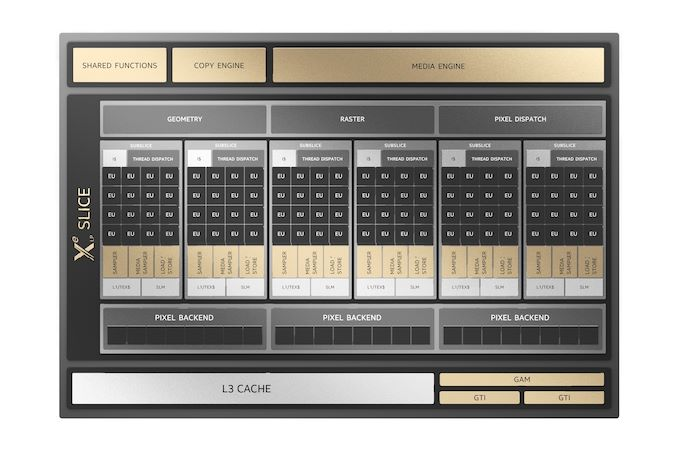
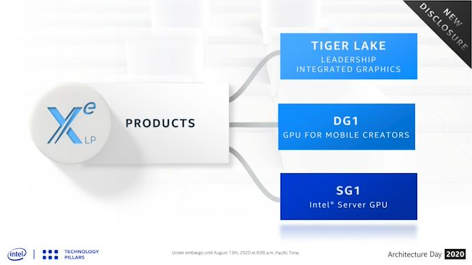
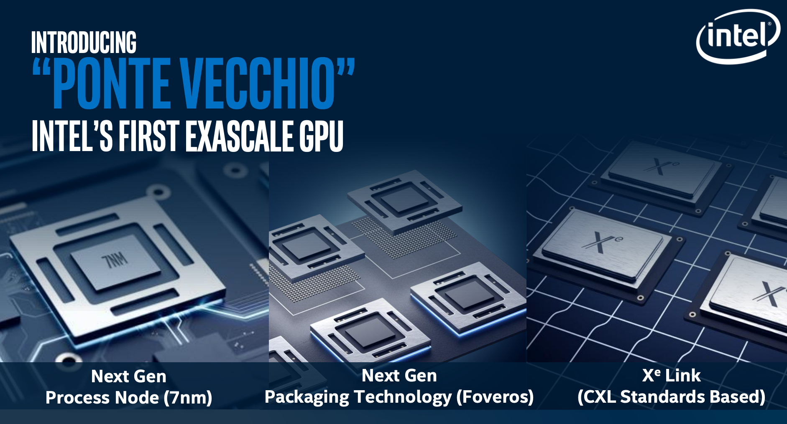
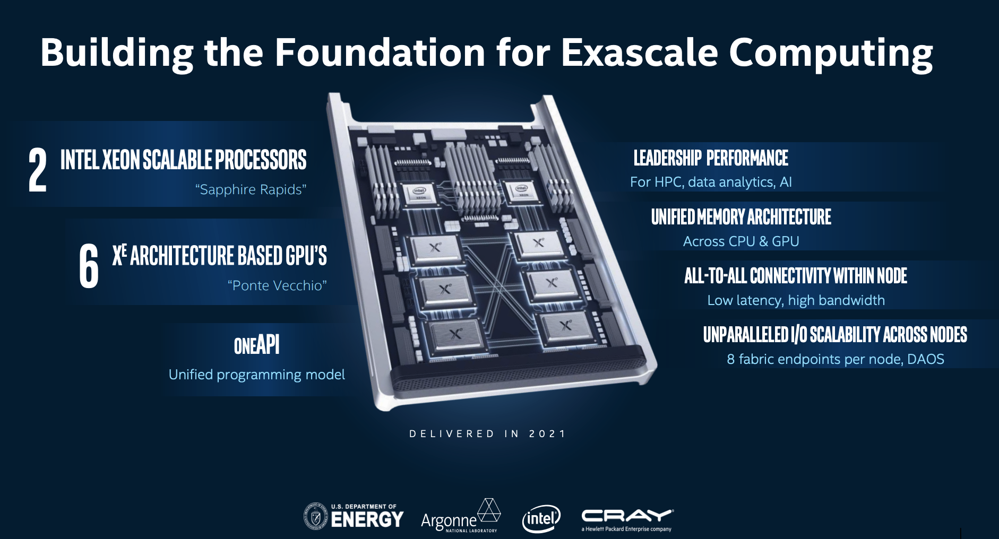

[NOTE]
====
Intel introduces a general-purpose GPU optimized for HPC/AI acceleration based on the Xe architecture, code-named “Ponte Vecchio.”
Intel unveils additional architectural details of the Aurora Supercomputer, delivering convergence at exascale at Argonne National Laboratory.

Website: link:https://newsroom.intel.com/news-releases/intel-unveils-new-gpu-architecture-optimized-for-hpc-ai-oneapi/[]
====

Intel’s Data-Centric Strategy Delivers the Foundation for AI/HPC Convergence

[.text-center]

Intel’s silicon portfolio is comprised of a diverse mix of architectures deployed in a range of silicon platforms. The foundation of Intel’s data centric strategy is the Intel® Xeon® Scalable processor, which today powers over 90 percent of the world’s Top500 supercomputers. Intel Xeon Scalable processors are the only x86 CPUs with built-in AI acceleration that are optimized to analyze the massive data sets in HPC workloads.

[.text-center]

At Supercomputing 2019, Intel unveiled a new category of general-purpose GPUs based on Intel’s Xe architecture. Code-named “Ponte Vecchio,” this new high-performance, highly flexible discrete general-purpose GPU is architected for HPC modeling and simulation workloads and AI training. Ponte Vecchio will be manufactured on Intel’s 7nm technology and will be Intel’s first Xe-based GPU optimized for HPC and AI workloads. Ponte Vecchio will leverage Intel’s Foveros 3D and EMIB packaging innovations and feature multiple technologies in-package, including high-bandwidth memory, Compute Express Link interconnect and other intellectual property.

[.text-center]

*Building the Foundation for Exascale Computing*

Intel’s data-centric silicon portfolio and oneAPI initiative lays the foundation for the convergence of HPC and AI workloads at exascale within the Aurora system at Argonne National Laboratory. Aurora will be the first U.S. exascale system to leverage the full breadth of Intel’s data-centric technology portfolio, building upon the Intel Xeon Scalable platform and using Xe architecture-based GPUs, as well as Intel Optane DC persistent memory and connectivity technologies. The compute node architecture of Aurora will feature two 10nm-based Intel Xeon Scalable processors (code-named “Sapphire Rapids”) and six Ponte Vecchio GPUs. Aurora will support over 10 petabytes of memory and over 230 petabytes of storage. Aurora will leverage the Cray Slingshot fabric to connect nodes across more than 200 racks.

[.text-center]

[IMPORTANT]
.Note from Jaro
====
GPU exascale Intel initiative is something to check - it is nothing to do with GPGPU but cerberas wafer also ;-)

====