[NOTE]
====

NVIDIA'S INVENTION OF THE GPU

In 1999 sparked the growth of the PC gaming market, redefined modern computer graphics, and revolutionized parallel computing. More recently, GPU deep learning ignited modern AI — the next era of computing — with the GPU acting as the brain of computers, robots, and self-driving cars that can perceive and understand the world.

- GPU and games  - Geforce, RTX
- HPC - Ampere architecture, DGX, EGX,HGX
- AI /researchers - Titan
- Embedded: Autonomous - Jetson, Cars -  DRIVE AGX, Medical - Clara AGX

- DPU - BlueField (in DPU chapter)

Website: link:https://www.nvidia.com/[]

Biggest news : nVidia acquires ARM

link:https://nvidianews.nvidia.com/news/nvidia-to-acquire-arm-for-40-billion-creating-worlds-premier-computing-company-for-the-age-of-ai/[]
====

2022:

https://blogs.nvidia.com/blog/2022/03/22/h100-transformer-engine/?ncid=em-anno-882613&mkt_tok=MTU2LU9GTi03NDIAAAGDeT6old-dUZqscqO-VBHTLn3FDASc6O1omBiK5K0TJYfe7TpmGbFWJz85kI-wxzf50rGkp36rpfSKCfXnL_uR1cjyJntX8CYZkvTuxTt-snWX#cid=hpc06_em-anno_en-eu

NVIDIA Announces Hopper Architecture, the Next Generation of Accelerated Computing
The New Engine for World's AI Infrastructure, NVIDIA H100 GPU Makes Order of Magnitude Performance Leap
Tuesday, March 22, 2022
NVIDIA Announces Hopper Architecture, the Next Generation of Accelerated Computing
GTC—To power the next wave of AI data centers, NVIDIA today announced its next-generation accelerated computing platform with NVIDIA Hopper™ architecture, delivering an order of magnitude performance leap over its predecessor.

Named for Grace Hopper, a pioneering U.S. computer scientist, the new architecture succeeds the NVIDIA Ampere architecture, launched two years ago.

The company also announced its first Hopper-based GPU, the NVIDIA H100, packed with 80 billion transistors. The world's largest and most powerful accelerator, the H100 has groundbreaking features such as a revolutionary Transformer Engine and a highly scalable NVIDIA NVLink® interconnect for advancing gigantic AI language models, deep recommender systems, genomics and complex digital twins.

"Data centers are becoming AI factories -- processing and refining mountains of data to produce intelligence," said Jensen Huang, founder and CEO of NVIDIA. "NVIDIA H100 is the engine of the world's AI infrastructure that enterprises use to accelerate their AI-driven businesses."

H100 Technology Breakthroughs
The NVIDIA H100 GPU sets a new standard in accelerating large-scale AI and HPC, delivering six breakthrough innovations:

World's Most Advanced Chip -- Built with 80 billion transistors using a cutting-edge TSMC 4N process designed for NVIDIA's accelerated compute needs, H100 features major advances to accelerate AI, HPC, memory bandwidth, interconnect and communication, including nearly 5 terabytes per second of external connectivity. H100 is the first GPU to support PCIe Gen5 and the first to utilize HBM3, enabling 3TB/s of memory bandwidth. Twenty H100 GPUs can sustain the equivalent of the entire world's internet traffic, making it possible for customers to deliver advanced recommender systems and large language models running inference on data in real time.
New Transformer Engine -- Now the standard model choice for natural language processing, the Transformer is one of the most important deep learning models ever invented. The H100 accelerator's Transformer Engine is built to speed up these networks as much as 6x versus the previous generation without losing accuracy.
2nd-Generation Secure Multi-Instance GPU -- MIG technology allows a single GPU to be partitioned into seven smaller, fully isolated instances to handle different types of jobs. The Hopper architecture extends MIG capabilities by up to 7x over the previous generation by offering secure multitenant configurations in cloud environments across each GPU instance.
Confidential Computing -- H100 is the world's first accelerator with confidential computing capabilities to protect AI models and customer data while they are being processed. Customers can also apply confidential computing to federated learning for privacy-sensitive industries like healthcare and financial services, as well as on shared cloud infrastructures.
4th-Generation NVIDIA NVLink -- To accelerate the largest AI models, NVLink combines with a new external NVLink Switch to extend NVLink as a scale-up network beyond the server, connecting up to 256 H100 GPUs at 9x higher bandwidth versus the previous generation using NVIDIA HDR Quantum InfiniBand.
DPX Instructions -- New DPX instructions accelerate dynamic programming -- used in a broad range of algorithms, including route optimization and genomics -- by up to 40x compared with CPUs and up to 7x compared with previous-generation GPUs. This includes the Floyd-Warshall algorithm to find optimal routes for autonomous robot fleets in dynamic warehouse environments, and the Smith-Waterman algorithm used in sequence alignment for DNA and protein classification and folding.
The combined technology innovations of H100 extend NVIDIA's AI inference and training leadership to enable real-time and immersive applications using giant-scale AI models. The H100 will enable chatbots using the world's most powerful monolithic transformer language model, Megatron 530B, with up to 30x higher throughput than the previous generation, while meeting the subsecond latency required for real-time conversational AI. H100 also allows researchers and developers to train massive models such as Mixture of Experts, with 395 billion parameters, up to 9x faster, reducing the training time from weeks to days.

Broad NVIDIA H100 Adoption
NVIDIA H100 can be deployed in every type of data center, including on-premises, cloud, hybrid-cloud and edge. It is expected to be available worldwide later this year from the world's leading cloud service providers and computer makers, as well as directly from NVIDIA.

NVIDIA's fourth-generation DGX™ system, DGX H100, features eight H100 GPUs to deliver 32 petaflops of AI performance at new FP8 precision, providing the scale to meet the massive compute requirements of large language models, recommender systems, healthcare research and climate science.

Every GPU in DGX H100 systems is connected by fourth-generation NVLink, providing 900GB/s connectivity, 1.5x more than the prior generation. NVSwitch™ enables all eight of the H100 GPUs to connect over NVLink. An external NVLink Switch can network up to 32 DGX H100 nodes in the next-generation NVIDIA DGX SuperPOD™ supercomputers.

Hopper has received broad industry support from leading cloud service providers Alibaba Cloud, Amazon Web Services, Baidu AI Cloud, Google Cloud, Microsoft Azure, Oracle Cloud and Tencent Cloud, which plan to offer H100-based instances.

A wide range of servers with H100 accelerators are expected from the world's leading systems manufacturers, including Atos, BOXX Technologies, Cisco, Dell Technologies, Fujitsu, GIGABYTE, H3C, Hewlett Packard Enterprise, Inspur, Lenovo, Nettrix and Supermicro.

NVIDIA H100 at Every Scale
H100 will come in SXM and PCIe form factors to support a wide range of server design requirements. A converged accelerator will also be available, pairing an H100 GPU with an NVIDIA ConnectX®-7 400Gb/s InfiniBand and Ethernet SmartNIC.

NVIDIA's H100 SXM will be available in HGX™ H100 server boards with four- and eight-way configurations for enterprises with applications scaling to multiple GPUs in a server and across multiple servers. HGX H100-based servers deliver the highest application performance for AI training and inference along with data analytics and HPC applications.

The H100 PCIe, with NVLink to connect two GPUs, provides more than 7x the bandwidth of PCIe 5.0, delivering outstanding performance for applications running on mainstream enterprise servers. Its form factor makes it easy to integrate into existing data center infrastructure.

The H100 CNX, a new converged accelerator, couples an H100 with a ConnectX-7 SmartNIC to provide groundbreaking performance for I/O-intensive applications such as multinode AI training in enterprise data centers and 5G signal processing at the edge.

NVIDIA Hopper architecture-based GPUs can also be paired with NVIDIA Grace™ CPUs with an ultra-fast NVLink-C2C interconnect for over 7x faster communication between the CPU and GPU compared to PCIe 5.0. This combination -- the Grace Hopper Superchip -- is an integrated module designed to serve giant-scale HPC and AI applications.

NVIDIA Software Support
The NVIDIA H100 GPU is supported by powerful software tools that enable developers and enterprises to build and accelerate applications from AI to HPC. This includes major updates to the NVIDIA AI suite of software for workloads such as speech, recommender systems and hyperscale inference.

NVIDIA also released more than 60 updates to its CUDA-X™ collection of libraries, tools and technologies to accelerate work in quantum computing and 6G research, cybersecurity, genomics and drug discovery.

Availability
NVIDIA H100 will be available starting in the third quarter.

To learn more about NVIDIA Hopper and H100, watch the GTC 2022 keynote from Jensen Huang, and register for GTC 2022 for free to attend sessions with NVIDIA and industry leaders.

*GAMING*

> Example: GEFORCE RTX  30 SERIES LAPTOPS 

GeForce RTX™ 30 Series GPUs power the world’s fastest laptops for gamers and creators. They’re built with the award-winning Ampere—NVIDIA’s 2nd gen RTX architecture—with new RT Cores, Tensor Cores, and streaming multiprocessors to give you the most realistic ray-traced graphics and cutting-edge AI features. GeForce laptops with new 3rd gen Max-Q technologies use AI and new system optimisations to make high-performance gaming laptops faster and better than ever.

*SPECS*

|===
| | GEFORCE RTX 3080	| GEFORCE RTX 3070  | GEFORCE RTX 3060

|NVIDIA® CUDA® Cores	| 6144	| 5120	| 3840
|Boost Clock (MHz)	| 1245 - 1710 MHz	| 1290 - 1620 MHz	| 1283 - 1703 MHz
| Memory Size	| 16GB or 8GB |	8 GB |	6 GB
| Memory Type	| GDDR6	| GDDR6	 | GDDR6
|===

---

*HPC*

[.text-center]
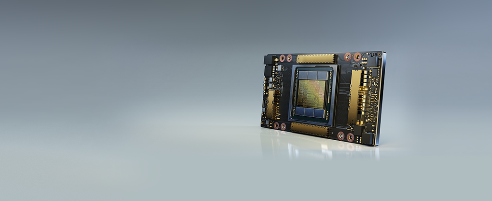

NVIDIA AMPERE ARCHITECTURE

The Heart of the World’s Highest-Performing, Elastic Data Centers

THE CORE OF AI AND HPC IN THE
MODERN DATA CENTER

Scientists, researchers, and engineers—the da Vincis and Einsteins of our time—are working to solve the world’s most important scientific, industrial, and big data challenges with AI and high-performance computing (HPC). Meanwhile businesses and even entire industries seek to harness the power of AI to extract new insights from massive data sets, both on-premises and in the cloud. The NVIDIA Ampere architecture, designed for the age of elastic computing, delivers the next giant leap by providing unmatched acceleration at every scale, enabling these innovators to do their life’s work.

GROUNDBREAKING INNOVATIONS
Crafted with 54 billion transistors, the NVIDIA Ampere architecture is the largest 7 nanometer (nm) chip ever built and features six key groundbreaking innovations.

Third-Generation Tensor Cores

First introduced in the NVIDIA Volta™ architecture, NVIDIA Tensor Core technology has brought dramatic speedups to AI, bringing down training times from weeks to hours and providing massive acceleration to inference. The NVIDIA Ampere architecture builds upon these innovations by bringing new precisions—Tensor Float (TF32) and Floating Point 64 (FP64)—to accelerate and simplify AI adoption and extend the power of Tensor Cores to HPC.

TF32 works just like FP32 while delivering speedups of up to 20X for AI without requiring any code change. Using NVIDIA Automatic Mixed Precision, researchers can gain an additional 2X performance with automatic mixed precision and FP16 adding just a couple of lines of code. And with support for bfloat16, INT8, and INT4, Tensor Cores in NVIDIA A100 Tensor Core GPUs create an incredibly versatile accelerator for both AI training and inference. Bringing the power of Tensor Cores to HPC, A100 also enables matrix operations in full, IEEE-certified, FP64 precision.

[.text-center]
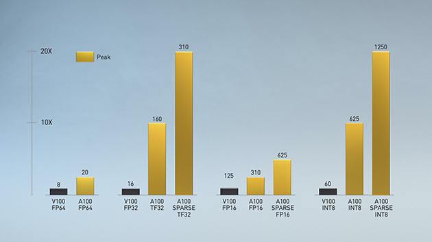

Multi-Instance GPU (MIG)

Every AI and HPC application can benefit from acceleration, but not every application needs the performance of a full A100 GPU. With MIG, each A100 can be partitioned into as many as seven GPU instances, fully isolated and secured at the hardware level with their own high-bandwidth memory, cache, and compute cores. Now, developers can access breakthrough acceleration for all their applications, big and small, and get guaranteed quality of service. And IT administrators can offer right-sized GPU acceleration for optimal utilization and expand access to every user and application across both bare-metal and virtualized environments.

[.text-center]
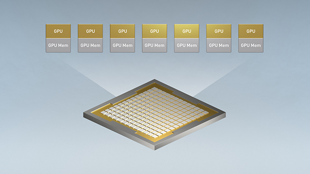

Third-Generation NVLink

Scaling applications across multiple GPUs requires extremely fast movement of data. The third generation of NVIDIA® NVLink® in A100 doubles the GPU-to-GPU direct bandwidth to 600 gigabytes per second (GB/s), almost 10X higher than PCIe Gen4. When paired with the latest generation of NVIDIA NVSwitch™, all GPUs in the server can talk to each other at full NVLink speed for incredibly fast data transfers.

NVIDIA DGX™ A100 and servers from other leading computer makers take advantage of NVLink and NVSwitch technology via NVIDIA HGX™ A100 baseboards to deliver greater scalability for HPC and AI workloads.

[.text-center]
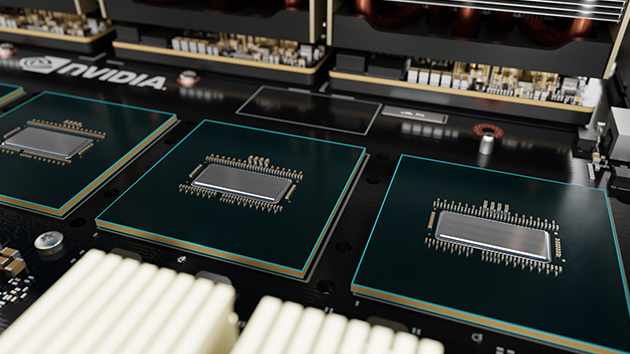

Structural Sparsity

Modern AI networks are big and getting bigger, with millions and in some cases billions of parameters. Not all of these parameters are needed for accurate predictions and inference, and some can be converted to zeros to make the models “sparse” without compromising accuracy. Tensor Cores in A100 can provide up to 2X higher performance for sparse models. While the sparsity feature more readily benefits AI inference, it can also be used to improve the performance of model training.

[.text-center]
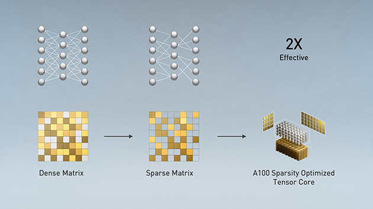

Second-Generation RT Cores

The NVIDIA Ampere architecture’s second-generation RT Cores in the NVIDIA A40 GPU deliver massive speedups for workloads like photorealistic rendering of movie content, architectural design evaluations, and virtual prototyping of product designs. RT Cores also speed up the rendering of ray-traced motion blur for faster results with greater visual accuracy and can simultaneously run ray tracing with either shading or denoising capabilities.

[.text-center]
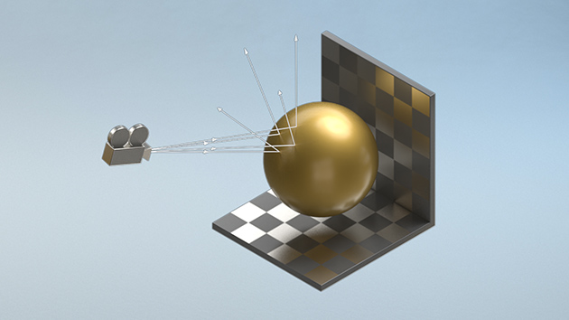

Smarter and Faster Memory

A100 is bringing massive amounts of compute to data centers. To keep those compute engines fully utilized, it has a leading class 1.6 terabytes per second (TB/sec) of memory bandwidth, a 67 percent increase over the previous generation. In addition, A100 has significantly more on-chip memory, including a 40 megabyte (MB) level 2 cache—7X larger than the previous generation—to maximize compute performance.

[.text-center]
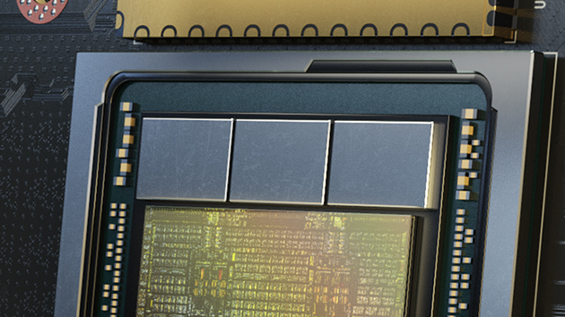

Converged Acceleration at the Edge

The combination of the NVIDIA Ampere architecture and the NVIDIA Mellanox® ConnectX-6® Dx SmartNIC in NVIDIA EGX™ converged accelerators brings unprecedented compute and network acceleration capabilities to process the massive amounts of data being generated at the edge. The Mellanox SmartNIC includes security offloads that decrypts at line rates up to 200 gigabits per second (Gb/s) and GPUDirect™ that transfers video frames directly into GPU memory for AI processing. With the EGX converged accelerator, businesses can accelerate AI deployment at the edge more securely and efficiently.

[.text-center]
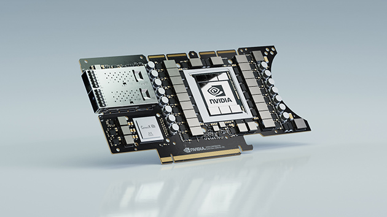

---

*AI*

*NVIDIA TITAN RTX*

NVIDIA® TITAN RTX™ is designed for researchers, developers and creators. It’s powered by Turing™ architecture, bringing 130 Tensor TFLOPs of performance, 576 tensor cores, and 24 GB of ultra-fast GDDR6 memory to your PC.

[.text-center]
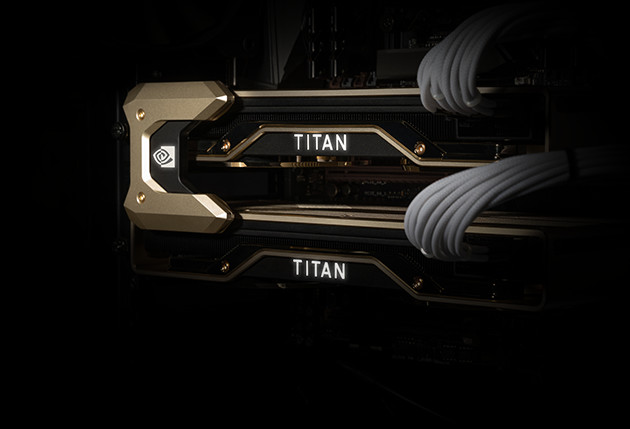

* TITAN RTX powers AI, machine learning, and creative workflows.

The most demanding users need the best tools. TITAN RTX is built on NVIDIA’s Turing GPU architecture and includes the latest Tensor Core and RT Core technology for accelerating AI and ray tracing. It’s also supported by NVIDIA drivers and SDKs so that developers, researchers, and creators can work faster and deliver better results.

* Start AI Development Now

Train AI models faster with 576 NVIDIA Turing mixed-precision Tensor Cores delivering 130 TFLOPS of AI performance. Supported by NVIDIA’s CUDA-X AI SDK, including cuDNN, TensorRT, and more than 15 other libraries. Works with all popular deep learning frameworks and is compatible with NVIDIA GPU Cloud (NGC).

* Accelerate Data Science

Work faster with 4608 NVIDIA Turing CUDA cores accelerating end-to-end data science workflows. Process huge data sets with 24 GB GDDR6 memory (or 48 GB with NVLink). Get started today with the RAPIDS suite of libraries for data science, built on NVIDIA’s CUDA-X AI SDK. Develop on your PC and deploy to the data center with ease.

* Power Your Creativity

Inspiration doesn’t wait. Build huge immersive worlds and stunning characters, accelerate multi-app workflows, and edit 8K video in real time. 24 GB of memory and 72 Turing RT cores delivering 11 Gigarays per second enable you to take on the most demanding projects.

* MULTI-GPU SCALABILITY : NVLink Bridge

The TITAN RTX NVLink™ bridge connects two TITAN RTX cards together over a 100 GB/s interface. The result is an effective doubling of memory capacity to 48 GB, so that you can train neural networks faster, process even larger datasets, and work with some of the biggest rendering models.

* REVOLUTIONARY PERFORMANCE, POWERED BY TURING

[.text-center]
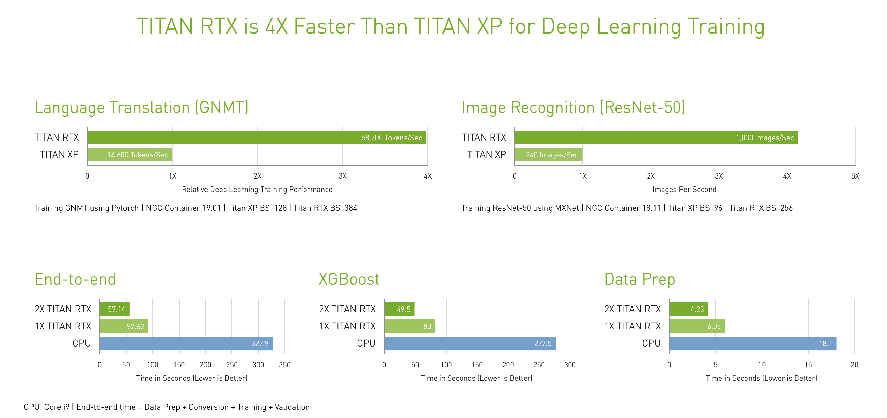

TITAN RTX trains advanced models like ResNet-50 and GNMT up to 4X faster than Titan Xp. And RAPIDS trains models up to 3X faster than CPUs. Built with multi-precision Turing Tensor Cores, TITAN RTX delivers breakthrough performance from FP32, FP16, INT8, and INT4, allowing faster training and inferencing of neural networks. Equipped with twice the memory capacity of previous-generation TITAN GPUs and NVIDIA NVLink™, TITAN RTX enables researchers and data scientists to experiment with larger neural networks and datasets than ever before, all on GPU memory.

* Tackle The Most Demanding Creative Workloads

[.text-center]
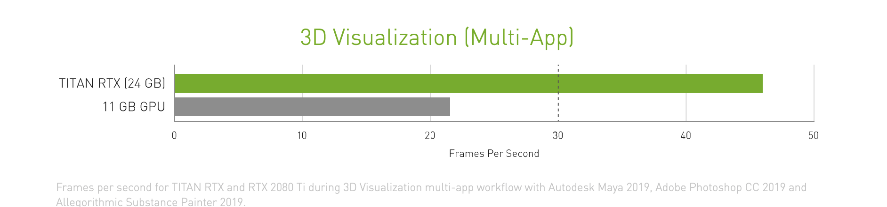

With 72 Turing RT Cores and 24 GB of memory, TITAN RTX renders extra-large models, supports real-time 8K video editing, and runs complex, multi-application workflows to enable a smooth and seamless experience.

SPEC:

[.text-center]
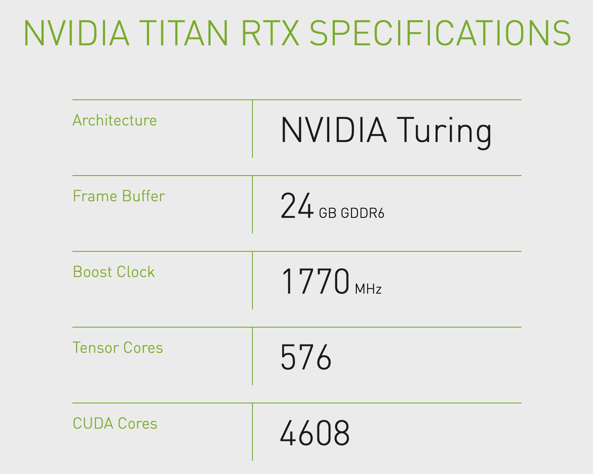

---

Embedded example: Clara

*NVIDIA Clara AGX*

The NVIDIA Clara AGX™ developer kit delivers real-time AI and imaging for medical devices. By combining low-powered, NVIDIA Jetson AGX Xavier and RTX GPU with the NVIDIA Clara AGX SDK and the NVIDIA EGX stack, it’s easy to securely provision and remotely manage fleets of distributed medical instruments.

* High-Performance Development Workstation : 
At its core are Jetson AGX Xavier, RTX 6000, and NVIDIA Mellanox ConnectX-6

* From Development to Productization : 
Bring future products to market quickly by building directly for the Jetson platform

* Advanced I/O Connectivity : 
Two PCIe Gen4x8 slots and high-speed network ports enable GPU RDMA for high-bandwidth streaming

NVIDIA CLARA AGX DEVELOPER KIT

Clara AGX

The NVIDIA Clara AGX™ developer kit is an embedded AI computer and software development framework for medical devices that need the ability to perform real-time AI and advanced image, video, and signal processing.

[.text-center]
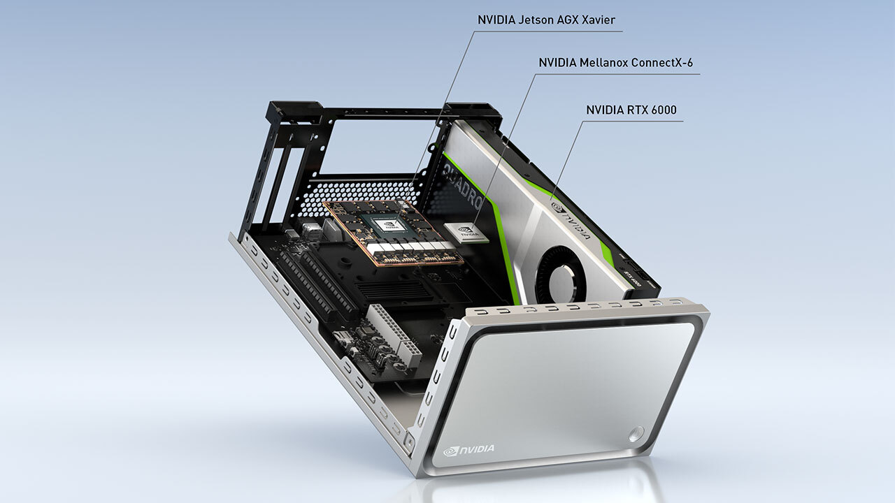

Built on the Jetson platform, you have all of the benefits and features that come along with an Embedded Linux System. Clara AGX Development kit reduces the overall development time to bring future products to market by building directly for the Jetson platform

Powered by ARM-based NVIDIA Jetson AGX Xavier™ along with an NVIDIA RTX GPU and running the NVIDIA EGX software stack, Clara AGX securely manages and orchestrates AI application deployments to fleets of medical devices or edge nodes. Also included is the NVIDIA Mellanox ConnectX-6 network interface card, which is capable of streaming data at full line rate via GPU Direct RDMA to the NVIDIA RTX 6000.

*Clara AGX SDK*

Clara AGX SDK runs on the Jetson platform and provides developers with capabilities to build end-to-end streaming workflows for medical imaging. It includes advanced samples for ultrasound video and endoscopy.

[.text-center]
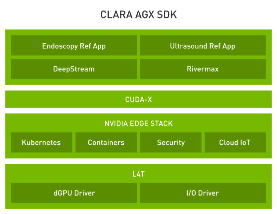

SDK Features

* NVIDIA RTX support - Docker and CUDA, TensorRT, dGPU enablement
* Rivermax 100GbE streaming -Rivermax transport protocol streams data over ethernet directly into GPU GDDR DRAM using GPU Direct Technology
* Windows Device mode support - I/O Driver provides Jetson AGX work in device mode on Windows 10 machine
* Endoscopy using NVIDIA DeepStream - Video-in and inference for endoscopy and other video-based modalities
* CUDA accelerated SUPRA library - Software-defined ultrasound processing for real-time Applications
* Sensor Processing - Support for camera serial interface
* Sample Applications
* AI endoscopy reference application
* AI ultrasound reference application

---

2020 biggest news:

*NVIDIA to Acquire Arm for $40 Billion, Creating World’s Premier Computing Company for the Age of AI*

Sunday, September 13, 2020

[.text-center]
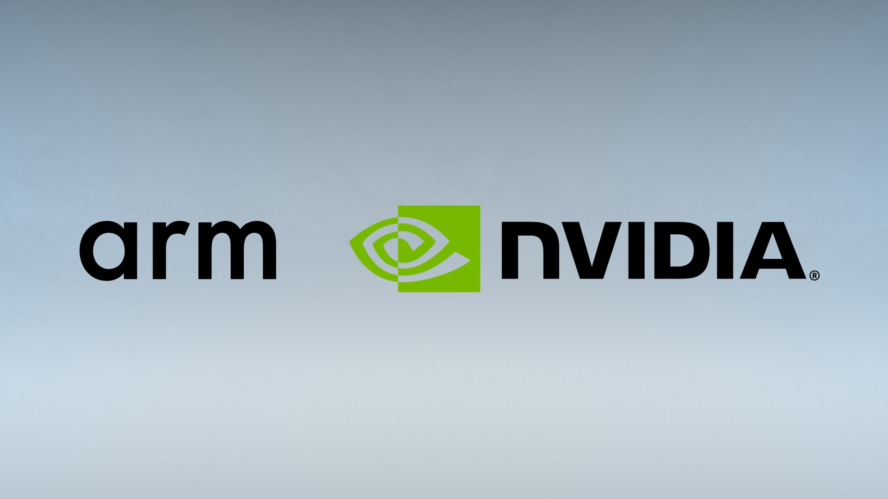

* Unites NVIDIA’s leadership in artificial intelligence with Arm’s vast computing ecosystem to drive innovation for all customers
* NVIDIA will expand Arm’s R&D presence in Cambridge, UK, by establishing a world-class AI research and education center, and building an Arm/NVIDIA-powered AI supercomputer for groundbreaking research
* NVIDIA will continue Arm’s open-licensing model and customer neutrality and expand Arm’s IP licensing portfolio with NVIDIA technology
* Immediately accretive to NVIDIA’s non-GAAP gross margin and EPS
* Consideration of $40 billion to be met through a combination of NVIDIA shares and cash

[IMPORTANT]
.Note from Jaro
====

NVidia till recently was considered as GPU producer, however last years set them as leader in ML/AI acceleration. Products exist in space of gamins, servers, HPC,na

A100 design:
Support HPC
Consider strong scalability
Consider scale-up and scale-out

Breaking performance records, the fastest AI chip

Biggest news for 2020:NVIDIA to Acquire Arm for $40 Billion, Creating World’s Premier Computing Company for the Age of AI

NVIDIA will expand Arm’s R&D presence in Cambridge, UK, by establishing a world-class AI research and education center, and building an Arm/NVIDIA-powered AI supercomputer for groundbreaking research
NVIDIA will continue Arm’s open-licensing model and customer neutrality and expand Arm’s IP licensing portfolio with NVIDIA technology

Nvidia: A100 strong scalability, scale-out and scale-up design considerations, performance breaks

====
