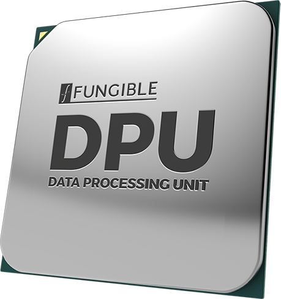
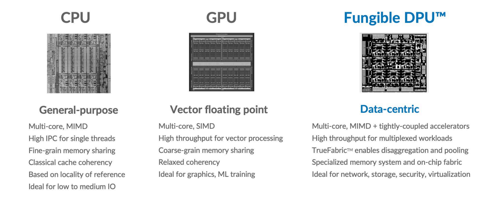

Fungible DPU: Hyper-disaggregation data exchange and data management

[.text-center]

* Fast - Blazing fast datapath computations supporting modern and cloud-native workloads
* Formidable - Ground-breaking data interchange performance realized at massive scale with no performance cliff
* Flexible - Programmable datapath that meets the most stringent requirements today and tomorrow
* Industry's highest performance 800Gbps DPU - its unique hardware and software co-design delivers maximum feature flexibility without compromising performance efficiencies for data-centric computing.

* Designed for the most demanding applications, the F1 DPU's performance density is well-suited to power storage servers, security appliances, AI and analytics servers. The F1 DPU fully displaces x86 CPUs in these solutions.

* The F1 DPU enables increased efficiencies and utilization across compute, network and storage - delivering 3X TCO savings across data center scales while improving reliability, security and agility of infrastructure management.

The Fungible S1 DPU is the second device in the Fungible DPU™ family of purpose-built processors
optimized for data-centric computing. Data-centric computing combines executing data-centric
computations within server nodes andefficiently moving data among nodes. Data-centric computations
are characterized by stateful processing of data streams at high rates. They are typified by networking,
security and storage stacks, and today represent 30% of the modern server workloads.

The S1 DPU is the industry’s mostflexible 200Gbps DPU, capable of executing data-centric
computations more efficiently than general-purposeCPUs. The S1 DPU fully offloads the entire
storage, networking, security and virtualization stack from x86 cores in host servers,freeing up
more than 50% ofthe x86CPUs’ cycles to run application workloads.

The S1 DPU also facilitates highly efficient data interchange among server nodes through its
TrueFabricTM technology.TrueFabric is a large-scale IP-over-Ethernetfabric protocolthatprovides
full network cross-sectional bandwidth with low average and tail latency, end-to-endQoS,
congestion-free connectivity and security among server nodes. The TrueFabric™ protocol is fully
standards-compliant and interoperable with TCP/IP over Ethernet, ensuring thatthe data center

Spine-Leaf network can be built with standard off-the-shelf Ethernet switches.
By combining these key capabilities into a single solution, the Fungible DPU family of processors
enables hyperdisaggregation and pooling of compute and storage resources - delivering a highperformance, massively scalable composable infrastructure for next generation data centers!

[.text-center]

*S1 DPU ARCHITECTURE*

The Fungible DPU family of processors leverage the same hardware and software co-design and
share the exact same programming model. However, while the F1 DPU is designed for highperformance standalone appliances such as storage, security, AI and analytics servers, the S1 DPU
maximizes performance within the footprint and power envelope of a standard PCIe adapter.

The S1’s advanced SoC architecture integrates clusters of multi-core processors that runs a
cleanly separated control plane and data plane. These clusters are interconnected through a fast
network-on-chip (NoC) to a carefully selected collection of hardware accelerator blocks. The SoC
interacts with external components through standard Ethernet network ports and PCIe Gen 3/
Gen 4 controllers supporting Endpoint (EP) SR-IOV and Root Complex (RC) functionality.

The novel architecture of the Fungible DPU enables a unique combination of performance and
flexibility - delivering a solution where the datapath is fully programmable, yet is fundamentally
more efficient; achieving higher throughput, maintaining lower latency and consuming less power
than existing solutions.

[IMPORTANT]
.Note from Jaro
====
They are currently booming - got a couple of awards between October and December 2020 (Layer123, FLash Memory Summit 2020, CRN, SDC Awards 2020), 

March 30, 2021 - there will be Fungible Product Launch: Fungible Data Centers, Hyperscale Infrastructure for All
====
