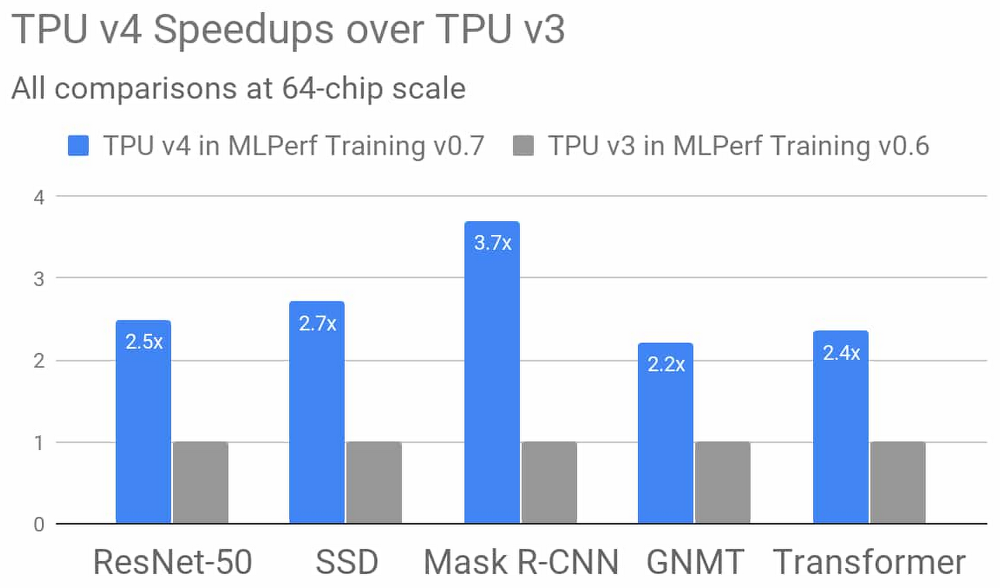

TPU versions

Each TPU version defines the specific hardware characteristics of a TPU device. The TPU version defines the architecture for each TPU core, the amount of high-bandwidth memory (HBM) for each TPU core, the interconnects between the cores on each TPU device, and the networking interfaces available for inter-device communication. For example, each TPU version has the following characteristics:

* TPU v2:
** 8 GiB of HBM for each TPU core
** One MXU for each TPU core
** Up to 512 total TPU cores and 4 TiB of total memory in a TPU Pod

* TPU v3:
** 16 GiB of HBM for each TPU core
** Two MXUs for each TPU core
** Up to 2048 total TPU cores and 32 TiB of total memory in a TPU Pod

[.text-center]

TPU v4: Google’s fourth-generation Tensor Processing Unit chip

Google’s fourth-generation TPU ASIC offers more than double the matrix multiplication TFLOPs of TPU v3, a significant boost in memory bandwidth, and advances in interconnect technology. Google’s TPU v4 MLPerf submissions take advantage of these new hardware features with complementary compiler and modeling advances. The results demonstrate an average improvement of 2.7 times over TPU v3 performance at a similar scale in the last MLPerf Training competition. Stay tuned, more information on TPU v4 is coming soon

[.text-center]

TPU v4 results in Google’s MLPerf Training v0.7 

Research submission show an average improvement of 2.7 times over comparable TPU v3 results from Google’s MLPerf Training v0.6 Available submission at the identical scale of 64 chips. Improvements are due to hardware innovations in TPU v4 as well as software improvements.footnote:[All results retrieved from www.mlperf.org on July 29, 2020. Figure compares results 0.7-70 v. 0.6-2.]

[IMPORTANT]
.Note from Jaro
====
There are still no official information about v4!
====
