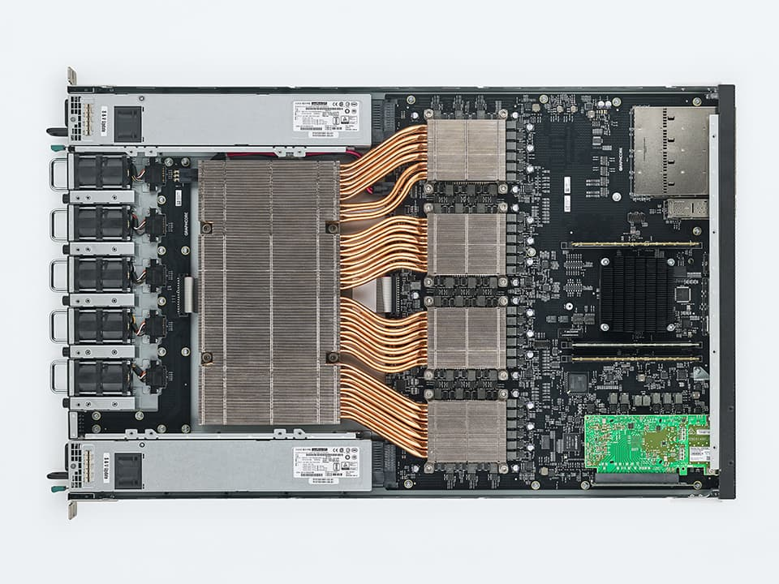
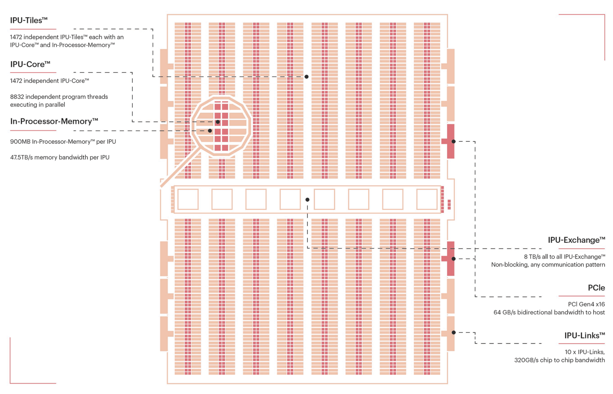
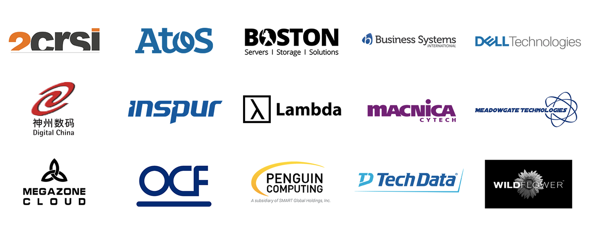

[NOTE]
====
- IPU-M2000
- Colossus™ MK2 GC200 IPU

Website: link:https://www.graphcore.ai/[]
====

*The IPU-Machine: IPU-M2000*

The IPU-M2000 is next-generation system solution built with the Colossus MK2 IPU. It packs 1 PetaFlop of AI compute and up to 450GB Exchange-Memory™ in a slim 1U blade for the most demanding machine intelligence workloads.

The IPU-M2000 has a flexible, modular design, so you can start with one and scale to thousands. Directly connect a single system to an existing CPU server, add up to eight connected IPU-M2000s or with racks of 16 tightly interconnected IPU-M2000s in IPU-POD64 systems, grow to supercomputing scale thanks to the high-bandwidth, near-zero latency IPU-Fabric™ interconnect architecture built into the box.

[.text-center]

*the Colossus™ MK2 GC200 IPU*

Second-generation Colossus™ MK2 IPU processor – the GC200. The IPU is a completely new kind of massively parallel processor, co-designed from the ground up with the Poplar® SDK, to accelerate machine intelligence. Since our first generation Colossus IPU, we have developed groundbreaking advances in compute, communication and memory in our silicon and systems architecture, achieving an 8x step up in real-world performance compared to the MK1 IPU. The GC200 is the world's most complex processor made easy to use thanks to Poplar software, so innovators can make AI breakthroughs.

[.text-center]

[IMPORTANT]
.Note from Jaro
====
Booming - lots of activity since 2016 continously non stop in 2020/2021, lots of positions.
On top of hardware - software stack - own SDK is very important.
There is Graphcore China - partnered with Kingsoft Cloud to host first Graphene IPU DevCloud in China.
They cooperate few times quite closely with Microsoft.
Graphcore  joined Baidu’s PaddlePaddle hardware ecosystem.

partners are:

2CRSi, Atos, Boston Limited, BSI, Dell Technologies, Digital China, Inspur, Lambda, Macnica/Cytech, Meadowgate Technologies, Megazone, OCF, Penguin Computing, Tech Data Europe, Tech Data US and Wildflower International.

====