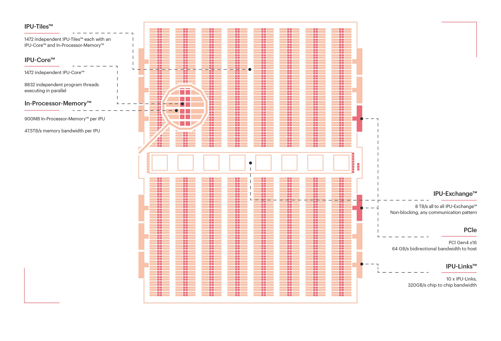

The IPU-Machine: IPU-M2000
The IPU-M2000 is our revolutionary next-generation system solution built with the Colossus MK2 IPU. It packs 1 PetaFlop of AI compute and up to 450GB Exchange-Memory™ in a slim 1U blade for the most demanding machine intelligence workloads.
The IPU-M2000 has a flexible, modular design, so you can start with one and scale to thousands. Directly connect a single system to an existing CPU server, add up to eight connected IPU-M2000s or with racks of 16 tightly interconnected IPU-M2000s in IPU-POD64 systems, grow to supercomputing scale thanks to the high-bandwidth, near-zero latency IPU-Fabric™ interconnect architecture built into the box.

image:../img/graphcore_IPUMachine2000Top_KL_compressed.jpg[]

Introducing the Colossus™ MK2 GC200 IPU
Introducing our second-generation Colossus™ MK2 IPU processor – the GC200. The IPU is a completely new kind of massively parallel processor, co-designed from the ground up with the Poplar® SDK, to accelerate machine intelligence. Since our first generation Colossus IPU, we have developed groundbreaking advances in compute, communication and memory in our silicon and systems architecture, achieving an 8x step up in real-world performance compared to the MK1 IPU. The GC200 is the world's most complex processor made easy to use thanks to Poplar software, so innovators can make AI breakthroughs.

Co-Designed with Poplar® SDK
With IPU-POD64 systems you can run vast workloads across up to 64,000 IPUs. With Poplar, computing on this scale is as simple as using a single machine. Poplar takes care of all the scaling and optimisation – allowing you to focus on the model and the results.
We’ve also made it possible to dynamically share your AI compute between users, with our Virtual-IPU software when you want to allow multiple users to run different workloads at the same time.
We support interfaces to integrate with industry standard ecosystem tools for infrastructure management, including Open BMC and Redfish, Docker containers and orchestration with Slurm and Kubernetes. And we’re adding support for more platforms all the time.

image:../img/graphcore_Poplar_081220.jpg[]

The Poplar SDK is a complete software stack, which was co-designed from scratch with the IPU, to implement our graph toolchain in an easy to use and flexible software development environment.

At a high level, Poplar is fully integrated with standard machine learning frameworks so developers can port existing models easily, and get up and running out-of-the-box with new applications in a familiar environment.

Below these frameworks sits Poplar. For developers who want full control to exploit maximum performance from the IPU, Poplar enables direct IPU programming in Python and C++.

*Standard framework support*

Poplar seamlessly integrates with standard machine intelligence frameworks:

*TensorFlow 1 & 2 support with full performant integration with TensorFlow XLA backend
*PyTorch support for targeting IPU using the PyTorch ATEN backend
*PopART™ (Poplar Advanced Runtime) for training & inference; supports Python/C++ model building plus ONNX model input
*Full support for PaddlePaddle and other frameworks is coming soon

*PopLibs™ Graph Libraries*

PopLibs is a complete set of libraries, available as open source code, that support common machine learning primitives and building blocks:

* Over 50 optimised functions for common machine learning models
* More than 750 high performance compute elements
* Simple C++ graph building API
* Implement any application
* Full control flow support

*Graph Compiler*

Our state of the art compiler simplifies IPU programming by handling the scheduling and work partitioning of large parallel programs including memory control:

* Optimised execution of the entire application model to run efficiently on IPU platforms
* Alleviates the burden on developers to manage data or model parallelism
* Code generation using standard LLVM

*Graph Engine*

High performance Graph Runtime to execute models and stream data through models running on IPU:

* Highly optimised IPU data movement
* Interfaces to host memory system
* Device management: configuring the IPU-Link network, loading applications to devices & performing setup
* Debug & profiling capabilities

*Multi-IPU Scaling & Communication*

Poplar takes on the heavy lifting, so you don't have to, in a world of growing model sizes and complexity:

* High bandwidth IPU-Link™ communication, fully automated and managed by Poplar, treats multiple IPUs like a single IPU compute resource
* Graph Compile Domain (GCD) allows a single application to be programmed against multiple IPU processors, enabling both data parallel and model parallel execution
* Model sharding allows the simple splitting of applications across multiple devices
* Combining sharding with replication allows you to take code data parallel with minimum effort
* Advanced model pipelining lets users extract maximum system performance to run large models fast and efficiently

[IMPORTANT]
.Note from Jaro
====
Booming - lots of activity since 2016 continously non stop in 2020/2021, lots of positions.
On top of hardware - software stack - own SDK is very important.
There is Graphcore China - partnered with Kingsoft Cloud to host first Graphene IPU DevCloud in China.
They cooperate few times quite closely with Microsoft.
Graphcore  joined Baidu’s PaddlePaddle hardware ecosystem.

partners are:

2CRSi, Atos, Boston Limited, BSI, Dell Technologies, Digital China, Inspur, Lambda, Macnica/Cytech, Meadowgate Technologies, Megazone, OCF, Penguin Computing, Tech Data Europe, Tech Data US and Wildflower International.
image:../img/graphcore_partners.png[]]
====