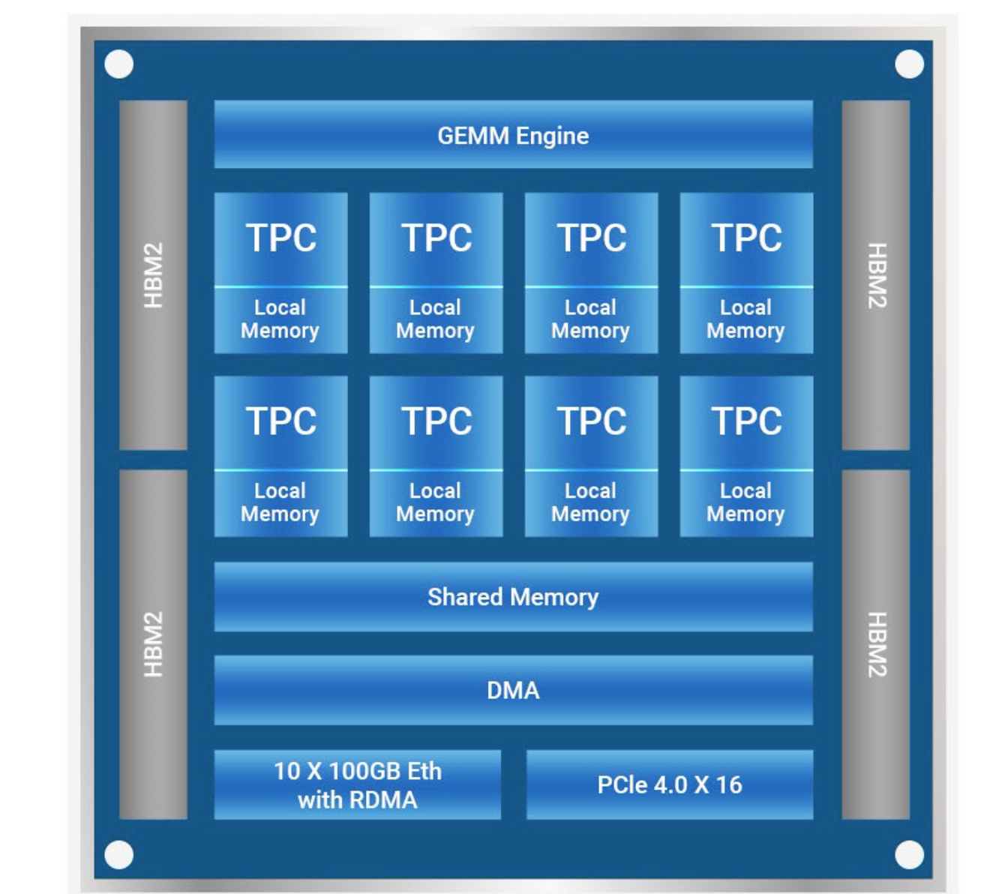
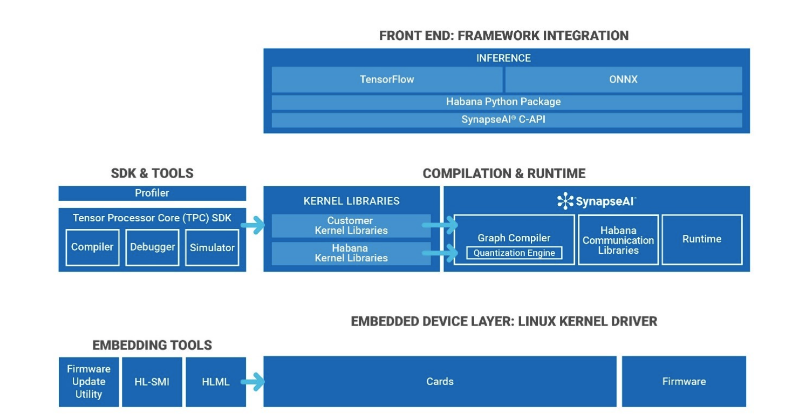

[NOTE]
====

*HABANA*

* GAUDI for AI training
* GOYA for AI Inference

Website: link:https://habana.ai/[]
====

*Gaudi*

Habana integrates ten 100 GbE ports of RoCE RDMA over Converged Ethernet–into every Gaudi processor to deliver unmatched advantages to customers to efficiently scale AI Training from one processor to 1000s for data parallel and model parallel systems.

Gaudi is based on the scalable architecture of the TPC. The Gaudi processor features a cluster of eight TPC 2.0 cores. The first generation of TPC cores was introduced in the Goya inference processor and the TPC 2.0 was designed to support Deep Learning training and inference workloads. 

The TPC 2.0 core is a VLIW SIMD processor with instruction set and hardware that were tailored to serve training workloads efficiently. It is C-programmable, providing the user with maximum flexibility to innovate, coupled with many workload-oriented features, such as:

• GEMM operation acceleration
• Tensor addressing
• Latency hiding capabilities
• Random number generation
• Advanced implementation of Special Functions

The TPC core natively supports the following data types: FP32, BF16, INT32, INT16, INT8, UINT32, UINT16 and UINT8.

The Gaudi memory architecture includes on-die SRAM and local memories in each TPC. In addition, the chip package integrates four HBM2 devices, providing 32 GB of capacity.

The PCIe interface provides a host interface and supports both generation 3.0 and 4.0 modes.

Gaudi is the first AI Processor that also integrates on-chip RDMA over Converged Ethernet (RoCE v2) engines. These engines play a critical role in the inter-processor communication needed during the training process. By integrating this functionality and supporting bi-directional throughput of up to 2 Tb/sec, customers can build systems of any size, and adapt them to their requirements.

The Gaudi includes 20 pairs of 56Gbps Tx/Rx PAM4 serializers/de-serializers (SerDes) that can be configured as 10 ports of 100Gb Ethernet, 20 ports of 50Gb/25Gb Ethernet, or any combination in between. A Gaudi port operating at 100GbE can also be configured to use four SerDes operating at 25Gbps for connecting to legacy switches. These ports are designed to scale out the inter-Gaudi communication by integrating a complete communication engine on-die.

This native integration allows customers to use the same scaling technology, both inside the server and rack (termed as scale-up), as well as to scale across racks (scale-out). These can be connected directly between Gaudi processors, or through any number of standard Ethernet switches.

Compared with competing architectures, customers do not need to add an array of PCIe switches and dedicated NICs.

Ethernet switches, unlike proprietary connectivity switches, are available from many vendors with greater options in port- count to choose from (from small switches to 25.6Tbps with 128 ports of 100GbE in a single chip or bigger).

A high-level scheme of the Gaudi architecture.

---

*GOYA*

The Goya Inference Processor is based on the scalable architecture of Habana’s Tensor-Processing Core (TPC)
and includes a cluster of eight programmable cores. TPC is Habana’s proprietary core designed to support deep
learning workloads. It is a VLIW SIMD vector processor with Instruction-Set-Architecture and hardware tailored
to serve deep learning workloads efficiently.

The TPC is C/C++ programmable, providing the user with maximum flexibility to innovate, coupled with many
workload-oriented features such as: General Matrix Multiply (GEMM) operation acceleration, special-functions
dedicated hardware, tensor addressing and latency hiding capabilities. The TPC natively supports these mixedprecision data types: FP32, INT32/16/8, UINT32/16/8. To achieve maximum hardware efficiency, Habana Labs

SynapseAI® quantizer tool selects the appropriate data type by balancing throughput and performance versus
accuracy. For predictability and low latency, Goya is based on software-managed, on-die memory along with
programmable DMAs. For robustness, all memories are ECC-protected.

All Goya engines (TPCs, GEMM and DMA) can operate concurrently and communicate via shared memory. For
external interface, the processor uses PCIe Gen4x16 enabling communication to any host of choice. The
processor includes two 64-bit channels of DDR4 memory interface with max capacity of 16 GB.

The Goya architecture supports mixed precision of both integer and floating points, which allows it to flexibly
support different workloads and applications, under quantization controls that the user can specify.

---

*SYNAPSE AI* SOFTWARE SUITE FOR TRAINING

Habana’s SynapseAI software suite is designed to facilitate high-performance DL training on Gaudi accelerators. The software suite includes Habana’s graph compiler and runtime, communication libraries, TPC kernel library, firmware and drivers. 

SynapseAI is integrated with TensorFlow and PyTorch frameworks, and performance-optimized for Gaudi

[IMPORTANT]
.Note from Jaro
====
Habana is Intel answer for AI world - dedicated TPU processors group into servers as: Gaudi - training, Goya - inference.
Intel is producing MLPerf outputs however need to be noticed how hardly they underline that they take part in an "available" category vs "preview" or "research", which means: yes - customers ac use it, no - is not the best on market.
====

