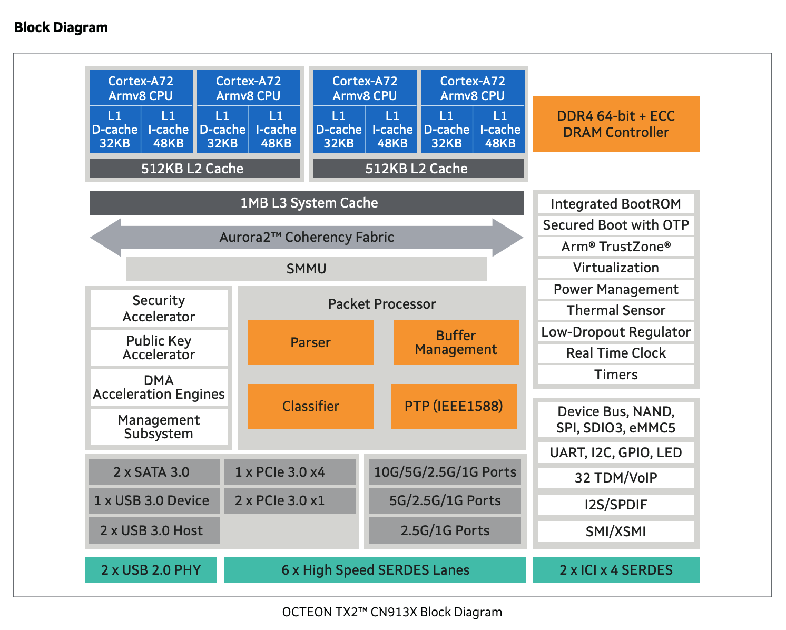
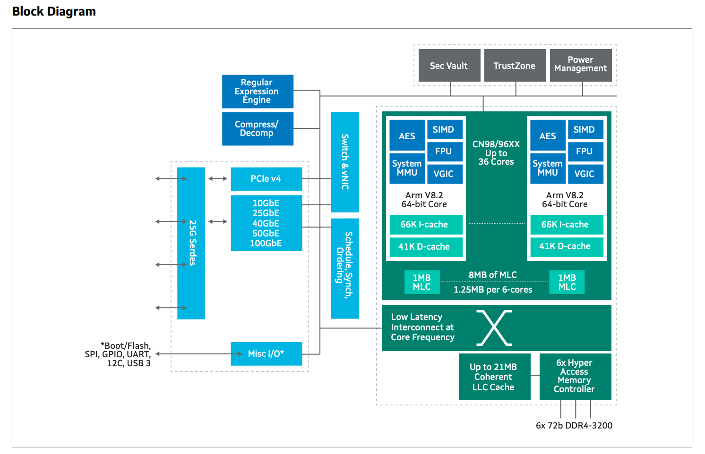
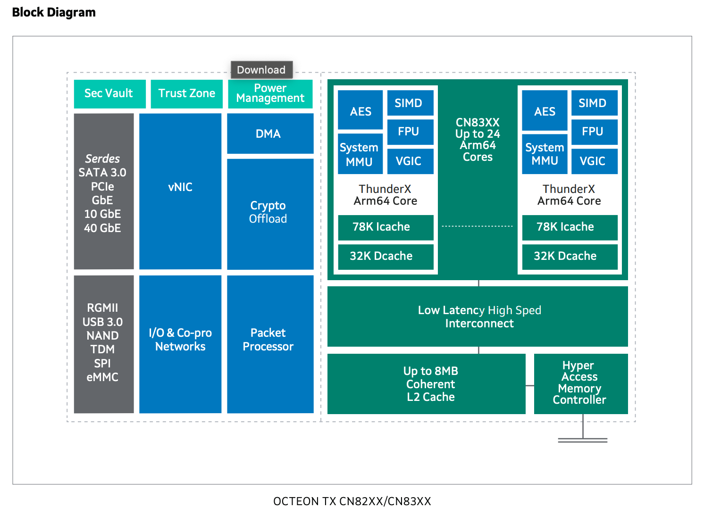
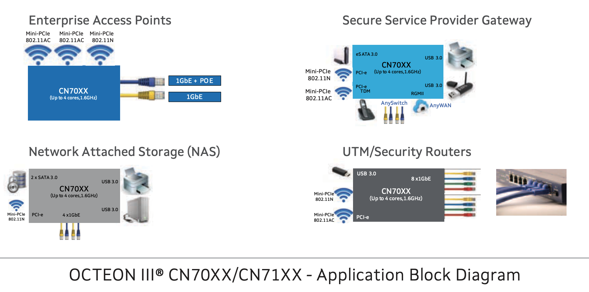
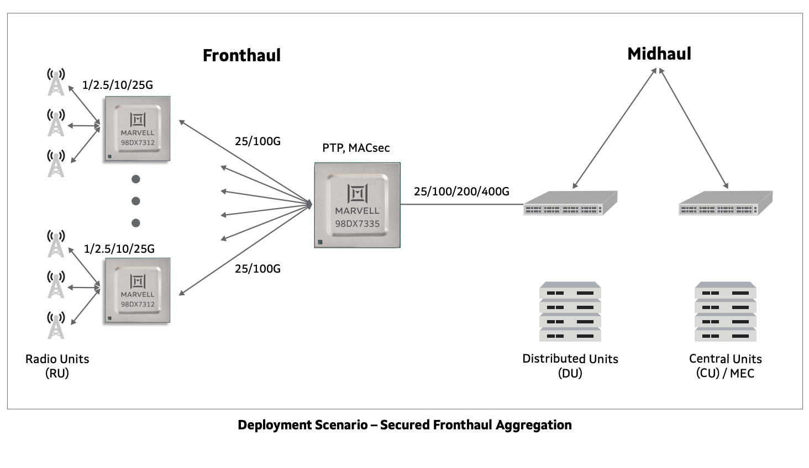
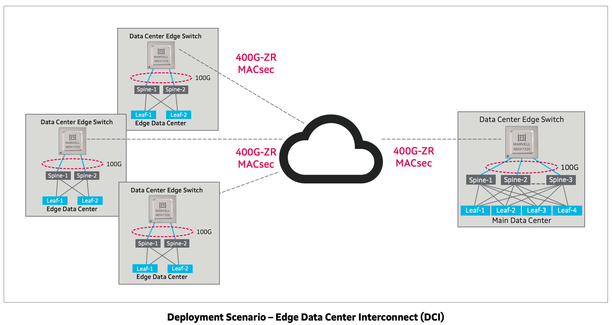
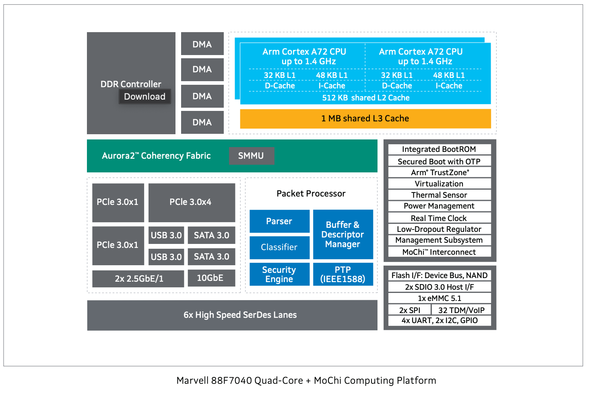

[NOTE]
====
*Data Processing Units*

Built on five generations of the industry’s most scalable and widely adopted data processing, Marvell’s OCTEON™ and ARMADA® devices are optimized for wireless infrastructure, carrier, enterprise and cloud data services.

Website: link:https://www.marvell.com/products/data-processing-units.html[]

*Custom ASICs*
Marvell’s custom ASIC offering specializes in addressing the complex, high-speed, high-performance silicon requirements of next generation 5G carriers, cloud data centers, enterprises, and automotive applications. Broad and growing portfolio of IP spanning compute, embedded memories, high-speed SerDes, networking, security and storage, accelerates time to market and is optimized for performance, power and area, enabling optimal returns on investments.

Website: link:https://www.marvell.com/products/custom-asic.html[]
====

*Data Processing Units*

Marvell’s OCTEON™ and ARMADA® devices are designed for use in wireless infrastructure and networking equipment including switches, routers, secure gateways, firewall, network monitoring, and smartNICs.

* *OCTEON™ Arm® Multi-Core DPUs*

Marvell’s OCTEON™ Arm 64-bit DPUs combine up to 36 cores with configurable and programmable hardware accelerator blocks that supports up to 200 GB data paths.

 - Up to 36 custom designed 64-bit Armv8 cores ranging up to 2.4 GHz frequency
 - Enhanced NITROX® V security co-processors with DPI capability which accelerate a comprehensive set of asymmetric and symmetric cryptographic operations
 - Up to 5 x 100G integrated MACs, up to 56 x 25G SerDes, and DDR4 3200MTS support
 - Rich I/O interfaces supporting PCIe 4.0 root-complex and end point configurations thereby enabling full SOC virtualization
 - Innovative load-balancing and work scheduling hardware for QoS, packet ordering and synchronization

** OCTEON TX2 CN9130

A 4 core Arm Cortex-A72 DPUs with up to 2.2 GHz frequency. It supports up to 18 lanes high-speed SerDes interfaces, PCIe 3.0 with up to 14 lanes and acceleration engines for networking, public key, security and time stamping.

** OCTEON TX2 CN92XX, CN96xx, CN98xx

DPUs with 12-36 64-bit Arm v8 cores at 2.4 GHz per core. The family incorporates NITROX® V security accelerator, DPI engine, compression, QoS and PCIe 4.0. It also supports hardware virtualization, and up to 56 lanes of SerDes.

** OCTEON TX CN82XX and CN83XX

DPUs with 8-24 64-bit Armv8 cores at 1.8 GHz per core. The family incorporates security engine, DPI, compression, QoS, SATA 3.0, USB 3.0, PCIe 3.0. and up to 22 lanes of SerDes

* *OCTEON MIPS64 Multi-Core DPUs*
The Marvell OCTEON family of MIPS64 data processing units, is the only DPU family that utilizes custom designed 64-bit cnMIPS cores and scales up to 48 cores. It incorporates networking I/Os along with the most advanced security, storage, and application hardware acceleration, offering unprecedented throughput and programmability.

- Enhanced security processors with DPI capability which accelerate a comprehensive set of asymmetric and symmetric cryptographic operations
- Rich I/O interfaces supporting root-complex and end point configurations on PCIe 3.0
- Innovative and unique load-balancing and work scheduling hardware which accounts for QoS, packet ordering and synchronization
- Common SDK and full networking data plane, control and management plane stack support across the entire family

* OCTEON III CN7XXX

CN7XXX scales up to 48 64-bit cnMIPS64 III cores at 1.8 GHz. The family supports standard SerDes I/O with multiple ports of PCIe 3.0, SATA 6G and hardware acceleration engines for 100 Gbps data processing.

* *OCTEON TX2 LiquidIO III SmartNIC*

Marvell’s LiquidIO III is an OCTEON-based DPU for inline network and security acceleration card in a SmartNIC PCI form factor.  It includes support for a full networking software stack based on Linux and DPDK.  The LiquidIO III architecture can scale on the hardware as well as software capabilities using the latest generation of OCTEON data processing units. Marvell’s third generation 100GbE adapter family enables data centers to rapidly deploy high-performance SDN applications for both installed and new infrastructure optimizing server utilization, response times and network agility. This product in a PCI Express form factor, provides a proven, high-performance programmable adapter platform that enables cloud service providers to offload and accelerate infrastructure workloads in the data center.

- Highest (24) ARM processor core count SmartNIC on the market.
- Full featured DPDK networking and security suite with Control, Management and Data plane modules

* *Open RAN & Virtualized RAN Platform Solutions*

Marvell’s O-RAN platform brings established, leading edge baseband, DPU and connectivity technology to open RAN and vRAN markets. Marvell’s OCTEON Fusion® baseband processors, OCTEON DPUs and Prestera switches have enabled leading telecom OEMs to deploy 5G and LTE networks worldwide. This technology is now available to O-RAN operators, OEMs and system integrators.

The O-RAN Platform provides a purpose-built, cloud native, highly programmable solution to address capacity, power, cost and time-to-market challenges of open RAN architectures. Leveraging carrier-proven silicon and comprehensive reference software, the O-RAN platform provides solutions for massive MIMO Radio Units (RU) and for integrated and virtualized Distributed Units (DU/vDU).

OCTEON DPUs provide leading performance in transport, security and RAN L2/L3 applications, which are critical for DU and Centralized Unit (CU) applications. Acceleration of specialized packets and data processing applications address the ever-increasing throughput and latency requirements of 5G virtualized networks.

The Prestera 7K switch family connects and aggregates large pipelines and assures stable and reliable connectivity without sacrificing visibility in the network, offering best-in-class telemetry, scalability, performance, power, and cost.

- Spans all 5G RAN elements: RU, DU, CU and connectivity
- Consists of silicon, software and hardware reference designs
- Achieves significant OPEX and CAPEX savings
- Supports the most stringent 5G and LTE latency requirements
- Delivers best in class scalability, performance, power and cost
- Provides a highly programmable solution
- Supports massive MIMO RU deployments
 

** OCTEON Fusion-O RU

3GPP 5G/4G lower L1 and beamforming silicon for 32T32R, 100MHz channelization radio units. Features up to 100Gbps of fronthaul capacity, 16 lanes of JESD204B/C, multiple programmable accelerators and signal processing units. Integrated with ADI’s 5G transceiver product line.

** OCTEON Fusion-O DU

3GPP 5G/4G L1 silicon capable of processing up to 16 DL and 8 UL MIMO layers at 100MHz channelization. Features up to 150Gbps of fronthaul and 100Gbps of midhaul RoE/eCPRI capacity, 15Gbps of OTA traffic, multiple programmable accelerators and signal processing units.

** Prestera® DX 7300 series

Family of switches optimized for Carrier Ethernet Access and Edge. Incorporates Class C PTP/SyncE, advanced security, and enhanced network telemetry and intelligence for actionable analytics. Supports flexible I/O speeds from 1G to 400G.

* *ARMADA® DPUs*

Marvell ARMADA data processing units are custom designed to deliver optimal performance, low power, and high levels of integration. Our ARMv8 standard CPU cores are the most advanced implementations of industry standard ARM architecture, delivering exceptional processing performance. The ARMADA DPU family is optimized for cost optimized applications in compute, networking and storage platforms.

- Up to 4 Cortex A72, 64-bit ARMv8 cores ranging up to 1.4 GHz frequency.
- Advanced security co-processor which accelerates a comprehensive set of asymmetric and symmetric cryptographic operations.
- Rich I/O interfaces supporting root-complex and end point configurations on PCIe 3.0.
- Networking engine which accounts for hardware parsing, classification, policing and QoS.
- Common SDK and full networking data plane, control and management plane stack support across the entire family.

** ARMADA 7040

ARMADA 7040 includes quad-core ARM Cortex-A72 64-bit processor with up to 1.4 GHz CPU clock speed. The processor supports up to 6 SerDes lanes, PCIe 3.0 and acceleration engines for storage, networking and security.

---

*Custom ASICs*

Marvell’s custom ASIC offering specializes in addressing the complex, high-speed, high-performance silicon requirements of next generation 5G carriers, cloud data centers, enterprises, and automotive applications. Our broad and growing portfolio of IP spanning compute, embedded memories, high-speed SerDes, networking, security and storage, accelerates time to market and is optimized for performance, power and area, enabling optimal returns on investments.

Marvell’s global custom ASIC team has delivered over two thousand customized ASICs over the last 25 years and is committed to delivering the following critical technology and IP areas for the next generation of ASIC solutions.

- Leading-edge silicon processes beyond 5nm
- Comprehensive low-power design and test methodologies
- High-density optimized embedded memories
- Low power, flexible and interoperable chip-to-chip interfaces for chiplet solutions
- High-speed, multi-protocol, mixed-signal SERDES IP ranging from 1Gbps to beyond 112Gbps supporting short to long reaches across Ethernet, PCIe, SAS, SATA and many emerging protocol and interface standards
- Industry-leading Arm system-on-chip (SoC) processor subsystems

[IMPORTANT]
.Note from Jaro
====
Few latest news:
Mar. 01: Marvell OCTEON DPU Family Joins Evenstar Program to Supply OpenRAN Distributed Unit Designs
Feb. 25 - OCTEON Fusion™ Baseband Processors Power Fujitsu’s Next-Generation 5G Micro Cells and O-RAN Distributed Units
Dec. 8  - Marvell Expands 5G Technology Leadership with End-to-End Open RAN and Virtualized RAN Platform Solutions

Marvell is rapidly expanding, and from the list of processors, applications they highly focused on telco/RAN/5G, optimizing OPEX and CAPAEX.

The Marvell O-RAN platform solution consists of silicon, software and hardware reference designs spanning the radio unit (RU), distributed unit (DU) and centralized unit (CU) with Ethernet connectivity between these network elements.

This is company that need to be closely look for.
====
