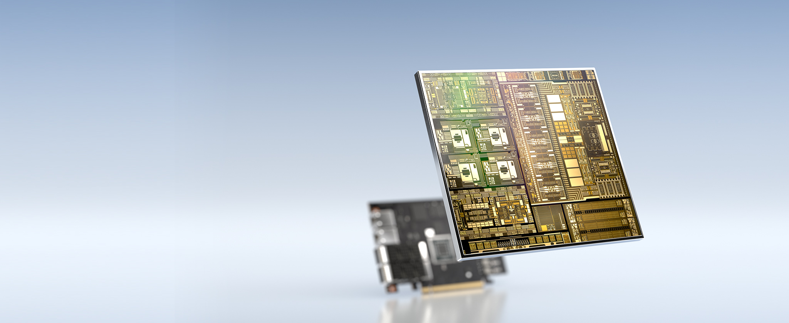
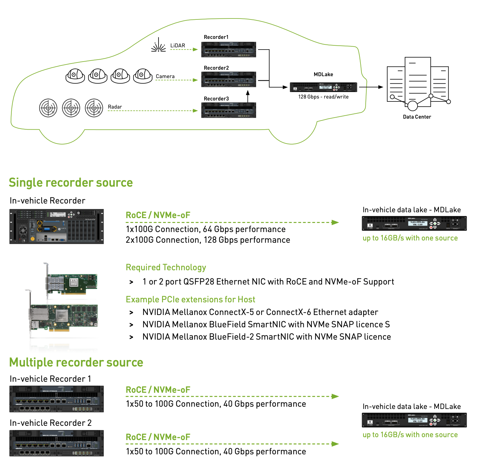
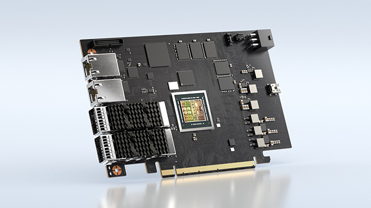
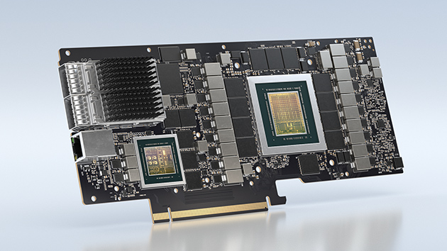
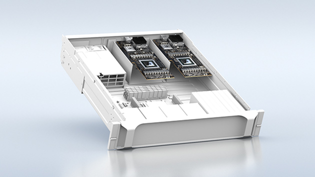
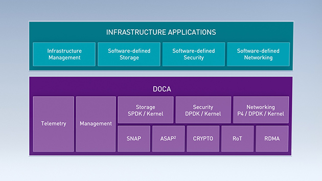
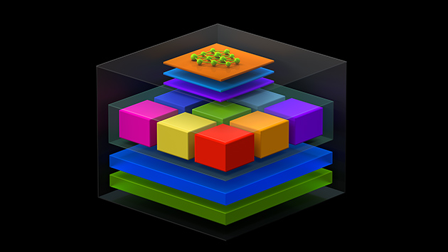

[NOTE]
====
Mellanox - DPU from nVidia.

Website: link:https://www.nvidia.com/en-us/networking/products/data-processing-unit/[]
====

NVIDIA BLUEFIELD DATA PROCESSING UNITS

Software-Defined, Hardware-Accelerated Data Center Infrastructure on a Chip

[.text-center]

The NVIDIA® BlueField® data processing unit (DPU) ignites unprecedented innovation for modern data centers, delivering a broad range of advanced networking, storage, and security services for complex compute and AI workloads. By combining the industry-leading ConnectX® network adapter with an array of Arm cores, BlueField offers purpose-built hardware acceleration engines with full data center infrastructure on chip programmability.

*Benefits*

- Secure from the Perimeter to the Server
DPU architecture isolates data center security policies from the host CPU while building a zero-trust data center domain at the edge of every server.

- Data Storage for the Expanding Workload
With NVMe over Fabric (NVMe-oF) Storage Direct, encryption, elastic storage, data integrity, compression, and deduplication, the NVIDIA BlueField-2 DPU provides a high-performance storage network with latencies  for remote storage that rivals direct attached storage.

- High-Performance, Efficient Networking
The BlueField-2 DPU is a powerful data center services accelerator, delivering up to 200 gigabits per second (Gb/s) Ethernet and InfiniBand line-rate performance for both traditional applications and modern GPU-accelerated AI workloads while freeing the host CPU cores.

- Software-Defined Infrastructure
The NVIDIA DOCA software development kit (SDK) enables developers to easily create high-performance, software-defined, cloud-native, DPU-accelerated services, leveraging industry-standard APIs.

[.text-center]

*NVIDIA’s Leading Portfolio of Data Processing Units*

* NVIDIA BlueField-2 DPU

NVIDIA BlueField-2 is a new kind of DPU, offering innovative acceleration, security, and efficiency in every host. BlueField-2 data center infrastructure on a chip combines the power of the ConnectX-6 Dx with programmable Arm cores and hardware offloads for software-defined storage, networking, security, and management workloads.

The NVIDIA BlueField-2 DPU product line also includes a Controller optimized for NVMe storage that delivers superior performance and reduced TCO for managing backend NVMe storage, all-flash-arrays(AFA) and hyperconverged systems.

[.text-center]

* NVIDIA BlueField-2X AI-Powered DPU

Introducing the first AI-powered DPU: NVIDIA BlueField-2X. This advanced DPU includes all the key features of BlueField-2 enhanced with the AI capabilities of an NVIDIA Ampere GPU. Drawing from NVIDIA’s third-generation Tensor Cores, it’s able to use AI for real-time security analytics, including identifying abnormal traffic that could indicate theft of confidential data, encrypted traffic analytics at line rate, host introspection to identify malicious activity, and dynamic security orchestration and automated response.

[.text-center]

* Converged Accelerators

NVIDIA EGX™ converged accelerators combine the powerful performance of the NVIDIA Ampere architecture with the enhanced security and latency-reduction capabilities of the NVIDIA SmartNIC and DPU technologies. Hospitals, stores, warehouses, factories, airports, and other enterprises can use EGX converged accelerators to create faster, more efficient, and secure AI systems in enterprise data centers and at the edge.

[.text-center]

* Data Center Infrastructure on a Chip Architecture

The NVIDIA DOCA SDK enables developers to program the data center infrastructure of tomorrow by creating high-performance, software-defined, cloud-native, DPU-accelerated services, increasing performance and security capabilities.

[.text-center]

* Optimized Servers for Modern Workloads

NVIDIA-Certified Systems™ deliver true multi-node scaling with NVIDIA Ampere GPUs and BlueField DPUs, optimized and tested to run modern AI workloads with built-in security, such as in-line crypto, secure boot, and air-gapped isolation. The NVIDIA DOCA SDK, available from the NVIDIA NGC™ catalog, provides a convenient containerized environment for third-party application providers to leverage advanced data center acceleration on NVIDIA-Certified Systems to develop, certify, and distribute applications to end customers.

---

*NVIDIA to Acquire Mellanox for $6.9 Billion*

Monday, March 11, 2019

- Unites leaders in processing and interconnect for the high performance computing market
- Builds on the companies’ long history of collaboration and joint innovation
- Expected to be accretive to NVIDIA’s non-GAAP gross margin, non-GAAP EPS and free cash flow immediately after close

[IMPORTANT]
.Note from Jaro
====
In nVidia DPU chapter, I presented BlueField DPU, but there is bigger story behind as this line of HPC solution is called Mellanox.

Mellanox - is older (2019) acquisition of nVidia, and if you look at the speed of integration, you can have high hopes about output on nVidia/ARM merge.

link:https://nvidianews.nvidia.com/news/nvidia-to-acquire-mellanox-for-6-9-billion[]

====
