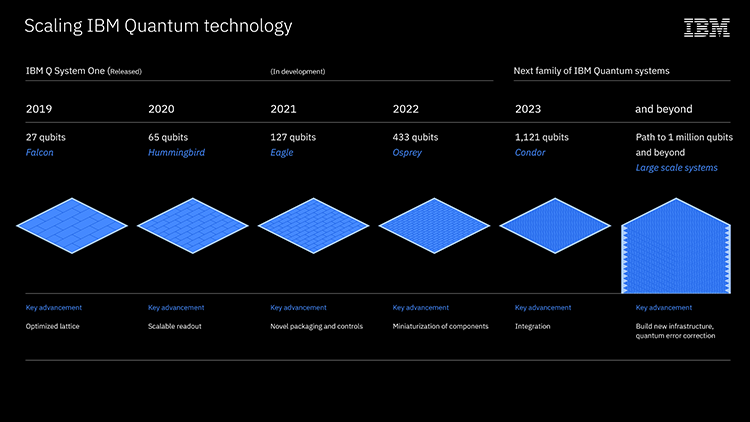
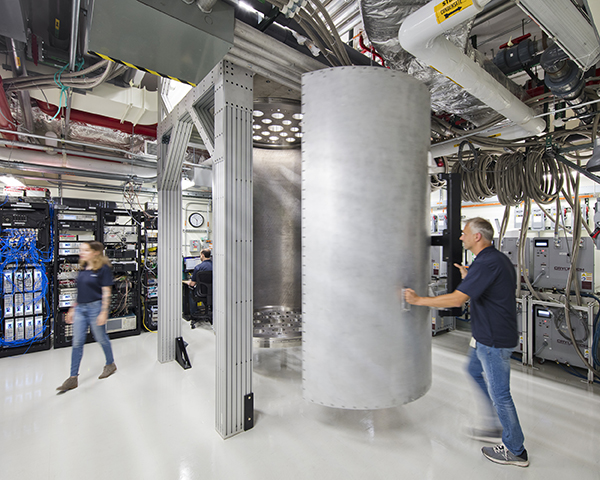

[NOTE]
====
IBM Quantum leads the world in quantum computing, which aims to solve complex problems the world's most powerful supercomputers cannot solve, and never will.

Below: IBM Quantum computing roadmap.

Website: link:https://www.ibm.com/blogs/research/2020/09/ibm-quantum-roadmap/[]
====

2021 - debut out 127-qubit IBM Quantum Eagle processor. Eagle features several upgrades in order to surpass the 100-qubit milestone: crucially, through-silicon vias (TSVs) and multi-level wiring provide the ability to effectively fan-out a large density of classical control signals while protecting the qubits in a separated layer in order to maintain high coherence times. Fixed balance of connectivity and reduction of crosstalk error with fixed-frequency approach to two-qubit gates and hexagonal qubit arrangement introduced by Falcon. This qubit layout will allow to implement the “heavy-hexagonal” error-correcting code that debuted 2019, so as scale up the number of physical qubits, will also be able to explore how they’ll work together as error-corrected logical qubits—every processor design has fault tolerance considerations taken into account.

With the Eagle processor, introduce concurrent real-time classical compute capabilities that will allow for execution of a broader family of quantum circuits and codes.

The design principles established for smaller processors will set on a course to release a 433-qubit IBM Quantum Osprey system in 2022. More efficient and denser controls and cryogenic infrastructure will ensure that scaling up processors doesn’t sacrifice the performance of individual qubits, introduce further sources of noise, or take up too large a footprint.

In 2023, debut the 1,121-qubit IBM Quantum Condor processor, incorporating the lessons learned from previous processors while continuing to lower the critical two-qubit errors so that can run longer quantum circuits. Condor should be an inflection point, a milestone that marks ability to implement error correction and scale up devices, while simultaneously complex enough to explore potential Quantum Advantages—problems that can be solved more efficiently on a quantum computer than on the world’s best supercomputers.

Members of the IBM Quantum team at work investigating how to control increasingly large systems of qubits for long enough, and with few enough errors, to run the complex calculations required by future quantum applications

[IMPORTANT]
.Note from Jaro
====
This is pure research, but IBM Quantum computing roadmap look impressive: 2021 - 127-qubit Eagle processor, 2022 - 433-qubit Osprey, 2023 - 1121-qubit Condor.

====