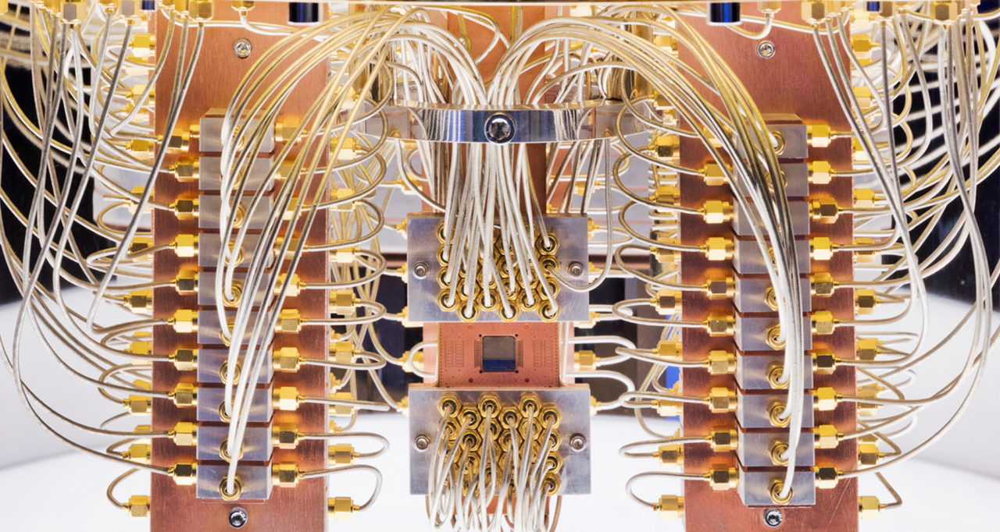

https://blogs.nvidia.com/blog/2022/03/22/hybrid-quantum-computing-ecosystem/?ncid=em-anno-882613&mkt_tok=MTU2LU9GTi03NDIAAAGDeT6olTpTMILXM03YTY369e9SLN0Zps9ZaG_WnXC9dGYj_96ZIq8zsE24_Q3nuRVGhqGK1E3AzDF727W1-bszGuI-2ro2jTss90P8vzvTEr0R#cid=hpc06_em-anno_en-eu

NVIDIA Unveils Onramp to Hybrid Quantum Computing
NVIDIA cuQuantum debuts with an expanding ecosystem and a collaboration building the programming model for tomorrow’s most powerful systems.

We’re working with leaders in quantum computing to build the tools developers will need to program tomorrow’s ultrahigh performance systems.

Today’s high-performance computers are simulating quantum computing jobs at scale and with performance far beyond what’s possible on today’s smaller and error-prone quantum systems. In this way, classical HPC systems are helping quantum researchers chart the right path forward.

As quantum computers improve, researchers share a vision of a hybrid computing model where quantum and classical computers work together, each addressing the challenges they’re best suited to. To be broadly useful, these systems will need a unified programming environment that’s efficient and easy to use.

We’re building this onramp to the future of computing today. Starting with commercially available tools, like NVIDIA cuQuantum, we’re collaborating with IBM, Oak Ridge National Laboratory, Pasqal and many others.

A Common Software Layer
As a first step, we’re developing a new quantum compiler. Called nvq++, it targets the Quantum Intermediate Representation (QIR), a specification of a low-level machine language that quantum and classical computers can use to talk to each other.

Researchers at Oak Ridge National Laboratory, Quantinuum, Quantum Circuits Inc., and others have embraced the QIR Alliance, led by the Linux Foundation. It enables an agnostic programming approach that will deliver the best from both quantum and classical computers.

Researchers at the Oak Ridge National Laboratory will be among the first to use this new software.

Ultimately, we believe the HPC community will embrace this unified programming model for hybrid systems.

Ready-to-Use Quantum Tools
You don’t have to wait for hybrid quantum systems. Any developer can start world-class quantum research today using accelerated computing and our tools.

NVIDIA cuQuantum is now in general release. It runs complex quantum circuit simulations with libraries for tensor networks and state vectors.

And our cuQuantum DGX Appliance, a container with all the components needed to run cuQuantum jobs optimized for NVIDIA DGX A100 systems, is available in beta release.

Researchers are already using these products to tackle real-world challenges.

For example, QC Ware is running quantum chemistry and quantum machine learning algorithms using cuQuantum on the Perlmutter supercomputer at the Lawrence Berkeley National Laboratory. The work aims to advance drug discovery and climate science.

An Expanding Quantum Ecosystem
Our quantum products are supported by an expanding ecosystem of companies.

For example, Xanadu has integrated cuQuantum into PennyLane, an open-source framework for quantum machine learning and quantum chemistry. The Oak Ridge National Lab is using cuQuantum in TNQVM, a framework for tensor network quantum circuit simulations.

In addition, other companies now support cuQuantum in their commercially available quantum simulators and frameworks, such as the Classiq Quantum Algorithm Design platform from Classiq, and Orquestra from Zapata Computing.

They join existing collaborators including Google Quantum AI, IBM, IonQ and Pasqal, that announced support for our software in November.