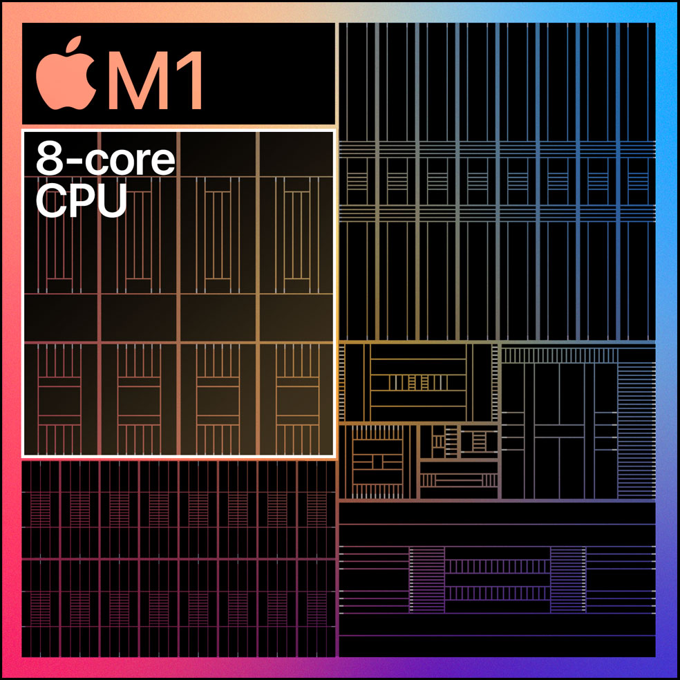

[NOTE]
====

Apple's silicon is changing our perspective on how ARM CPU's perform.

M1 consist of:

- 8-core GPU (25K threads)
- 16 - core neural engines

But not there are rumours about next one - codename M1X.

Website: link:https://www.apple.com/mac/m1/[]
====

[.text-center]

An entire system. On a single chip.

Until now, a Mac needed multiple chips to deliver all of its features — including the processor, I/O, security, and memory. With M1, these technologies are combined into a single system on a chip (SoC), delivering a new level of integration for more simplicity, more efficiency, and amazing performance. And with incredibly small transistors measured at an atomic scale, M1 is remarkably complex — packing the largest number of transistors we’ve ever put into a single chip. It’s also the first personal computer chip built using industry‑leading 5‑nanometer process technology.

[.text-center]

* 5‑nanometer  process
The first personal computer chip built with this cutting‑edge technology.
* 16 billion  transistors
The most we’ve ever put into a single chip.

Unified memory.
Shared across the entire system.

M1 also features our unified memory architecture, or UMA. M1 unifies its high‑bandwidth, low‑latency memory into a single pool within a custom package. As a result, all of the technologies in the SoC can access the same data without copying it between multiple pools of memory. This dramatically improves performance and power efficiency. Video apps are snappier. Games are richer and more detailed. Image processing is lightning fast. And your entire system is more responsive.

[.text-center]
image:../img/apple_chip_memory.jpg[pdfwidth=40%,width=40%,align="center"]

* Up to  3.9X faster video processing
* Up to 7.1X faster image processing

Massive CPU performance.
Using a fraction of the power.

The 8‑core CPU in M1 is by far the highest‑performance CPU we’ve ever built. Designed to crush tasks using the least amount of power, M1 features two types of cores: high performance and high efficiency. So from editing family photos to exporting iMovie videos for the web to managing huge RAW libraries in Lightroom to checking your email, M1 blazes right through it all — without blazing through battery life.

[.text-center]

* 8-core CPU
Yhe highest‑performance CPU we’ve ever built.
* Up to  3.5X
faster CPU performance1

Four high‑performance cores

M1 features four performance cores, each designed to run a single task as efficiently as possible while maximizing performance. Our high‑performance core is the world’s fastest CPU core when it comes to low‑power silicon.3 And because M1 has four of them, multithreaded workloads take a huge leap in performance as well.

Four high‑efficiency cores

M1 has four efficiency cores to handle lighter workloads. They use a tenth of the power while still delivering outstanding performance. These e‑cores are the most efficient place to run lightweight tasks, allowing the performance cores to be used for your most demanding workflows.

CPU performance vs. power

2x faster CPU performance

M1 delivers significantly higher performance at every power level when compared with the very latest PC laptop chip. At just 10 watts (the thermal envelope of a MacBook Air), M1 delivers up to 2x the CPU performance of the PC chip. And M1 can match the peak performance of the PC chip while using just a quarter of the power.

[.text-center]

* Up to 2X
faster CPU performance4
Matches peak PC performance using
* 25%
of the power

CPU performance per watt

3x higher performance per watt

When we look back at the single‑threaded performance of low‑power silicon in the Mac, gains in performance per watt have been very small from one chip to the next. But when we look at M1, we see a massive 3x improvement in performance per watt.

[.text-center]

3X
CPU performance per watt5

The world’s fastest integrated graphics in a personal computer.

Typically, PCs have to use a discrete chip to get great graphics performance — which consumes a lot of power. But M1 is different. Its integrated graphics bring the best of both worlds — a huge increase in graphics performance together with low power consumption. The result of years of thorough analysis of Mac applications, the GPU in M1 is the most advanced graphics processor we’ve ever built. With up to eight GPU cores, M1 is capable of executing nearly 25,000 threads at a time. From teraflops to texture bandwidth to fill rate to power efficiency, this GPU is in a class of its own — and brings the world’s fastest integrated graphics in a personal computer.6

[.text-center]

* Up to 8-core GPU
The most advanced graphics processor we’ve ever built.
* Up to 25K
concurrent threads

GPU performance vs. power

2x faster graphics performance

At every power level, M1 delivers significantly higher graphics performance than the very latest PC laptop chip — for up to 2x the graphics speed. And M1 can match the peak performance of the PC chip while using just a third of the power.
[.text-center]

Up to
2X
faster GPU performance7
Matches peak PC performance using
33%
of the power7

* The next generation of machine learning.

M1 features our latest Neural Engine. Its 16‑core design is capable of executing a massive 11 trillion operations per second. In fact, with a powerful 8‑core GPU, machine learning accelerators, and the Neural Engine, the entire M1 chip is designed to excel at machine learning. Final Cut Pro can intelligently frame a clip in a fraction of the time. Pixelmator Pro can magically increase sharpness and detail at incredible speeds. And every app with ML‑powered features benefits from performance never before seen on Mac.

[.text-center]

* Up to  15X
faster machine learning performance8
* Up to 11 trillion
operations per second

---

*M1X*

The M1 chips Apple used in its 13-inch laptops was one of the greatest innovations the Cupertino company has made. According to Geekbench 5, the Apple Mac mini with an M1 chip beats all other Macs in the single-core test with a score of 1,710, while the next non-M1 mac on the board is the 2020 iMac with an Intel Core i7–10700k with a score of 1,251, hell even the Macbook air outperforms that high-end machine.

In multi-core benchmarks also, it performs incredibly better with a multi-core score of 7,404, though it doesn’t take the crown in the multi-core test, that is because you can’t expect an 8-core CPU to outperform a 28-core Intel Xeon CPU with a score of 19,185. Though a laptop performance should not be always based on benchmarks, it shows us how good the M1 is.

[.text-center]

The M1x rumors.

According to a popular benchmark site, CpuMonkey, there is an M1x in production that will be used in the upcoming 14 and 16 inches Macbook pros. According to this leak, the M1x has a 12 core CPU and a 16 core GPU.

How much will be the performance increase?

From the leak, apple will be using four efficiency cores plus eight high-performance cores. Thus Apple is generally doubling the number of high-performance CPU cores. We must clearly note that the rumored M1x and the current M1 feature the same core architecture, so it’s likely we won’t see any generational improvements in the basic cores. But doubling the number of cores makes the M1x take the lead in multi-core performances according to CPU monkey and popular YouTuber, MaxTech. For reference, the M1 scored a multicore point of 7760 whilst the M1x scores 14450.

[.text-center]

Having this kind of multi-core power is the same as using the high-end desktop CPU from Intel, the Core i7–11700k. And let us not forget that the rumored M1x is a laptop chip, not a desktop variant.

[.text-center]
image:../img/apple_m1x_gpu_bench.png[pdfwidth=80%,width=80%,align="center"]

It is the same when it comes to the GPU department, according to the leaks, because Apple will be doubling the GPU cores. Performance will increase by 50%. For reference, the M1 scored 2600 points in the iGPU-FP232 performance test, but the M1x scored double giving it a point of 5200.

[IMPORTANT]
.Note from Jaro
====
Apple M1 was rally revolutionary - It shows all industry that you can have not only Intel or AMD, but you can design and build your own chip, put on them your own components - GPUs, NPUs and achieve much better performance.
Lookig for the fact that Apple is going into 4nm  (remember - Intel announced 10nm), future looks quite interesting!: link:https://www.macrumors.com/2021/03/30/4nm-chips-for-apple-silicon-macs/[macrumours]_

====