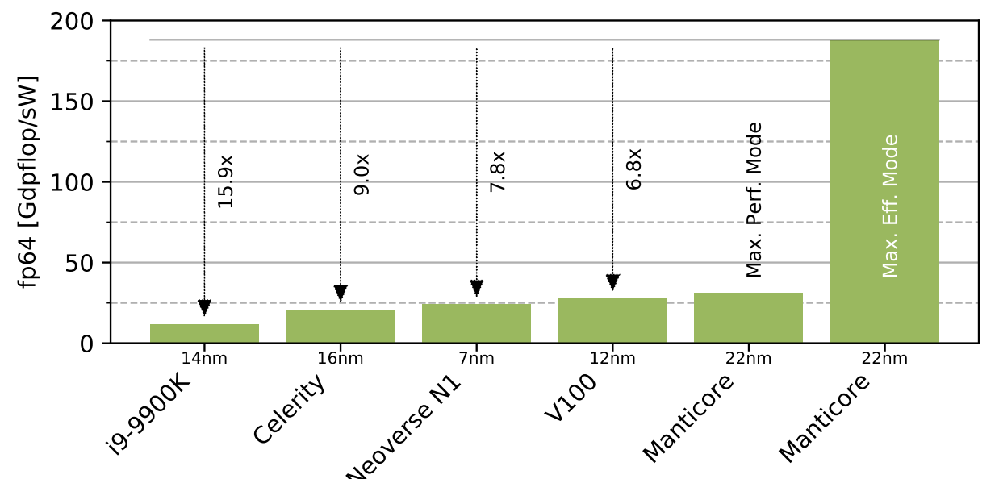

[NOTE]
====
Manticore Quad-Chiplet, 22nm, fp32 calculation comparable to v100 (12nm), fp64 surpasses v100

H2020 project of 2 universities: Bologna and Zurich.

Benefits:

- Small core, large FPU
- SSR/FREP combats von Neumann
bottleneck
- Extreme efficiency on fp64
- Competitive on fp32

Next steps:

- “Quad-chiplet” prototype board
-  Larger prototype silicon (FinFET)
-  Looking for industrial partners for  D2D/HBM/DDR PHY integration

link:https://arxiv.org/pdf/2008.06502.pdf[]

====

[.text-center]

Benchmark: DP energy efficiency on linear algebra (assuming 90% of peak
performance); Manticore shown for maximum
performance and maximum efficiency operating
points.

Manticore, a general-purpose, ultra-efficient, RISC-V, chiplet-based architecture for data-parallel floating-point workloads. Manufactured a prototype of the chiplet's computational core in Globalfoundries 22nm FD-SOI process and demonstrate more than 5 times improvement in energy efficiency on floating-point intensive workloads compared to high performance compute engines (CPUs and GPUs), despite their more advanced FinFET process. The prototype contains two 64-bit, application-class RISC-V Ariane management cores that run a full-fledged Linux OS. The compute capability at high energy and area efficiency is provided by Snitch clusters. Each cluster contains eight small (20kGE) 32-bit integer RISC-V cores, each controlling a large double-precision floating-point unit (120kGE). Each core supports two custom RISC-V ISA extensions: FREP and SSR. The SSR extension elides explicit load and store instructions by encoding them as register reads and writes. The FREP extension mostly decouples the integer core from the FPU by allowing a sequence buffer to issue instructions to the FPU independently. Both extensions allow the tiny, single-issue, integer core to saturate the instruction bandwidth of the FPU and achieve FPU utilization above 90%, with more than 80% of core area dedicated to the FPU.

The development in floating point calculations takes place mainly for X86 and to a lesser extent ARM on the processor side, and is a focus area in new graphics card generations for data centers from companies such as Nvidia and AMD. During the technology fair Hot Chips, researchers at the University of ETH Zurich demonstrate the processor Manticore. It is based on the instruction set RISC-V and intends to show that this is well suited for building performance-efficient processors for floating point calculations.

The name Manticore comes partly from a beast in the world of fables which consists of a scattered collection of terrifying parts, and partly it alludes to the manycore concept with large amounts of cores on one and the same processor. The naming is appropriate as the processor concept described consists of 4,096 processor cores which are housed in four separate circuits.

These four circuits are 222 mm² in size each and are connected to each other via communication links that work over several channels, where their work can be synchronized with each other. Each individual circuit is equipped with 8 GB HBM2 memory and is designed to be manufactured on Globalfoundries 22-nanometer technology.

The large number of nuclei is divided into 32 clusters, which in themselves take place on the four circuits called quadrants. In total, they can perform 16 calculations with double precision per clock cycle, and 32 calculations with single precision per clock cycle. The processor clusters run at a clock frequency of 1 GHz and all quadrants connect to a common L2 cache of 27 MB, and each individual quadrant also shares a common L1 cache.

When the clusters of cores communicate with each other across the communication layer at the lowest level in the processor hierarchy, 64 TB / s bandwidth is achieved between the quadrants. At a higher level where the quadrants are to communicate with the HBM2 memory, bandwidth of 1 TB / s is achieved. Each individual core is equipped with a SIMD device that can handle several different data formats, and support for floating point calculations with reduced precision (FP8) is also supported.

In terms of the structure of the cores, they are relatively simple and stripped down, where functions for floating point calculations (FPU) occupy a larger part of the core’s total transistor budget than in conventional processor cores. The purpose of this is to achieve a highly parallelized calculation capacity, without compromising the capacity for floating point calculations. The cores can also handle integer and floating point calculations simultaneously (dual issue).

The ability to perform both of these types of calculations means that the cores are less likely to be inactive, as they can be assigned integer or floating point data depending on the set of data the processor is currently processing. According to the researchers’ data, this should lead to a resource utilization of 80 percent for memory-intensive data, and 90 percent utilization for general data (eng. Compute).

All this gives a processor that in theory can perform 27 teraflops in double precision, something that stands well against the 9.7 teraflops Nvidia’s Ampere-based data center card A100 performs. However, Manticore currently represents a theoretical design, but it is not without practical evidence. The researchers have produced a prototype that combines three clusters with eight cores each with a simpler communication fabric that provides 2.5 GB / s bandwidth between the clusters.

[IMPORTANT]
.Note from Jaro
====
Slides about Manticore:

link:https://www.anandtech.com/show/16007/hot-chips-2020-live-blog-manticore-4096core-riscv-330pm-pt[]

In a question and answer session after the presentation during Hot Chips, the researchers behind Manticore explain that they did not intend to create commercial products that implement the full capacity with 4,096 cores. The purpose has instead been to demonstrate that it is possible to create large sets of RISC-V cores with good and energy-efficient capacity for floating point calculations.

====