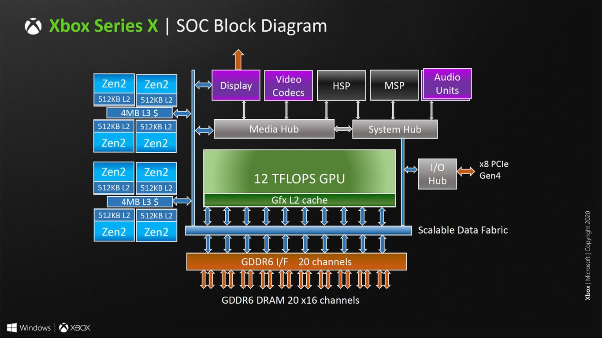
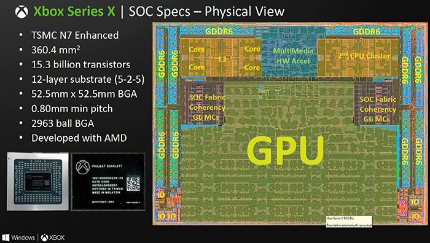
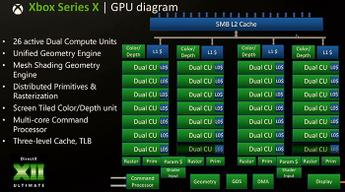
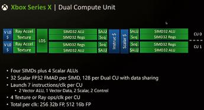

[NOTE]
====
The Xbox Series X SoC has been detailed during Microsoft’s presentation at Hot Chips 2020. Besides revealing the SoC die, Microsoft also shared new information about the Xbox Series X, including graphical features and optimisations, storage specifications, encode/decode support and more.

Website: link:https://www.xbox.com/en-IE/consoles/xbox-series-x[]
====

The processor inside the Xbox Series X is known as ‘Project Scarlett’.  Scarlett is a monolithic system-on-chip built on TSMC’s N7 process node. The design has 15.3 billion transistors, measuring 360.4 mm2, with dimensions of 15.831 x 22.765 mm2.

Inside the chip are eight Zen 2 mobile cores, configured into two groups of four cores, each sharing 4 MB of L3 cache similar to AMD’s mobile Renoir/Lucienne processors. These cores are connected through the Scalable Data Fabric to a custom RDNA-based GPU capable of 12 TFLOPS of peak performance, enabling variable rate shading, ray tracing, and other new graphical features. This GPU is built as a 56 compute unit design, however only 52 are used in the final product (more on this later).

[.text-center]

The GPU part of the SoC will be based on RDNA 2 architecture and feature 26 Dual-sided CUs (52 CUs) with their own L0 cache and GDDR6 memory. There will be 5MBs of shared L3 cache across the four arrays of DCUs, with each array consisting of 7 DCUs sharing an undisclosed amount of L1 cache.

[.text-center]

Above you can see a picture of the physical chip with various sub-components annotated and coloured. To create this TSMC N7 enhanced fabricated SoC with 15.3 million transistors, AMD/Microsoft has put together 3.8GHz Zen 2 server class CPU cores (8C/16T), 52 CUs based upon the RDNA 2 architecture, 16GB of 14Gbps GDDR6 memory on a 320-bit bus providing 560GB/s, and various multimedia hardware accelerators.

[.text-center]

Other optimisations that will come with Xbox Series X include mesh shaders, which allow the GPU to render more objects with less computing power, texture sampler feedback, used to free up VRAM from unused textures, and variable rate shading, which enables allocation of computing power depending on how “visually important” a certain area of the screen is.

Hardware accelerated ray-tracing will also be supported on the Xbox Series X. The console will be able to do up to 380G/sec ray-box calculations and up to 95G/sec ray-triangle calculations. Something similar to DLSS might also be introduced, as the slides state that there will be “ML inference acceleration for games (character behaviour, resolution scaling)”.

---
*TECH SPECS*

PROCESSOR: 

- CPU. 8X Cores @ 3.8 GHz (3.66 GHz w/SMT) Custom Zen 2 CPU
- GPU. 12 TFLOPS, 52 CUs @1.825 GHz Custom RDNA 2 GPU
- SOC Die Size. 360.45 mm
- Process. 7nm Enhanced

MEMORY & STORAGE:

- Memory. 16GB GDDR6 w/320 bit-wide bus
- Memory Bandwidth. 10 GB @ 560 GB/s, 6 GB @ 336 GB/s.
- Internal Storage. 1TB Custom NVME SSD
- I/O Throughput. 2.4 GB/s (Raw), 4.8 GB/s (Compressed, with custom hardware decompression block)
- Expandable Storage. Support for 1TB Seagate Expansion Card for Xbox Series X|S matches internal storage exactly (sold separately). Support for USB 3.1 external HDD (sold separately).

VIDEO CAPABILITIES:

- Gaming Resolution. True 4K
- High Dynamic Range. Up to 8K HDR
- Optical Drive. 4K UHD Blu-Ray
- Performance Target. Up to 120 FPS
- HDMI Features. Auto Low Latency Mode. HDMI Variable Refresh Rate. AMD FreeSync.

SOUND CAPABILITIES:

- Dolby Digital 5.1
- DTS 5.1
- Dolby TrueHD with Atmos
- Up to 7.1 L-PCM

PORTS & CONNECTIVITY: 

- HDMI. 1x HDMI 2.1 port
- USB. 3x USB 3.1 Gen 1 ports
- Wireless. 802.11ac dual band
- Ethernet. 802.3 10/100/1000
- Accessories radio. Dedicated dual band Xbox Wireless radio.

[IMPORTANT]
.Note from Jaro
====
Microsoft Xbox SoC ... or actually AMD again. 

====

   