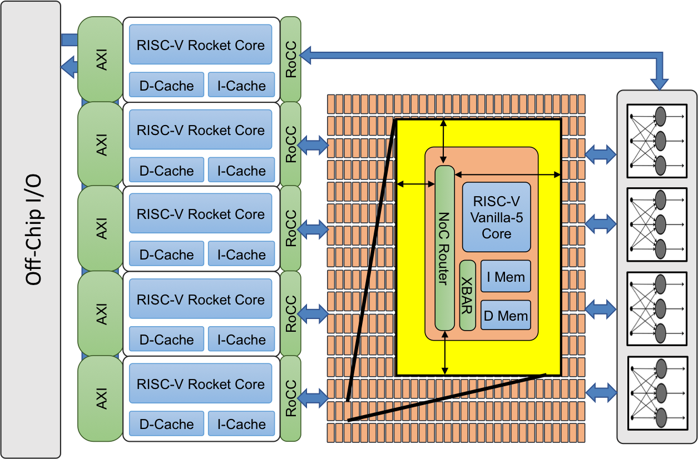

[NOTE]
====
Celerity is an accelerator-centric system-on-chip (SoC) which uses a tiered accelerator fabric to improve energy efficiency in the context of high-performance embedded systems. The SoC is a 5 × 5 mm 385 M-transistor chip in TSMC 16 nm designed and implemented by a modest team of over 20 students and faculty from the University of Michigan, Cornell University, and the Bespoke Silicon Group (now at U. Washington) as part of the DARPA Circuit Realization At Faster Timescales (CRAFT) program. Celerity currently holds the world record for RISC-V performance; 500B RISC-V instructions per second, beating prior records by 100X

Website: link:http://opencelerity.org/[]
====

OpenCelerity
Open-Source RISC-V Tiered Accelerator Fabric SoC

* *General Purpose Tier*

A few fully featured RISC-V processors capable of running general-purpose software including an operating system. Modified version of Berkeley Rocket core.

Rocket : bsg_rocket
RoCC Doc: RoCC Doc V2

* *Massive Parallel Tier*

A manycore comprising hundreds of lightweight RISC-V processors, a distributed shared memory system, and a mesh-based interconnect.

BaseJump Manycore: link:https://github.com/bespoke-silicon-group/bsg_manycore[]
BaseJump STL: link:http://bjump.org/[]

* *Specialization Tier*

Application-specific accelerators (possibly generated using high-level synthesis).

BNN FPGA: link:https://github.com/cornell-zhang/bnn-fpga[]

Accelerating Binarized Convolutional Neural Networks
with Software-Programmable FPGAs

[IMPORTANT]
.Note from Jaro
====
Another example of open source / open hardware project, quite si
Celerity is a multi-university effort that has resulted in an open-source manycore RISC-V tiered accelerator chip. The project is part of the DARPA Circuit Realization At Faster Timescales (CRAFT) program which wants to drive the design cycle for custom integrated circuits to weeks and months from years. The Celerity team first presented the chip at Hot Chips 29. At VLSI 2019, Celerity was back to talk about the PLL and the NoC of its second-generation chip.
====
