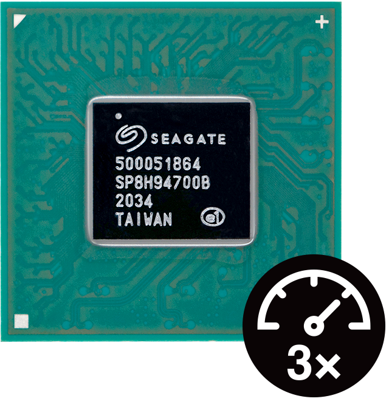

[NOTE]
====
Seagate us storage and all technology behind.

Seagate engineers built a system on a chip, demonstrating a custom RISC-V processor as functional in hard drives.
We live in a time of unprecedented growth of enterprise data, and much of this data is in motion. To help businesses activate ever-increasing volumes of information—particularly at the edge where timely insights tend to be most valuable—Seagate engineers designed two RISC-V-enabled processors for silicon chips.

One of the cores, designed for high performance, has already been built with RISC-V-enabled silicon and demonstrated as functional in hard disk drives (HDDs). The other processor, which is an area-optimized core for lightweight and security-critical applications, is currently being built.

The new microprocessor designs will allow devices to share a common RISC-V instruction set architecture (ISA). With the introduction of RISC-V to storage devices, application-specific computational capabilities such as scientific simulation and the model training aspect of machine learning can be implemented. Another benefit: the use of open security architectures makes possible a more secure movement of data.

The RISC-V-enabled cores will have huge implications for numerous and varied workloads at the edge. It was thanks to the simplicity and openness of RISC-V that Seagate was able to quickly create a proof-of-concept design and evolve it into the development of these cores. This project would not have been possible within the barriers of traditional ISAs.

Website: link:https://www.seagate.com/gb/en/innovation/risc-v/[]
====

[.text-center]

Promising Initial Results

Seagate’s high-performance microprocessor outperforms other cores by up to 3 times.
The high-performance core offers up to triple the performance for real-time, critical HDD workloads when compared to current solutions.

In an initial use case, this core enabled Seagate to dramatically increase the available real-time processing power.
This processor paves the way for finer positioning by implementation of advanced servo (motion control) algorithms.
The area-optimized core boasts a highly configurable microarchitecture and feature set.

This processor is optimized for both footprint and power savings.

It powers auxiliary, supporting, or background workloads.

Additionally, it can execute security-sensitive edge-computational operations (including next-generation, post-quantum cryptography) while targeting a small-footprint implementation of security features over performance.

[IMPORTANT]
.Note from Jaro
====
Seagate RISC-V is one of examples how SoC can help in almost every existing solution.
====
