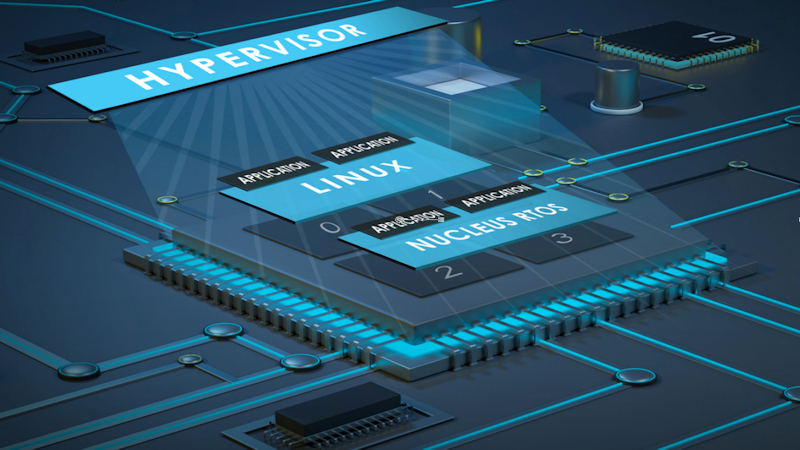

[NOTE]
====
Complex and highly integrated SoCs are quickly becoming the common choice these days as demands increase for more performance, improved security, and reliable connectivity options – with less power. Many options have emerged to address these demands and one of the most effective is embedded virtualization. What was once the sole domain of desktop and server environments is now an accepted practice in resource-constrained embedded systems. Embedded Nucleus Hypervisor allows developers to meet the design needs of a complex system, especially those systems requiring open-source flexibility, real-time performance, or adherence to industry standards

Website: link:https://www.plm.automation.siemens.com/global/en/products/embedded/nucleus-hypervisor.html[]
====

[.text-center]

*Hypervisor*

Reduce costs with high performance, secure consolidation on multicore processors.
Nucleus Hypervisor
The Hypervisor allows developers to meet the design needs of a complex system, especially those systems requiring separation between different OS’s, enablement of resource sharing on a multicore SoC, and real-time performance.

Nucleus Hypervisor is extremely flexible, allowing it to run on single-core or multicore processor architectures supporting asymmetric multiprocessing (AMP), symmetric multiprocessing (SMP), or a combination of both.

*Build High Performance High Reliability Systems Separation*

Nucleus Hypervisor addresses security concerns by enabling strong isolation and containment of guest operating environments. Functioning at the highest privilege level in a system, the hypervisor can enforce the partitioning of memory and devices to ensure that misbehaving applications, either unintentional or malicious, cannot disrupt or corrupt other areas of the system.

For applications requiring hardware-based partitioning of resources such as memory and crypto blocks, Nucleus Hypervisor takes advantage of the separation capabilities built into the silicon for efficient performance and additional protection.

*Multicore or Single Core Flexibility*

Building upon the Nucleus RTOS, the Nucleus Hypervisor is a small footprint Type 1 hypervisor designed and built specifically for embedded applications. The high performance enables systems to boot quickly while minimizing the impact on guest operating system execution. With dynamic scheduling of virtual machines, it allows for the load balancing of the payload and priority-based execution to support stringent real-time and performance constraints. In addition, Nucleus Hypervisor features a flexible device model that supports virtualized device access and direct device access for performance-critical applications and provides various mechanisms for interest communications.

*Secure by Design*

Enable strong isolation and containment of guest operating environments. Operating at the highest privilege level in a system the hypervisor can enforce the partitioning of memory and devices to ensure applications do not disrupt or corrupt areas of the system.

*Integrated Tools and Analysis*

Nucleus Hypervisor comes with the Sourcery™ CodeBench, which provides an industry-proven commercial quality toolchain and associated utilities. CodeBench also contains the Sourcery Analyzer providing analysis visualization that is time-correlated with the events traced in the Nucleus Hypervisor and device drivers.

- A fully integrated development environment (IDE)
- Access to a performance-optimized compiler and libraries
- Advanced software insight and analysis tools

[IMPORTANT]
.Note from Jaro
====
Another example of core semiconductor creators who tries to take part in the  world of SoC. 
====
