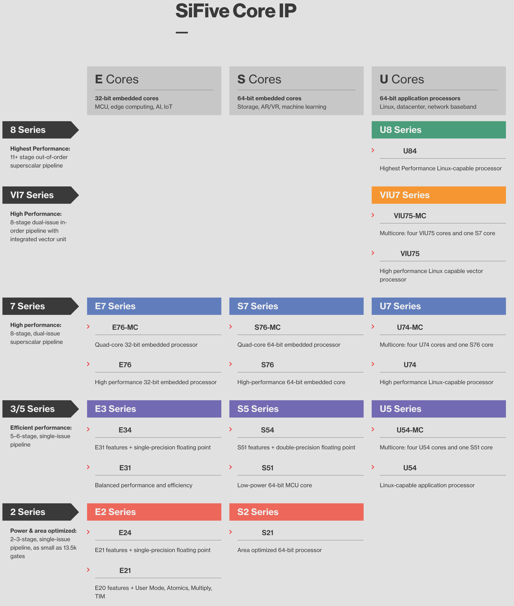

[NOTE]
====
*Leading the RISC-V revolution.*

Design domain-specific solutions using the industry’s most widely adopted RISC-V CPU portfolio.

SiFive Core IP are complete processors with pre-integrated SiFive Shield, for whole SoC security, and SiFive Insight advanced trace and debug. Backed by comprehensive software support, and using industry standard tooling, SiFive Core IP is the broadest silicon-ready RISC-V portfolio.

The RISC-V ISA we invented is configurable and extensible, and our processor cores are, too. Elevate your design beyond standard cores using SiFive Core Designer to configure a core to your workload requirements.

Website: link:https://www.sifive.com/[]
====

The SiFive Core IP portfolio spans from high-performance multi-core heterogeneous application processors to area-optimized, low-power embedded microcontrollers. SiFive Core IP standard core microarchitectures are based on the RISC-V ISA to provide 64-bit and 32-bit options.

SiFive Core IP can be tuned to your workload using SiFive Core Designer, leveraging the flexible generator style SiFive uses to design processor architectures for different classes of performance and efficiency. SiFive Standard cores based on our flexible microarchitecture designs are pre-configured for common use cases and are the perfect starting point for designing your own core in SiFive Core Designer.

Get started with a free Standard Core evaluation, or build your own custom core design, and receive Verilog RTL and FPGA bitstream.

[.text-center]

[IMPORTANT]
.Note from Jaro
====
SiFive brings the power of the open source RISC-V ISA that it invented combined with innovations in CPU IP to the semiconductor industry, making it possible to develop domain-specific silicon faster than ever before. With its OpenFive business unit, the industry leaders in domain-specific silicon, SiFive is accelerating the pace of innovation for businesses large and small.
====

