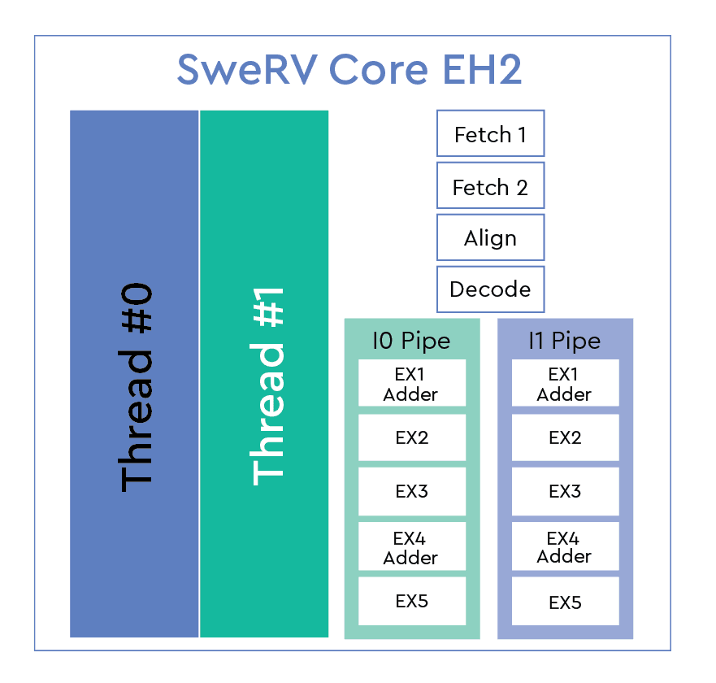
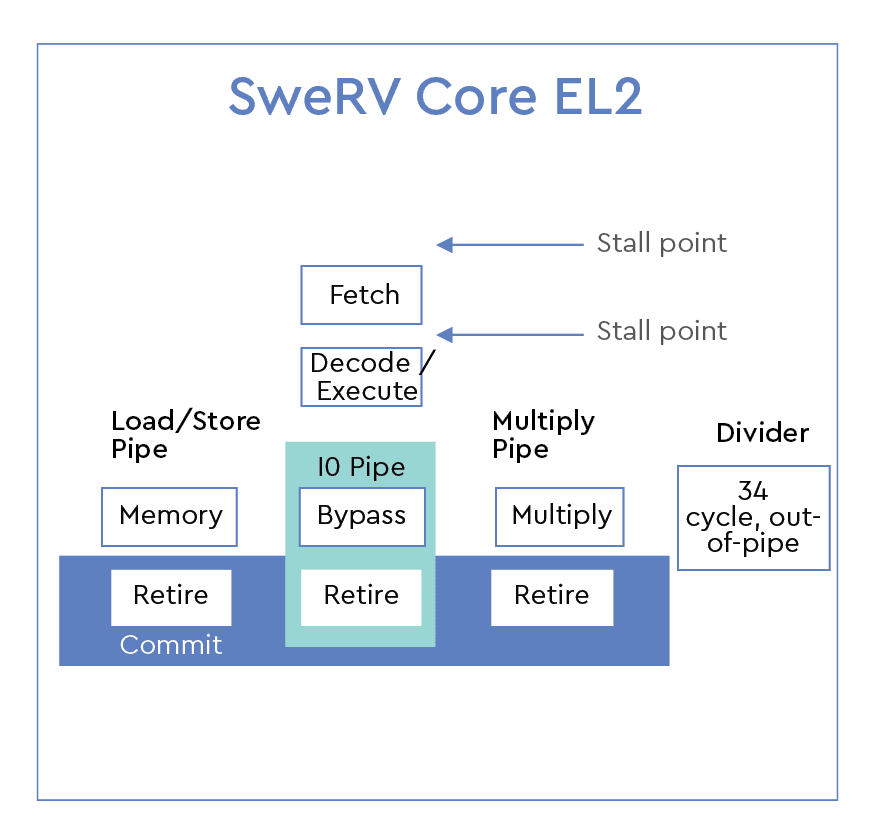

[NOTE]
====
Western Digital has contributed hardware and software solutions to help grow the RISC-V ecosystem.

Website: link:https://www.westerndigital.com/company/innovations/risc-v[]
====

*The RISC-V SweRV CoreTM Family*

Western Digital has developed three RISC-V Cores, the SweRV Core EH1, EH2 and EL2.

|===
| Core Name |RISC-V Type |Pipeline Stages |Threads |Size @ TSMC |CoreMarks/Mhz

|SweRV Core EH1
|RV32IMC
|9- dual issue
|Single
|.11mm @ 28nm
|5.7

|SweRV Core EH2
|RV32IMAC
|9- dual issue
|Single
|-
|6

|SweRV Core EH2
|RV32IMAC
|9- dual issue
|Dual
|.067 @ 16nm
|7.8

|SweRV Core EL2
|RV32IMC
|4- single issue
|Single
|.023 @ 16nm
| 4.3

|===

The Western Digital SweRV Core EH1 is a 32-bit, 2-way superscalar, 9 stage pipeline core. The SweRV Core EH2 was built off of the EH1, but adds dual threaded capability for additional performance. Lastly the SweRV Core EL2 is a smaller core with moderate performance. It was designed to replace state machines and other logic functions in SoCs.

swerv-core-logo
The SweRV Cores will be used in a variety of Western Digital products in the near future. All three cores have been open sourced in CHIPS Alliance github. CHIPS Alliance is an organization that develops open source hardware and open source software design tools. It is a barrier free, collaborative environment which lowers the cost of RTL development. The SweRV Core EH1 is available at https://github.com/chipsalliance/Cores-SweRV

[.text-center]

The EH2 is here, https://github.com/chipsalliance/Cores-SweRV-EH2

[.text-center]

The EL2 is here, https://github.com/chipsalliance/Cores-SweRV-EL2

[IMPORTANT]
.Note from Jaro
====
Western Digital just like Seagate  - quite interesting development from storage solutions company - and big influence/contributor to the RISC-V family / opensource.

====

