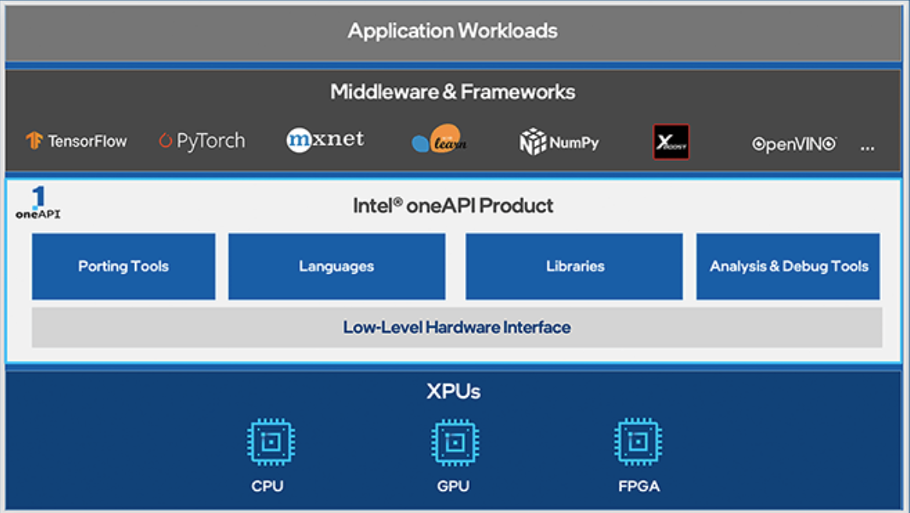
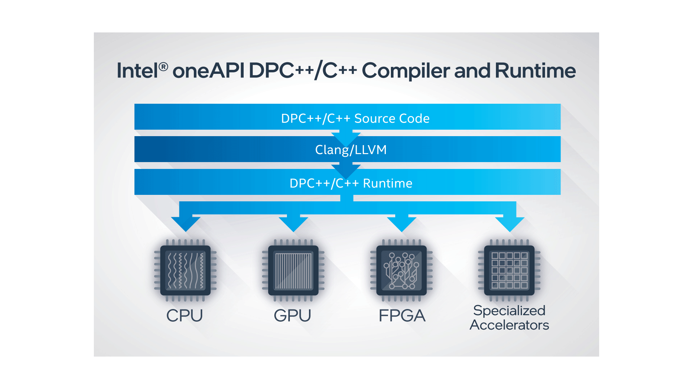
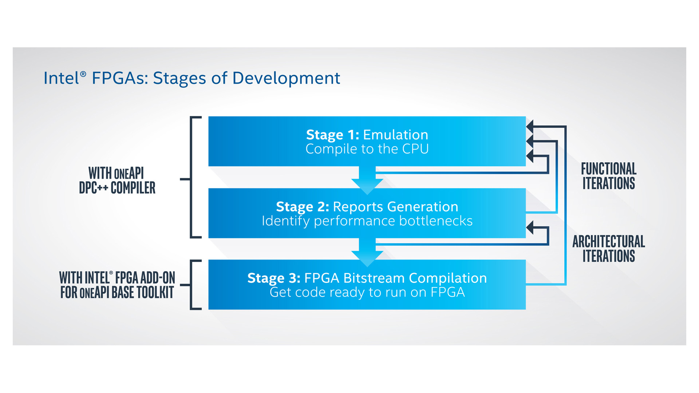
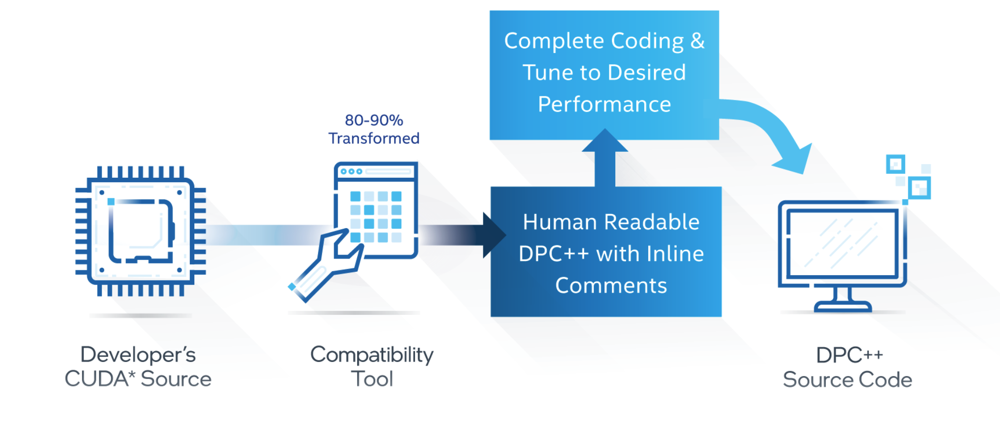

[NOTE]
====
Intel launches oneAPI, a unified and scalable programming model to harness the power of diverse computing architectures in the era of HPC/AI convergence.

Website: link:https://software.intel.com/content/www/us/en/develop/tools/oneapi.html[]
====
[.text-right]
image:../img/Intel_oneapi-logo1.png[100,100]

*oneAPI* is an open, unified programming model built on standards to simplify development and deployment of data-centric workloads across CPUs, GPUs, FPGAs and other accelerators.

[.text-center]

Extract the most application performance on multiple types of Intel® architecture by using advanced, cross-architecture software development tools from Intel.

The Intel® oneAPI product family includes:

* Industry-leading compilers
* Performance libraries
* Analyzer and debugger tools
* Domain-specific toolkits, including libraries and accelerated workload tools

---

*Features*

[.text-center]

* Development Productivity: Targets CPUs and accelerators through single-source code while permitting custom tuning
* Language Standards Support: Is built to the latest standards, including C++ 17 and SYCL†, and initial support for C++ 20, to ensure portability and support of features like generic lambda expressions and variable templates
* Industry Standards Support: Supports a subset of OpenMP* 4.5 and 5.0 for GPU offload†
* Trusted Technology: Leverages well-proven LLVM compiler technology as well as Intel’s history of compiler leadership

[.text-center]

* Enables experienced FPGA developers to target accelerations workloads to field-programmable platforms 
* Is an optional add-on to the Intel oneAPI Base Toolkit

---

*Intel® DPC++ Compatibility Tool*

* Efficient Code Migration

The Intel® DPC++ Compatibility Tool assists in migrating your existing CUDA code to Data Parallel C++ (DPC++) code
DPC++ is based on ISO C++ and incorporates standard SYCL* and community extensions to simplify data parallel programming

* How It Works

The tool ports both CUDA language kernels and library API calls
Typically, 80%-90% of CUDA code automatically migrates to DPC++ code
Inline comments help you finish writing and tuning your DPC++ code

* What You Need

The Intel DPC++ Compatibility Tool is included in the Intel® oneAPI Base Toolkit
It integrates into familiar IDEs, including Eclipse* and Microsoft Visual Studio*
Explore the Intel® oneAPI Base Toolkit

[.text-center]

[IMPORTANT]
.Note from Jaro
====
oneAPI focuses currently on GPUs. There is specific compatibility tool which automatically migrates CUDA to DPC (Data Parallel C++)

Feb9, 2021 - oneAPI Data Parallel C++ (DPC++) features are included in the SYCL 2020 final specification, released today by The Khronos Group, an open consortium of industry-leading companies creating advanced interoperability standards.
link:https://newsroom.intel.com/articles/oneapi-dpc-features-2020-final-spec/[]

Worth watching news page - link:https://techdecoded.intel.io/resources/intel-oneapi-news-and-updates/[]
====
