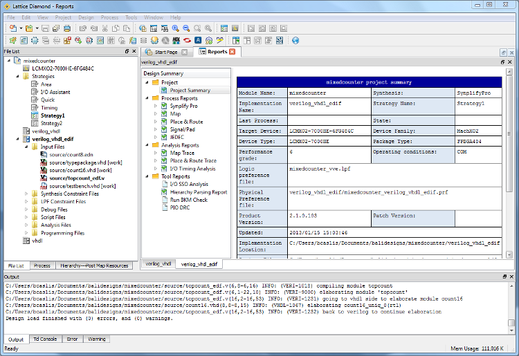
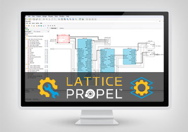
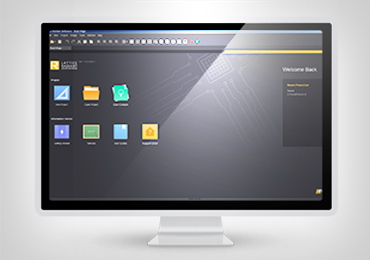
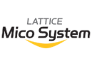
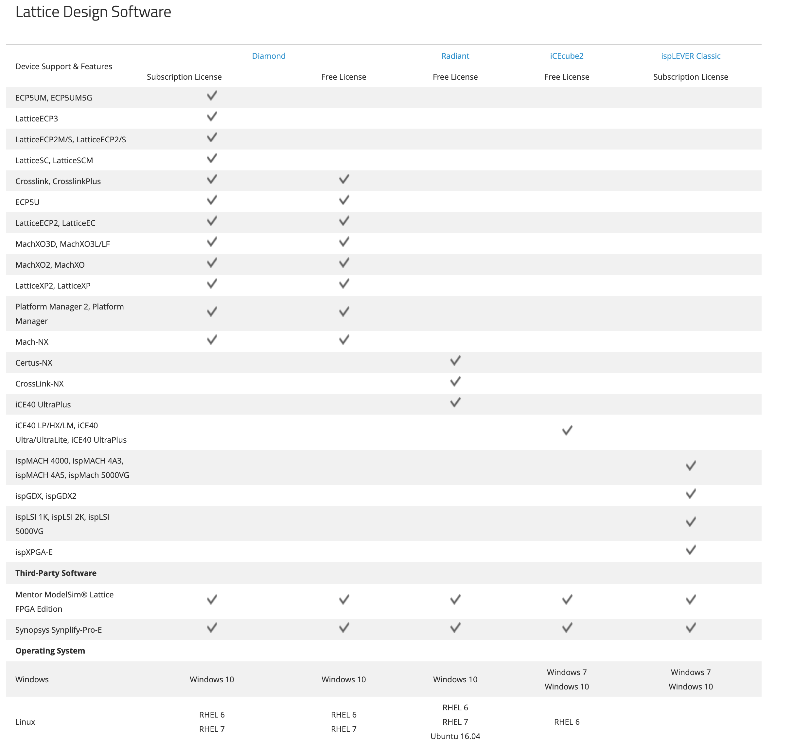

[NOTE]
====
Lattice software packs are quite big, however looking for licensing types, there is conclusion that different applications are designed to different chip architectures. This could means that software could be small and _"properly cut"_ however trend is to avoid confusion - and build one SDK pack - like Xilinx.

Website: link:https://www.latticesemi.com/Products/DesignSoftwareAndIP[]
====

* Lattice Diamond Software

Leading edge design software for Lattice FPGA families. Upgrade your design process with an easy-to-use interface, superior design exploration, optimized design flow, Tcl scripting, and more.

Easy Design Exploration – Finding the best solutions often requires evaluating multiple solutions. Lattice Diamond allows for easy design exploration.

Easy to Use Powerful Tools – Adapting to a new tool is often difficult. Lattice Diamond employs familiar easy to use tools and methodologies that make common tasks easier.

Optimized for Lattice Devices – Lattice Diamond offers an optimized and tailored design and verification environment for Lattice FPGAs featuring extensive constraints, advanced optimization, accurate analysis, extensive verification, and fast iterations.

Features:

- Complete GUI based FPGA design and verification environment.
- Design exploration with multiple implementations and optimization strategies within a single project.
- Graphical environment timing and power analysis.

---

* Lattice Propel Design Environment

Lattice Propel is a complete set of graphical and command-line tools to create, analyze, compile, and debug both FPGA-based processor system hardware and software design.

Our new Lattice Propel design environment is optimized for the use of low-power, small form-factor FPGAs by easily assembling components from a robust IP library including a RISC-V processor core and numerous peripherals.

A general problem for software developers, until now, they have been intimidated by the thought of using traditional FPGA design tools and hardware description languages (HDLs). As a result, they have been at the mercy of hardware design engineers to configure and implement the RISC-V processor on the FPGA.

The solution is Lattice Propel™, which is a state-of-the-art standalone graphical user interface (GUI)-based design environment that allows any user (with or without FPGA expertise) to employ a drag-and-drop methodology to capture and configure a RISC-V processor-based design in minutes.

Propel allows software developers to achieve success in minutes, from simple “Hello World” type applications to complex embedded control and data processing systems.
Figure 2. Propel allows software developers to achieve success in minutes, from simple “Hello World” type applications to complex embedded control and data processing systems.

In addition to drag-and-drop instantiation, the Propel Builder features automated pin-to-pin connections, wizard-guided configuration and parameterization, and correct-by-construction IP integration.

Propel also boasts a seamless software development environment in the form of a software development kit (SDK) that features an industry-standard integrated development environment (IDE) and toolchain. The SDK features software/hardware debugging capabilities along with software libraries and board support packages (BSPs) for Propel-defined systems.

The output from Propel is an RTL file in Verilog HDL that can be passed to the synthesis engine, which generates the configuration file to be loaded into the FPGA. This configuration file can be targeted at the Lattice MachXO3D™, Mach™-NX, CrossLink™-NX, and Certus™-NX FPGA families.

Now, software developers no longer need to wait for their hardware counterparts. Once they’ve configured the FPGA with their RISC-V design, they can run their RISC-V executable files on this FPGA-based RISC-V implementation as they would with any other RISC-V processor. The availability of Lattice Propel opens a world of possibilities for software developers.

Design Environment for Lattice FPGA-based Processor System Design - Lattice Propel is a complete set of graphical and command-line tools to create, analyze, compile, and debug both the hardware design of an FPGA-based processor system, and the software design for that processor system.

Lattice Propel Builder - An easy to use system IP integration environment, Propel Builder provides tools to integrate processors and peripheral IP. The graphical integration environment features an easy-to-use, drag and drop correct-by-construction methodology. All commands are Tcl scriptable.

Lattice Propel SDK - A seamless software development environment, Propel SDK is a software development kit (SDK) with an integrated industry standard IDE and toolchain. The SDK features SW/HW debugging capabilities along with software libraries and board support packages (BSP) for Propel Builder defined systems.

Features

- Drag and drop IP instantiation
- Correct by construction design methodology
- High productivity HW/SW debugging
- Software libraries and BSP support
- Tcl scripting commands

---

* Lattice Radiant Software

Full featured FPGA design suite offering best in class tools for small form factor FPGA applications. Powerful yet intuitive tools provide fast design starts and precise implementation with intelligent planning and accurate analysis.

Our next-generation Lattice Radiant software is a full featured FPGA design tool suite. Achieve predictable FPGA design convergence, optimized for edge devices.

Full Featured, Easy to Use Tool Suite - Lattice Radiant software offers all the best in class tools and features to help users develop their FPGA applications efficiently and effectively. Powerful yet intuitive tools provide fast design starts and precise implementation.

Predictable Design Convergence - Powerful optimization and analysis tool help achieve fast and predictable design convergence. Lattice Radiant software utilizes a unified design database, design constraints flow, and timing analysis throughout the flow to ensure consistent optimization and analysis with optimal results.

Unparalleled Ease of Use - To provide the best user experience, Lattice Radiant software brings the ease of use of an FPGA design software to a whole new level with a graphical user interface that is modular and wizard driven, and intuitively guides the user through the design flow that includes design creation, synthesis, constraint entry, design analysis, debugging, and programming.

Features: 
- Easy design navigation and debugging with “One Click” execution
- Powerful optimization tools that feature best in class algorithms to ensure quick timing closure
- Precise analysis tools for design, timing, and power analysis
- Complete closed-loop cross probing from physical to logical design implementation
- IP packaging capability allows users and IP providers to package encrypted IP for distribution

---

* iCEcube2 Design Software

Easy to use design tools to help you hit your cost, power, and time-to-market targets. iCEcube2 design software supports the iCE40 family of ultra low-density FPGAs.

* ispLEVER Classic Software

ispLEVER Classic is the design environment for Lattice CPLDs and mature programmable products. It can be used to take a Lattice device design completely through the design process, from concept to device JEDEC or Bitstream programming file output.

* Neural Network Compiler

Neural Network Compiler takes output from TensorFlow and Caffe and compiles for implementation on Lattices CNN and Compact CNN Accelerator IPs.

* LatticeMico System Development Tools

The LatticeMico System is used to implement the LatticeMico32 and LatticeMico8 soft microcontrollers, and attached peripheral components in a Lattice FPGA. The System is based on Eclipse C/C++ Development Tools (CDT).

* PAC-Designer Design Software

Fully integrated design and simulation environment for Platform Manager, Power Manager, and ispClock devices.

* Programmer and Deployment Tool

For programming all Lattice FPGA, CPLD, Mixed Signal devices (included with Lattice Diamond also)

* ORCAstra

SERDES debug support for the LatticeECP3 FPGA

---

Whn looking on license page there could be made conclusion that different software pack is designed for different architecture of chips.

[IMPORTANT]
.Note from Jaro
====
Lattice software packs are quite big, however looking for licensing types, there is conclusion that different applications are designed to different chip architectures. This could means that software could be small and _"properly cut"_ however trend is to avoid confusion - and build one SDK pack - like Xilinx. There is strange inconsistency on SDK operating system availability which

====
