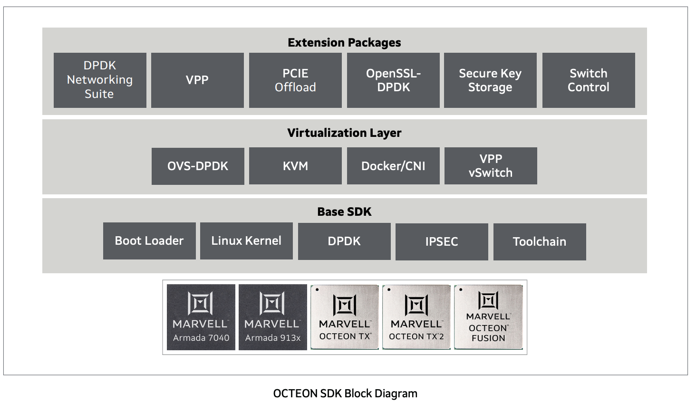

[NOTE]
====
Marvell® OCTEON SDK

An optimized software platform based on open source platforms that enables accelerated  performance over an end to end architecture

DPU SDK provides complete software platform for development on OCTEON™ and ARMADA® processors. Base SDK is available with generic, and customer-specific extensions such as DPDK, VPP, and ODP.

Website: link:https://www.marvell.com/content/dam/marvell/en/public-collateral/embedded-processors/marvell-octeon-tx2-sdk-solutions-brief.pdf[]
====

Marvell provides a Unified Software Development Kit (SDK) for all OCTEON and ARMADA® families. The Data Processing Unit family device capabilities are enhanced by open source packet and security application acceleration APIs. Marvell® also offers an industry standard control, management and data plane software stack optimized for the latest generation of ARM based OCTEON processors.

- Market applications that are supported include routing and SD-WAN, network security and threat detection, MEC and edge compute, network disaggregation.
- Support for DPDK poll mode and event mode drivers.
- VPP and ODP support on top of DPDK.
- Kernel hooks provided for XDP and eBPF.
- SDK support for tight integration with Marvell® Switch API and NIC device driver software.

Unified Software Development Kit

[.text-center]

Marvell’s OCTEON processors are supported by a common SDK
with user plane extensions and hooks for kernel level
enhancements.

The software platform enables a uniform user experience
across the entire portfolio of the latest generation of OCTEON
devices and enables tight integration with other Marvell silicon
products to create an end to end solution. Marvell’s OCTEON
product line has a leadership position across multiple market
verticals and workloads and ensures that the customers
investment stays relevant across multiple generations of the
silicon product lines. It also ensures that there is no vendor lock
in or dependence on the refresh cadence of hardware and
custom software.

OCTEON processors provide highly efficient execution or
workloads for networking, security, 5G baseband, and edge
infrastructure applications. Through the use of open standards
and APIs, the OCTEON SDK helps customers re-use software
seamlessly on both OCTEON and non-OCTEON platforms
including x86. by providing highly efficient network, security,
5G, and Edge infrastructure hardware acceleration offloads.
The software platform comes with specific vertical workload
extensions for control, management and user plane APIs which
can support a complete portfolio of integrated control and data
plane to independent CPU architecture which is compatible to a
bare metal as well as a virtualized cloud native implementati

*Key  Features*

- Core Open Platform: Open source linux-based platform fully leveraging the multi-core processing, hardware acceleration and high-performance networking of OCTEON processors
- High-Performance DPDK: Marvell provides a highly optimized and hardware accelerated implementation of DPDK 
- Optimized Network and Application Stacks: Ready-map stacks for TCP/UDP, IPSEC, Routing/Forwarding, SSL/TLS, Tunneling, QoS, NAT, etc.
- Virtualization: Run control plane and data plane applications blazingly fast whether on bare metal, containers or virtual machines
- Carrier and Edge: 5G baseband, MEC edge , vEPC, vBNG, vRouter. Cloud and Enterprise: DPU for network, switching, storage , ML and security

[IMPORTANT]
.Note from Jaro
====
Marvell delivers quite specific SDK for its processors (they are in NPU/DPU/xPU section however they could be in SoC section as well).

Marvell SDK claims "use of open standards and APIs, the OCTEON SDK helps customers re-use software seamlessly on both OCTEON and non-OCTEON platforms  including x86" on other hand it need to be closely connected to specific hardware, which generally could be limiting factor for re-use. It could be interesting exercise to see how do they solve that issue.
====

