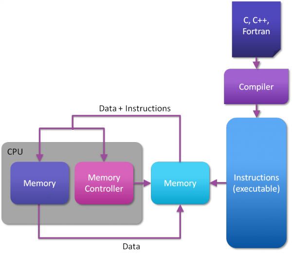
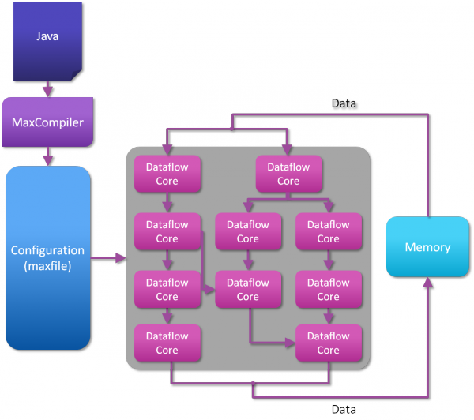

[NOTE]
====
Maxeler, we lead in innovation, development and delivery of High Performance Computing solutions. Our solutions include hardware, software and services to gain at least an order of magnitude advantage in performance per unit of rack space, computations per Watt (green computing), and top price-performance considering total cost of ownership for monolithic applications.

Our computers exploit dataflow computing – a revolutionary way of performing computation, completely different to computing with conventional CPUs. Dataflow computers focus on optimizing the movement of data in an application and utilize massive parallelism between thousands of tiny ‘dataflow cores’ to provide order of magnitude benefits in performance, space and power consumption.

Maxeler provides complete solutions to enable production deployment of dataflow computing, including high-performance compute nodes, compilers and management software. Our technology is in use at FORTUNE 500 companies and universities across the world (see publications for more information).

Website: link:https://www.maxeler.com/[]
====

Maxeler Technologies is proud to collaborate with our university partners on a range of joint research projects. If you are interested to become a MAX-UP member or if you are interested in writing a research grant proposal jointly with Maxeler, please contact info@maxeler.com.

Current projects

exa2pro-logo	legato-logo	sdk4ed_small

EXA2PRO will develop a programming environment that will enable the productive deployment of highly parallel applications for exascale computing systems.	The LEGaTO project addresses the need for greater energy efficiency in the ICT sector. While there is already a trend towards using heterogeneous accelerators, LEGaTO will deliver a software stack that focuses achieving greater energy efficiency.	The SDK4ED project will tackle the challenge of minimizing cost, time, and complexity of the software development processes, in particular for low-power and low-energy applications. This includes the automatic optimization of both software quality and non-functional requirements.

euroexa_logo

The EuroExa project will deliver a ground-breaking platform for extreme scale computing capable of 400 PFLOP peak performance with high energy efficiency by incorporating heterogeneous processing on reconfigurable hardware and focusing on dense system integration.

Past projects

VINEYARD logo	extra_logo	aegle_logo

VINEYARD has developed an integrated platform for energy-efficient data centres based on new servers with novel, coarse-grain and fine-grain programmable accelerators.	The EXTRA project targeted future exascale HPC applications through new architectures, tools that include reconfiguration as a design concept, and applications that are tuned to exploit run-time reconfiguration.	AEGLE has provided cloud computing and accelerated HPC data analytics services for integrated and personalized healthcare services in Europe.

CloudLightning_logo	cossim_logo	QMlogo2

The CloudLightning project has created a new way of provisioning heterogeneous cloud computing resources with reduced deployment and optimisation effort and improved efficiency through self-management.	The COSSIM project has provided an open-source framework for seamlessly simulating both networking and processing parts of cyber-physical systems.	Qualimaster focused on financial analysis by combining financial data streams and social web data, especially for analysis of systemic risk.

ProjectLogoSAVE	ProjectLogoPOLCA	ProjectLogoHARNESS

SAVE has developed software/hardware technologies for efficient self-adaptive heterogeneous system architectures.	The POLCA project developed a new mathematically-oriented programming language that can target both embedded and high performance systems.	HARNESS has developed technologies for enabling truly heterogeneous cloud computing, supporting diverse compute, storage and connectivity technologies.

ProjectLogoFASTER	ProjectLogoHPCFinance

HPCFinance has provided solutions for managing financial risks through High Performance Computing.	FASTER has focussed on a new level of application performance by developing hardware synthesis technologies that fully exploit the potential of reconfigurable hardware technologies.

---

Dataflow Computing
At Maxeler, we lead in innovation, development and delivery of High Performance Computing solutions. Our solutions include hardware, software and services to gain at least an order of magnitude advantage in performance per unit of rack space, computations per Watt (green computing), and top price-performance considering total cost of ownership for monolithic applications.

Our solutions exploit dataflow computing – a revolutionary way of performing computation, completely different to computing with conventional CPUs. Dataflow computers focus on optimizing the movement of data in an application and utilize massive parallelism between thousands of tiny ‘dataflow cores’ to provide order of magnitude benefits in performance, space and power consumption. An analogy for moving from control flow to dataflow is the Ford car manufacturing model, where expensive highly-skilled craftsman (control flow CPU cores) are replaced by a factory line, moving cars through a sea of single-skill workers (dataflow cores).

Maxeler provides compute solutions to enable production deployment of dataflow computing, including high-performance compute nodes, compilers and management software. Our technology is in use at FORTUNE 500 companies and universities across the world (see our publications for more information).

[.text-center]

Computing with a control flow core

In a software application, the program source is transformed into a list of instructions for a particular processor, which is then loaded into the memory attached to the processor. Data and instructions are read from memory into the processor core, where operations are performed and the results are written back to memory. Modern processors contain many levels of caching, forwarding and prediction logic to improve the efficiency of this paradigm; however the model is inherently sequential with performance limited by the latency of data movement in this loop.

[.text-center]

Computing with dataflow cores

In a Dataflow application, the program source is transformed into a Dataflow engine configuration file, which describes the operations, layout and connections of a Dataflow engine. Data can be streamed from memory into the chip where operations are performed and data is forwarded directly from one computational unit (“dataflow core”) to another, as the results are needed, without being written to the off-chip memory until the chain of processing is complete.

[IMPORTANT]
.Note from Jaro
====
Maxeler - is not typical company - they started with MAX4 SoC/FPGA, but now hey are consulting/programming company. They are giving services - you have problem.

====
