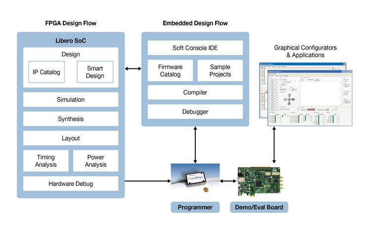
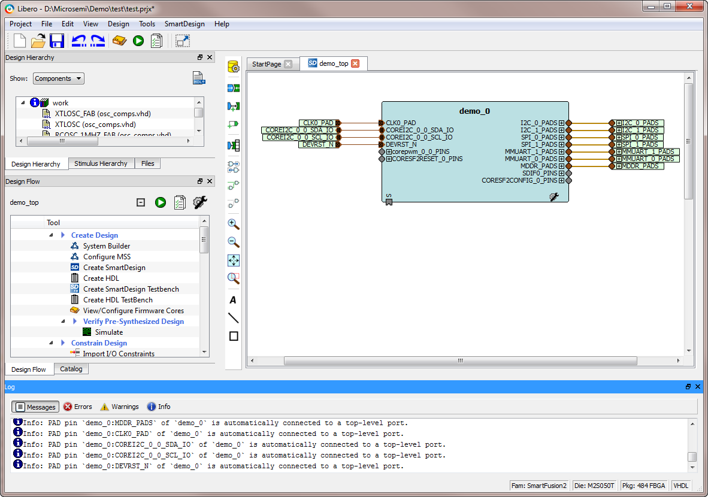
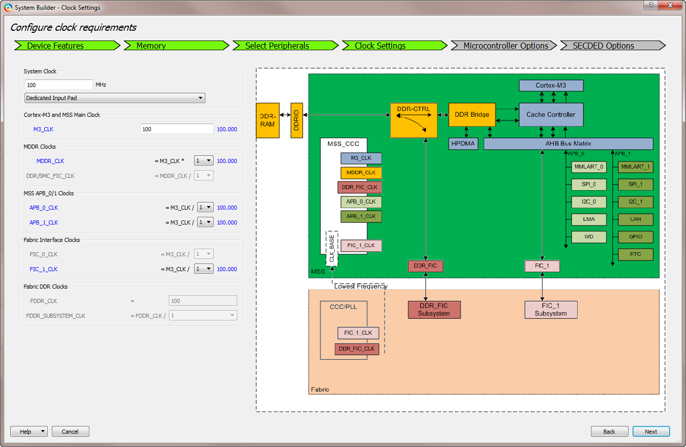

[NOTE]
====
Libero® SoC Design Suite offers high productivity with its comprehensive, easy-to-learn, easy-to-adopt development tools for designing with Microsemi's  PolarFire SoC,PolarFire, IGLOO2, SmartFusion2, RTG4, SmartFusion, IGLOO, ProASIC3 and Fusion families.The suite integrates industry standard Synopsys Synplify Pro® synthesis and Mentor Graphics ModelSim® simulation with best-in-class constraints management, Programming & Debug Tools capabilities, and secure production programming support.

Website: link:https://www.microsemi.com/product-directory/design-resources/1750-libero-soc[]
====

Starting with Libero SoC Design Suite v12.0, we are supporting PolarFire SoC(Starting from  Libero v12.5),PolarFire, RTG4, SmartFusion2 and IGLOO2 FPGA families. Libero SoC Design Suite supports Enhanced Constraints Flow only and it does not support Classic Constraints flow. If the users developed their designs using these FPGA families in Libero SoC v11.9 SP2 or earlier releases and would like to migrate your designs to Libero SoC Design Suite v12.0, please read the instructions given in the "Migrating Designs to Libero SoC v12.0" section in the Libero SoC Design Suite v12.0 release notes.

Libero SoC v11.9 and earlier (including its service packs) will continue to support IGLOO2, SmartFusion2, RTG4, SmartFusion, IGLOO, ProASIC3 and Fusion families, as well as IGLOO2, SmartFusion2, and RTG4 (both Classic and Enhanced Constraint Flows). However, the Libero SoC v11.9 software branch is in maintenance mode, and only critical bug fixes will be made going forward.

Reduce your FPGA development time by 5x with Microchip's High-level synthesis compiler. Fill the form here to evaluate the HLS compiler tool. To learn more click here.

*Comprehensive Design Flow*

[%autowidth]
|===
|Design entry	|Multiple approaches using SmartDesign, System Builder, HDL, or Embedded design flows
|Simulation	|Functional, gate-level, and timing verification using Mentor Graphics ModelSim ME
|Synthesis	|Design optimization for power and performance using Synopsys Synplify Pro ME and Synphony Model Compiler ME
|Place and Route	|Advanced, incremental, power-driven, and multi-pass layout options
|Power analysis	|In-depth visualization of power consumption for each individual design element using SmartPower
|Timing analysis	|Support for multiple constraint scenarios to optimize timing using SmartTime
|Programming	|Complete solution with industry’s first Secure Production Programming Solution (SPPS)
|Debug	|Best-in-class debug solution with SmartDebug and Synopsys Identify ME
|===

Easy-To-Learn

- Intuitive design flow
- GUI wizards guiding through the design process

Easy-To-Adopt

- Single-click flow from synthesis to programming
- Integrates industry-standard third-party tools
- Rich IP library of DirectCores and CompanionCores
- Availability of complete reference designs and development kits

Design Entry using SmartDesign

[.text-center]

Design Entry using System Builder

[.text-center]

[IMPORTANT]
.Note from Jaro
====
Microchip gets the same approach as Archonix - uses / extends existing tools for it's own product.

====
