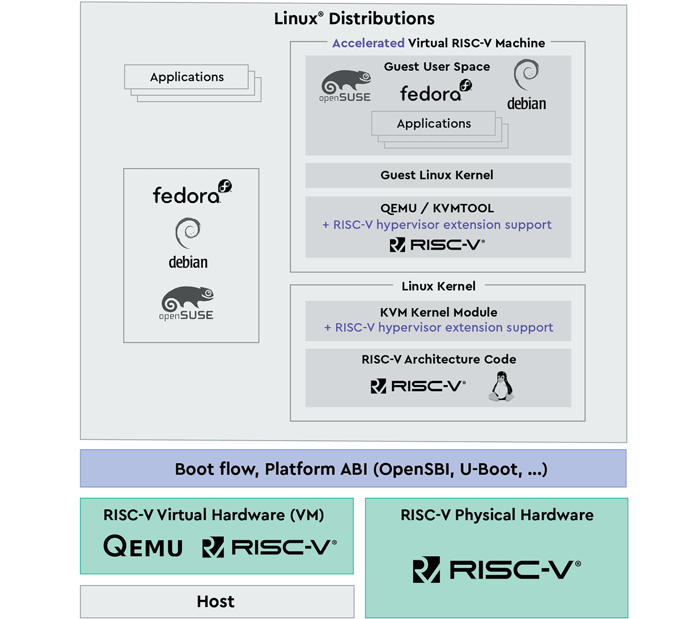
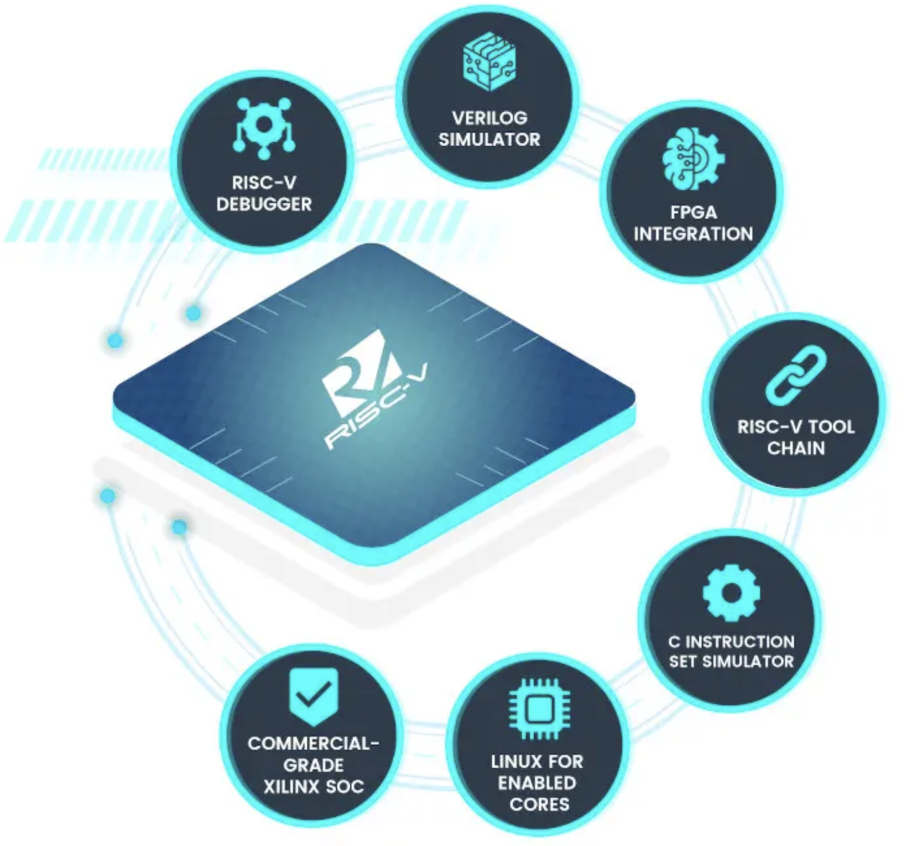

[NOTE]
====
RISK-V software ecosystem.

Website: link:https://www.cnx-software.com/2020/12/10/risc-v-hardware-software-ecosystem-highlights-in-2020/[]
====

*Open Source RISC-V Software*

RISC-V needs a complete software ecosystem surrounding it in order to thrive. The components of the ecosystem are very diverse, spreading across all layers from low level firmware and boot loaders up to a fully functional operating system kernel and applications. Each of these components is important to ensure the success of RISC-V and the power of open source contributions accelerates the build out.

[.text-center]

---

*RISC-V software development tools*

Most people are probably using the GNU toolchain to build projects for RISC-V targets, but some commercial tools added support for the open ISA including the IAR Embedded Workbench adding support for GigaDevice Semiconductor RISC-V MCU (e.g. GD32V), and advanced trace for RISC-V based applications in collaboration with SiFive.

The obvious choice for people who want to experiment without hardware is to use QEMU emulator supporting RISC-V, but for professional who may need more advanced features and performance, Imperas OVPsim may be a better option, and the company added the first reference model with UVM encapsulation for RISC-V verification last February.

Since RISC-V ISA is open, there’s a fairly large number of cores to choose from before starting a design, and to help you select the best one for your application, Bluespec released the RISC-V Explorer, a free tool to evaluate and compare RISC-V cores.

[.text-center]

[IMPORTANT]
.Note from Jaro
====
RISK-V is open source/ open hardware project as-so most of the software esosystem also is opensource - GNU toolchain. Most of the tools are created in colaboration with SiFive.

link:https://info.bluespec.com/explorer-kit[]

====
