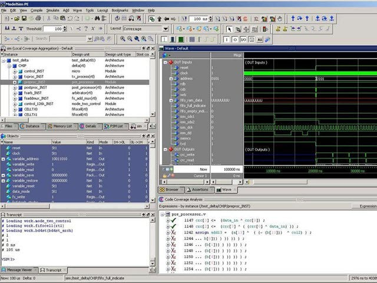

[NOTE]
====
ModelSim is a multi-language environment by Mentor Graphics, for simulation of hardware description languages such as VHDL, Verilog and SystemC, and includes a built-in C debugger. ModelSim can be used independently, or in conjunction with Intel Quartus Prime, Xilinx ISE or Xilinx Vivado. Simulation is performed using the graphical user interface (GUI), or automatically using scripts.

Website: link:https://eda.sw.siemens.com/en-US/ic/modelsim/[]
====

ModelSim simulates behavioral, RTL and gate-level code, delivering increased design quality and debug productivity and platform-independent compile with outstanding performance. Single Kernel Simulator technology enables transparent mixing of VHDL and Verilog in one design.

[.text-right]

KEY FEATURES

Native Compiled, Single Kernel Simulator Technology
ModelSim packs an unprecedented level of verification capabilities into a cost-effective HDL simulation solution and delivers a powerful simulation solution ideally suited for the verification of small and medium sized FPGA designs, especially designs with complex, mission critical functionality.

FAST TIME TO COVERAGE CLOSURE

[.text-center]

Advanced Code Coverage
ModelSim’s advanced code coverage capabilities provide valuable metrics for systematic verification and ease of use lowers the barriers for leveraging verification resources. All coverage information is stored in the highly efficient UCDB database. Coverage results can be viewed interactively, post-simulation, or after a merge of multiple simulation runs.

MIXED LANGUAGE SIMULATION

Mixed HDL Simulation
Comprehensive support of Verilog, SystemVerilog for Design, VHDL, and SystemC provide a solid foundation for single and multi-language design verification environments. An easy-to-use and unified debug and simulation environment provide FPGA designers the advanced capabilities they need.

FAST TIME-TO-DEBUG

Intuitive Debug Environment
ModelSim eases the process of finding design defects with an intelligently engineered debug environment that efficiently displays design data for analysis and debug of all languages. A broad set of intuitive capabilities for Verilog, VHDL and SystemC make it the ideal choice for ASIC and FPGA design.

[IMPORTANT]
.Note from Jaro
====
Siemens continues existence of ModelSim.

ModelSim can be used independently, or in conjunction with Intel Quartus Prime, Xilinx ISE or Xilinx Vivado.

====
