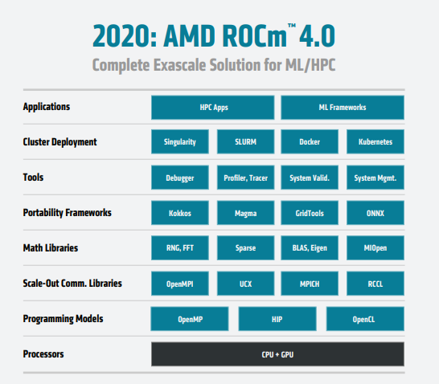
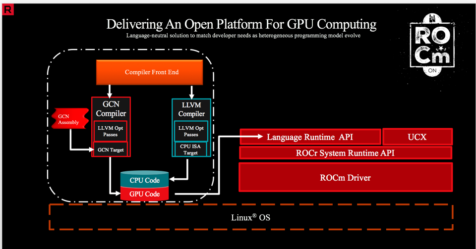
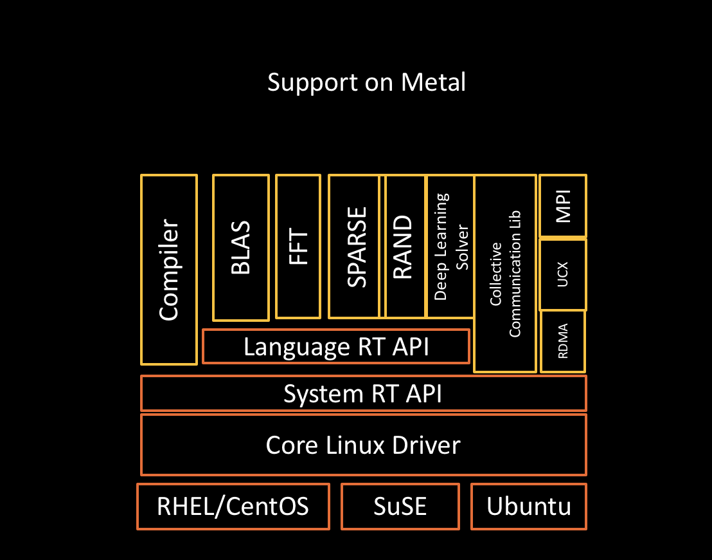

[NOTE]
====
AMD HPC Programming Models for GPU Acceleration 

Website: link:https://www.amd.com/en/graphics/servers-solutions-rocm-hpc[]
====

*HPC Programming Models for GPU Acceleration*

The open-source ROCm stack supports multiple programming-language choices for HPC workloads. The goal is to give developers a range of tools to help solve the problem at hand. Here, we describe some of the options and how to choose among them.

* *OpenMP®*

ROCm offers support for offloading compute to AMD GPUs in multi-node deployments via the OpenMP application programming interface using pragma target offload directives.

* *HIP*

The Heterogeneous Computing Interface for Portability (HIP) is a vendor-neutral C++ programming model for implementing highly tuned workload for GPUs. HIP (like CUDA) is a dialect of C++ supporting templates, classes, lambdas, and other C++ constructs.

A “hipify” tool is provided to ease conversion of CUDA codes to HIP, enabling code compilation for either AMD or NVIDIA GPU (CUDA) environments.  The ROCm HIP compiler is based on Clang, the LLVM compiler infrastructure, and the “libc++” C++ standard library.

* *OpenCL™*

ROCm supports the OpenCL open standard for parallel programming of heterogeneous systems.

* *Python™*

ROCm supports Anaconda with Numba by Python. This, modern analytics programming language is used for large-scale data-analytics, and for solving scientific and engineering problems that require the manipulation of large data arrays.

---

*Math and Communication Libraries*

ROCm-optimized libraries currently include BLAS, FFT, RNG, Sparse, NCCL (RCCL) and Eigen. We work continuously to improve and expand these libraries in order to help deliver more functional HPC code on AMD accelerators, and to drive up performance. Explore the full range at ROCm.

---

AMD ROCm™ Core Libraries - Source Code Information

[%autowidth]
|===
|Library  | Description | License |  Source

| rocALUTION | Sparse iterative solvers & preconditioners with Geometric & Algebraic MultiGrid | MIT | https://github.com/ROCmSoftwarePlatform/rocALUTION

| rocBLAS |Basic Linear Algebra Subroutines | MIT | https://github.com/ROCmSoftwarePlatform/rocBLAS

|rocFFT | Fast Fourier Transfer Library | MIT | https://github.com/ROCmSoftwarePlatform/rocFFT
| rocPRIM | Low Level Optimized Parallel Primitives | MIT | https://github.com/ROCmSoftwarePlatform/rocPRIM

| rocRAND | Random Number Generator Library | MIT | https://github.com/ROCmSoftwarePlatform/rocRAND

| rocSOLVER | Lapack Library  | BSD
2-clause | https://github.com/ROCmSoftwarePlatform/rocSOLVER

| rocSPARSE | Sparse BLAS + SPMV | MIT | https://github.com/ROCmSoftwarePlatform/rocSPARSE

| rocThrust | C++ parallel algorithms library | Apache
2.0 | https://github.com/ROCmSoftwarePlatform/rocThrust
MIOpen Deep learning Solver Library MIT https://github.com/ROCmSoftwarePlatform/MIOpen
| RCCL | Communications Primitives Library based on the MPI
equivalents | BSD  3-clause | https://github.com/ROCmSoftwarePlatform/rccl

|===

---

*AMD ROCm Platform*

AMD ROCm is the first open-source software development platform for HPC/Hyperscale-class GPU computing. AMD ROCm brings the UNIX philosophy of choice, minimalism and modular software development to GPU computing.

Since the ROCm ecosystem is comprised of open technologies: frameworks (Tensorflow / PyTorch), libraries (MIOpen / Blas / RCCL), programming model (HIP), inter-connect (OCD) and up streamed Linux® Kernel support – the platform is continually optimized for performance and extensibility. Tools, guidance and insights are shared freely across the ROCm GitHub community and forums.

Note: The AMD ROCm™ open software platform is a compute stack for headless system deployments. GUI-based software applications are currently not supported.

[.text-center]

AMD ROCm is built for scale; it supports multi-GPU computing in and out of server-node communication through RDMA. AMD ROCm also simplifies the stack when the driver directly incorporates RDMA peer-sync support.

*The AMD ROCm Programming-Language Run-Time*

The AMD ROCr System Runtime is language independent and makes heavy use of the Heterogeneous System Architecture (HSA) Runtime API. This approach provides a rich foundation to execute programming languages, such as HIP and OpenMP.

[.text-center]

Important features include the following:

* Multi-GPU coarse-grain shared virtual memory
* Process concurrency and preemption
* Large memory allocations
* HSA signals and atomics
* User-mode queues and DMA
* Standardized loader and code-object format
* Dynamic and offline-compilation support
* Peer-to-peer multi-GPU operation with RDMA support
* Profiler trace and event-collection API
* Systems-management API and tools

[.text-center]

*Solid Compilation Foundation and Language Support*

* LLVM compiler foundation
* HIP for application portability
* GCN assembler and disassembler

AMD ROCm gives developers the flexibility of choice for hardware and aids in the development of compute-intensive applications.

HIP is a C++ Runtime API and Kernel Language that allows developers to create portable applications for AMD and NVIDIA GPUs from single source code.

Key features include:

- HIP is very thin and has little or no performance impact over coding directly in CUDA mode.
- HIP allows coding in a single-source C++ programming language including features such as templates, C++11 lambdas, classes, namespaces, and more.
- HIP allows developers to use the "best" development environment and tools on each target platform.
- The HIPIFY tools automatically convert source from CUDA to HIP.
- Developers can specialize for the platform (CUDA or AMD) to tune for performance or handle tricky cases.

New projects can be developed directly in the portable HIP C++ language and can run on either NVIDIA or AMD platforms. Additionally, HIP provides porting tools which make it easy to port existing CUDA codes to the HIP layer, with no loss of performance as compared to the original CUDA application. HIP is not intended to be a drop-in replacement for CUDA, and developers should expect to do some manual coding and performance tuning work to complete the port.

more:
link:https://github.com/ROCm-Developer-Tools/HIP[]

[IMPORTANT]
.Note from Jaro
====
Quick summary : ROCm is AMD response to CUDA. It' is so "close" that there is even tool - HIP where you can write program in C++ and decide to which platform should it be compiled - Radeon or CUDA/nVidia. 

Need to mention that AMD ROCm is backing up Tensorflow, Caffe2, PyTorch, MlOpen.

Looking for the fact how successful nVidia is in promoting CUDA and having amazing list of available programs/libraries I consider this as another very smart move from AMD side.

====