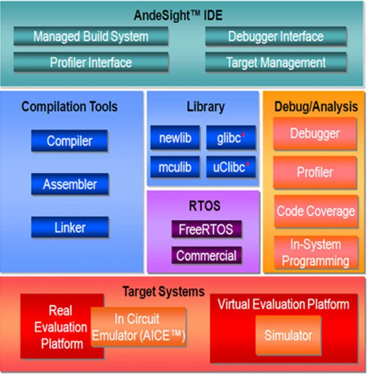
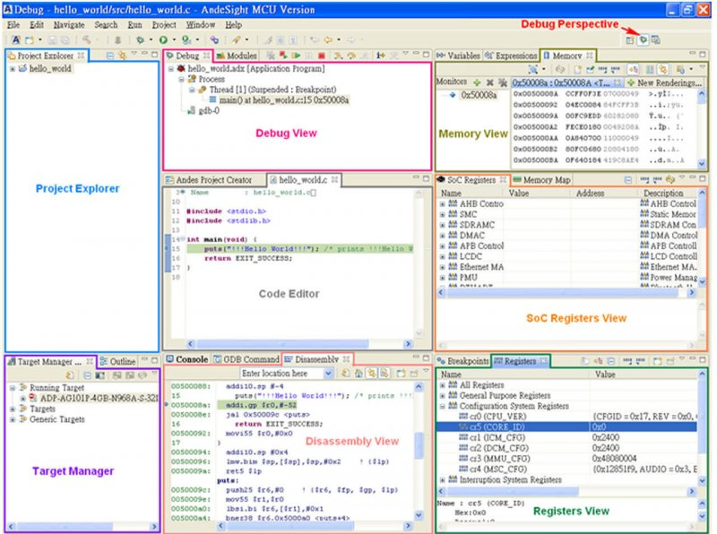

[NOTE]
====
AndeSight™ IDE

AndeSight™ has STD, RDS and Lite versions and is an Eclipse-based IDE that provides an efficient way to develop embedded applications for AndesCore™ based SoC. AndeSight™ STD is a full-featured IDE with highly optimized compilers and Linux support. AndeSight™ RDS is based on AndeSight™ STD with additional customization capabilities for customers’ redistribution. AndeSight™ Lite is based on AndeSight™ RDS for with use IoT promotion. If you are FreeStart program licensee, you can check Quick Start Guide and watch demo video on YouTube.

Website: link:http://www.andestech.com/en/products-solutions/andesight-ide/[]
====

*Features* 

AndeSight™

- Eclipse-based IDE
- Refine UI for ease of use
- LdSaG Editor
- EVB board profiling
- Code Coverage
- Plug-ins internationalization
- Performance Analyzer
- Function code size analysis
- Hotkeys for collecting logs
- Target Management
- Chip Profile Editor
- In-System Programming
- External Plugin APIs
- Advanced Debugging
- RTOS Awareness Debugging
- COPILOT support

Toolchains

- Compiler
- Assembler
- Linker
- Debugger
- Libraries

Simulator

- Core simulator (ISS)
- AndeShape™ platform

ICE

- AICE ICE debugger
- OpenOCD is supported

Tested Hosts

- Windows 7 SP1 (32bit/64bit)
- Windows 10 (64bit)
- Ubuntu 18.04 (64bit)
- CentOS / Red Hat 6.6 (64bit) with GTK>=2.24

*Co-design of Hardware and Software*

With the rapidly convergence of the embedded products, to pursuit an easy and flexible design environment and to save efforts of hardware designers and software programmers, AndeSight™ integrates all environments of hardware and software to provide a complete development solution.

[.text-center]

*Coder Perspective*

A fully functional Andes Assembly, C and C++ integrated development environment with various perspective views help users on multiple project management. The coder perspective houses Project Explorer View, Code Editor, Target Manager and Console View. Users can create, delete, and change project configurations and manage build system in Project Explorer View. On the Project Properties window, any project build related options, including toolchain selections, assembler, compiler, linker and debugger options and environment settings can be done through self-explanatory graphical user interfaces. The source code editor comes with syntax highlighting, code folding and auto-complete features which can help users edit the imported or newly created source code.

[.text-center]
image:../img/andes_product1-o95fd49f819ycu7r6d14c5qt93rlge8uh6aixifh5a.jpg[pdfwidth=80%,width=80%,align="center"]

*Configuration Setting*

More options are added in Project Configuration to provide fine-grained control on the executable image generation, such as start-up code tailor, program loading address, and customized linker script file. In addition to compiler, assembler and linker, user can also configure a few useful utility programs from Configuration Settings, such as objdump, readelf, nm objcopy and size.

*Debug Perspective*

The Debug Perspective consists of the Code Editor, Target Manager and Debug Views that aid users in diagnosing each step in the program execution. The rich diagnosis features help users monitor system information during debugging process, such as execution stack outlining and active threads for each target on Debug Views and source-level debugging status in Code Editor. The Memory View provides users memory content display and modification functions with user specified addresses. On the Disassembly View, users can see both high-level source code and its associated assembler code and identify issues in instruction level during debugging process even the program is written in high level programming language.

[.text-center]

[IMPORTANT]
.Note from Jaro
====
AndeSight - eclipse based IDE, with C and C++ language interface.

====