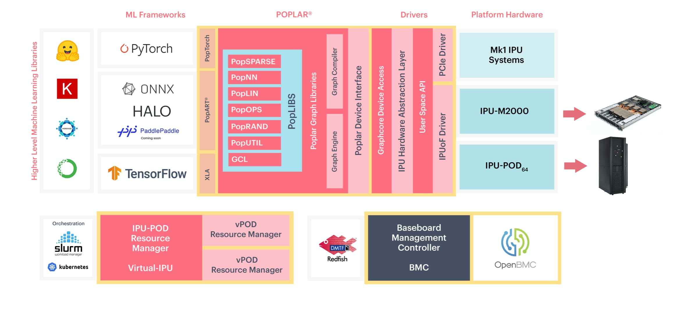

[NOTE]
====
Poplar SDK

The Poplar SDK is a complete software stack, which was co-designed from scratch with the IPU, to implement our graph toolchain in an easy to use and flexible software development environment.

At a high level, Poplar is fully integrated with standard machine learning frameworks so developers can port existing models easily, and get up and running out-of-the-box with new applications in a familiar environment.

Below these frameworks sits Poplar. For developers who want full control to exploit maximum performance from the IPU, Poplar enables direct IPU programming in Python and C++.

Website: link:https://www.graphcore.ai/products/poplar[]
====

*Poplar® SDK*

- With IPU-POD64 systems you can run vast workloads across up to 64,000 IPUs. With Poplar, computing on this scale is as simple as using a single machine. Poplar takes care of all the scaling and optimisation – allowing you to focus on the model and the results.
- We’ve also made it possible to dynamically share your AI compute between users, with our Virtual-IPU software when you want to allow multiple users to run different workloads at the same time.
- We support interfaces to integrate with industry standard ecosystem tools for infrastructure management, including Open BMC and Redfish, Docker containers and orchestration with Slurm and Kubernetes. And we’re adding support for more platforms all the time.

[.text-center]

The Poplar SDK is a complete software stack, which was co-designed from scratch with the IPU, to implement our graph toolchain in an easy to use and flexible software development environment.

At a high level, Poplar is fully integrated with standard machine learning frameworks so developers can port existing models easily, and get up and running out-of-the-box with new applications in a familiar environment.

Below these frameworks sits Poplar. For developers who want full control to exploit maximum performance from the IPU, Poplar enables direct IPU programming in Python and C++.

*Standard framework support*

Poplar seamlessly integrates with standard machine intelligence frameworks:

*TensorFlow 1 & 2 support with full performant integration with TensorFlow XLA backend
*PyTorch support for targeting IPU using the PyTorch ATEN backend
*PopART™ (Poplar Advanced Runtime) for training & inference; supports Python/C++ model building plus ONNX model input
*Full support for PaddlePaddle and other frameworks is coming soon

*PopLibs™ Graph Libraries*

PopLibs is a complete set of libraries, available as open source code, that support common machine learning primitives and building blocks:

* Over 50 optimised functions for common machine learning models
* More than 750 high performance compute elements
* Simple C++ graph building API
* Implement any application
* Full control flow support

*Graph Compiler*

Our state of the art compiler simplifies IPU programming by handling the scheduling and work partitioning of large parallel programs including memory control:

* Optimised execution of the entire application model to run efficiently on IPU platforms
* Alleviates the burden on developers to manage data or model parallelism
* Code generation using standard LLVM

*Graph Engine*

High performance Graph Runtime to execute models and stream data through models running on IPU:

* Highly optimised IPU data movement
* Interfaces to host memory system
* Device management: configuring the IPU-Link network, loading applications to devices & performing setup
* Debug & profiling capabilities

*Multi-IPU Scaling & Communication*

Poplar takes on the heavy lifting, so you don't have to, in a world of growing model sizes and complexity:

* High bandwidth IPU-Link™ communication, fully automated and managed by Poplar, treats multiple IPUs like a single IPU compute resource
* Graph Compile Domain (GCD) allows a single application to be programmed against multiple IPU processors, enabling both data parallel and model parallel execution
* Model sharding allows the simple splitting of applications across multiple devices
* Combining sharding with replication allows you to take code data parallel with minimum effort
* Advanced model pipelining lets users extract maximum system performance to run large models fast and efficiently

[IMPORTANT]
.Note from Jaro
====
Poplar enables direct IPU programming in Python and C++. This is example of trend that I'm really found of - integration of hardware through specific libraries exposed as high level languages to allow wide spread of developer to utilize hardware's power.
====
