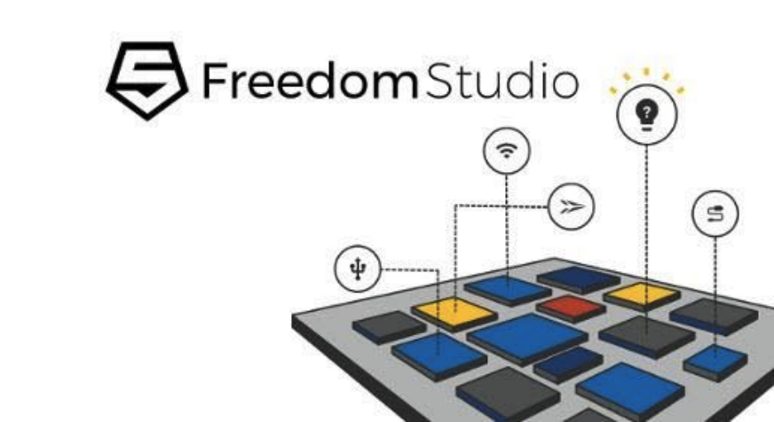

[NOTE]
====
Freedom Studio is an integrated development environment which can be used to write and
debug software targeting SiFive based processors. Freedom Studio is based on the industry
standard Eclipse platform and is bundled with a pre-built RISC-V GCC Toolchain, OpenOCD,
and the freedom-e-sdk. The freedom-e-sdk is a complete software development kit
targeting SiFive bare metal processors.

Website: link:https://www.sifive.com/software[]
====

Freedom Studio is the fastest way to get started programming with your SiFive hardware. Freedom Studio is built on top of the popular Eclipse IDE and packaged with a prebuilt toolchain and example projects from the Freedom E SDK. Freedom Studio is compatible with all SiFive RISC-V development boards. Previous released versions are available through our Freedom Studio GitHub repository.

[.text-right]

*Freedom E SDK*

The Freedom E SDK is a repository of demo programs, industry standard benchmarks, and board support packages (BSPs) for our hardware platforms. Running benchmark code on our development boards is as easy as building a single Makefile target.

link:https://github.com/sifive/freedom-e-sdk[]
- this repository, maintained by SiFive Inc, makes it easy to get started developing software for the Freedom E and Freedom S Embedded RISC-V Platforms. This SDK is intended to work on any target supported by SiFive's distributions of the RISC-V GNU Toolchain.

[IMPORTANT]
.Note from Jaro
====
Freedom Studio is based on the Eclipse platform and is bundled with a pre-built RISC-V GCC Toolchain, OpenOCD, and the freedom-e-sdk - a complete SDK for SiFive RISC-V bare metal processors.

====
