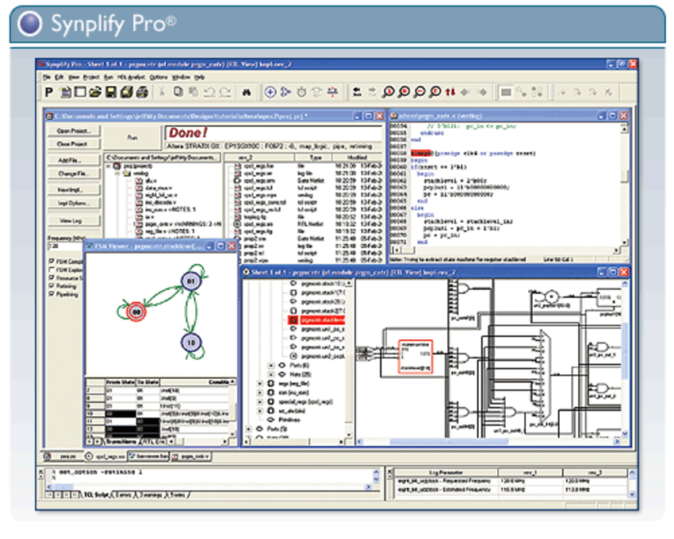
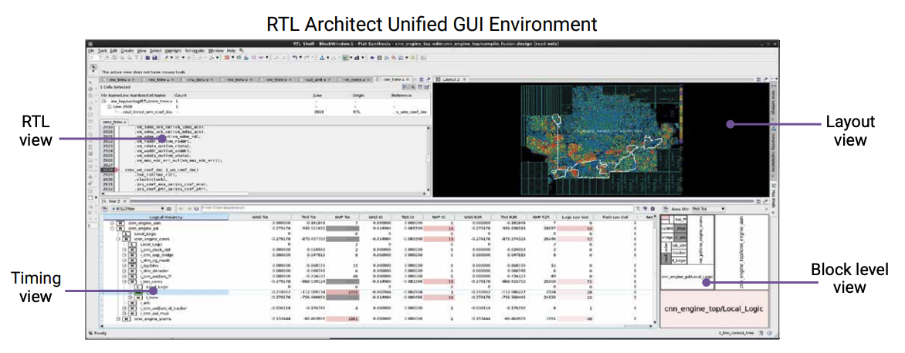

[NOTE]
====
Synopsys technology is at the heart of innovations that are changing the way people work and play. Self-driving cars. Machines that learn. Lightning-fast communication across billions of devices in the datasphere. These breakthroughs are ushering in the era of Smart Everything―where devices are getting smarter and connected, and security is an important consideration.

Powering this new era of digital innovation are high-performance silicon chips and exponentially growing amounts of software content. Synopsys is at the forefront of Smart Everything with the world’s most advanced technologies for chip design, verification, IP integration, and software security and quality testing. We help our customers innovate from silicon to software so they can bring Smart Everything to life.

Website: link:https://www.synopsys.com/[]
====

*Synplify Pro*

* Logic Synthesis for FPGA Design

Synplify Pro® FPGA synthesis software is the industry standard for producing high-performance and cost-effective FPGA designs. Synplify software supports the latest VHDL and Verilog language constructs including SystemVerilog and VHDL-2008. The software also supports FPGA architectures from a variety of FPGA vendors, including Altera, Achronix, Lattice, Microsemi and Xilinx, all from a single RTL and constraint source. Synplify Pro software uses a single, easy-to-use interface and has the ability to perform incremental synthesis and intuitive HDL code analysis.

For designers of large designs that need the fastest possible synthesis runtimes and the highest quality timing, area and power results. Synplify® Premier software provides all of the features of Synplify Pro as well as a comprehensive suite of tools for advanced FPGA design, see the Synplify Feature Comparison Chart.

[.trext-center]

Synplify Pro logic synthesis includes:

- Incremental, block-based and bottom-up flows for consistent results from one run to the next
- Automatic compile points incremental flow for up to 4x faster runtime while maintaining QoR
- Accelerated runtimes with support for up to 4 processors
- Scripting and Tcl/Find support for flow automation and customizable synthesis, debug and reporting
- Optimal area and timing results using FPGAs from Achronix, Altera, Lattice, Microsemi, Xilinx
- Hierarchical team design flow allowing parallel and/or geographically distributed design development
- Comprehensive language support including Verilog, VHDL, SystemVerilog, VHDL-2008 and mixed-language design
- FSM Compiler and FSM Explorer for automatic extraction and optimization of finite state machines from RTL
- Graphical state machine viewer to automatically create bubble diagrams for debugging and documenting FSMs
- Automatic memory and DSP inference provides automatic implementation of a design with optimal area, power and timing quality of results
- Incremental static timing for analysis allows updates to timing exception constraints with immediate visibility into results, without re-synthesis
- HDL Analyst interactive graphical analysis and debug tool for design diagnosis, problem isolation and functional and performance analysis

---

*RTL Architect*

The Synopsys RTL Architect™ product represents the industry’s first physically-aware RTL analysis, exploration, and optimization system with signoff technology integration.

RTL Architect uses a fast, multi-dimensional implementation prediction engine that enables RTL designers to predict the power, performance, area, and congestion impact of their RTL changes. Built on a unified data model, RTL Architect directly leverages Synopsys’ world-class implementation and golden signoff solutions, including PrimePower RTL, to deliver results that are accurate early in the design cycle. RTL Architect enables designers to significantly reduce RTL development time and to achieve “Simply Better RTL."

[.text-center]

Benefits

- Predictable RTL closure with accurate feedback on implementability and PPA metrics
- Reduced RTL development time with early and accurate feedback on RTL quality
- Superior PPA through parallel RTL exploration

Features

- Fast, high-capacity, and multi-dimensional predictive engine
- Unified data model for unmatched multi-billion gate capacity and full-chip hierarchical RTL designs
- Built on Synopsys’ implementation and golden signoff solutions, including PrimePower RTL
- Advanced interactive GUI interface with RTL cross-probing for insightful analysis

[IMPORTANT]
.Note from Jaro
====
Synopsys Synplify Pro® FPGA synthesis software is the industry standard for producing high-performance and cost-effective FPGA designs. Synplify software supports the latest VHDL and Verilog language constructs including SystemVerilog and VHDL-2008. The software also supports FPGA architectures from a variety of FPGA vendors, including Altera, Achronix, Lattice, Microsemi and Xilinx, all from a single RTL and constraint source.
====
