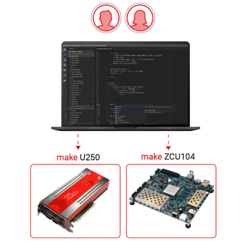
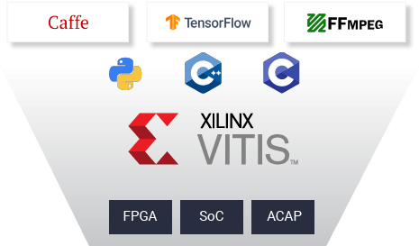
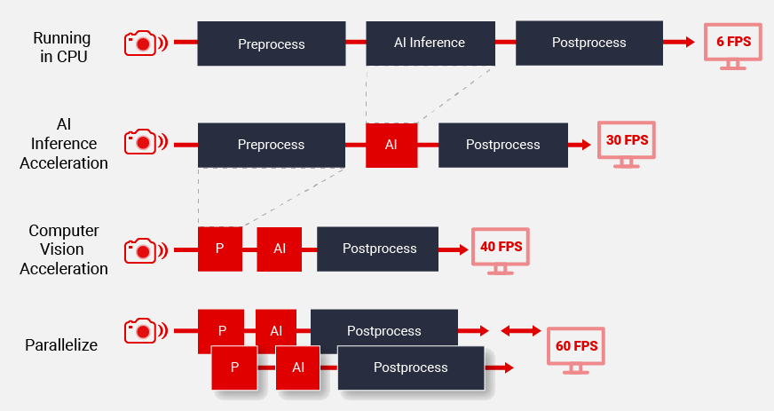
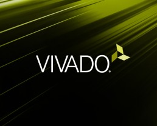

[NOTE]
====

Vitis for Software Developers

Website: link:https://www.xilinx.com/products/design-tools/vitis.html[]

Vivado for Hardware Development

Website: link:https://www.xilinx.com/products/design-tools/vitis.html[]
====

[.text-right]

The Vitis unified software platform enables the development of embedded software and accelerated applications on heterogeneous Xilinx platforms including FPGAs, SoCs, and Versal ACAPs. It provides a unified programming model for accelerating Edge, Cloud, and Hybrid computing applications.

[.text-center]

Leverage integration with high-level frameworks, develop in C, C++, or Python using accelerated libraries or use RTL-based accelerators & low-level runtime APIs for more fine-grained control over implementation — Choose the level of abstraction you need.

*Unified design methodology for all Xilinx platforms*

[.text-center]

Single design methodology and programming model for deploying accelerated applications on all Xilinx platforms
Including Alveo accelerator cards, embedded platforms or FPGA instances in the cloud
Develop and deploy your accelerated applications on different hardware platforms with a simple makefile change.

*Familiar software development experience*

[.text-center]

Access Xilinx adaptive compute within familiar developer workflows and environments
The Vitis unified software platform offers both GUI and command line development tools
Leverage integration or develop accelerated applications with high-level frameworks and languages including Tensorflow and Caffe, C, C++ or Python

*Software-defined whole application acceleration*

[.text-center]

Use Xilinx adaptive compute to meet system-level performance goals of your applications by accelerating AI inference and other performance-critical functions.
Vitis AI and Vitis accelerated libraries allow end-to-end application acceleration using a purely software-defined flow - no hardware expertise required.

---

[.text-right]

Vivado Design Suite HLx Editions - Accelerating High Level Design
The new Vivado® Design Suite HLx editions supply design teams with the tools and methodology needed to leverage C-based design and optimized reuse, IP sub-system reuse, integration automation and accelerated design closure. When coupled with the UltraFast™ High-Level Productivity Design Methodology Guide, this unique combination is proven to accelerate productivity by enabling designers to work at a high level of abstraction while facilitating design reuse.

Accelerating High Level Design

- Software-defined IP Generation with Vivado High-Level Synthesis
- Block-based IP Integration with Vivado IP Integrator
- On demand reconfiguration with Dynamic Function eXchange (DFX)
- Model-based Design Integration with Model Composer and System Generator for DSP

Accelerating Verification

- Vivado Logic Simulation
- Integrated Mixed Language Simulator
- Integrated & Standalone Programming and Debug Environments
- Accelerate Verification by >100X with C, C++ or SystemC with Vivado HLS
- Verification IP

Accelerating Implementation

- 4X Faster Implementation
- 20% Better Design Density
- Up to 3-Speedgrade Performance Advantage for the low-end & mid-range and 35% Power Advantage in the high-end

[IMPORTANT]
.Note from Jaro
====
Vitis is one of the best software on market to write code runnable on FPGAs, and by code I'm talking about C/C++ not HDL/Verilog. I tested that on TIG 100 project (2020) - XGBoost  algorithm, which proved also acceleration of FPGA cards.

====
